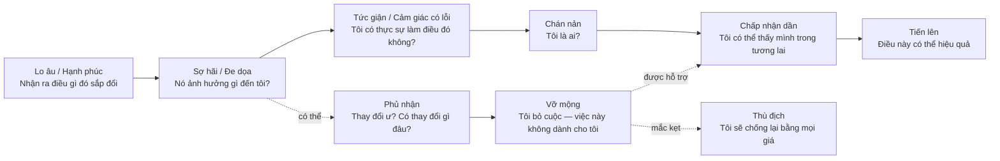
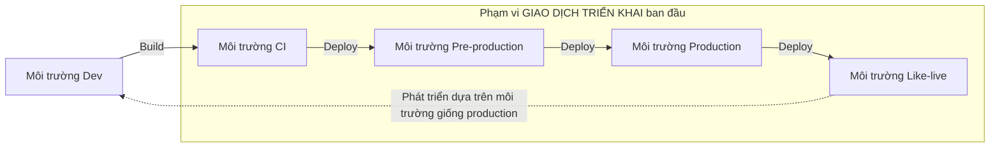
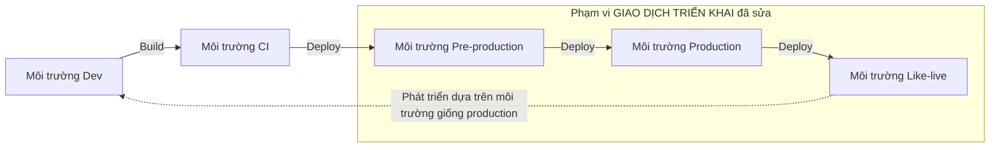

# Chương 6: Những rào cản cần lưu ý

*Nguyên tác: Chapter 6: Hurdles to Look Out For — trang 89–103*

Cho đến thời điểm này, cuốn sách tập trung vào các công cụ cốt lõi mà bạn cần có trong hộp công cụ để triển khai Continuous Delivery (CD) và DevOps thành công. Trên đường đi, chúng ta cũng đã xem xét một vài rào cản cần vượt qua. Bây giờ, chúng ta sẽ tìm hiểu kỹ hơn một số rào cản tiềm ẩn ấy, cùng những cách có thể vượt qua chúng — hoặc ít nhất là giảm thiểu tác động — để bạn tiếp tục tiến về phía mục tiêu và tầm nhìn của mình.

Danh sách sau đây hoàn toàn không đầy đủ, nhưng khả năng cao là bạn sẽ gặp ít nhất một vài vấn đề trong số đó. Điều quan trọng nhất là nhận thức rằng hành trình đôi lúc sẽ gặp bão. Bạn cần hiểu cách điều hướng vòng qua hoặc đi xuyên qua cơn bão, bảo đảm nó không khiến con tàu mắc cạn hay đẩy toàn bộ quá trình triển khai va vào đá — không hiểu sao tác giả lại dùng phép ẩn dụ hàng hải ở đây.

## Những vấn đề tiềm ẩn nào bạn cần lưu ý?

*Nguyên tác: What are the potential issues you need to look out for?*

Tùy thuộc vào văn hóa, môi trường, cách làm việc và mức độ trưởng thành của doanh nghiệp, số rào cản tiềm ẩn có thể nhiều không đếm xuể. Hy vọng việc triển khai của bạn sẽ diễn ra thuận lợi, nhưng để phòng trường hợp ngược lại, hãy điểm qua một số rào cản dễ thấy nhất:

- Những người không hiểu vì sao mọi thứ phải thay đổi, hoặc đơn giản là không muốn hiện trạng thay đổi.
- Những người muốn mọi việc diễn ra nhanh hơn và thiếu kiên nhẫn với tốc độ thay đổi.
- Phản ứng cảm xúc của con người trước thay đổi có thể hỗ trợ hoặc cản trở tiến độ.
- Việc người bên ngoài không hiểu hoặc không nhìn thấy điều bạn đang cố đạt được có thể gây trở ngại khi ưu tiên kinh doanh thay đổi.
- Thủ tục rườm rà và các quy trình doanh nghiệp nặng nề.
- Các nhóm phân tán về địa lý.
- Vấn đề không lường trước ở những công cụ đã chọn cho bộ công cụ, cả kỹ thuật lẫn phi kỹ thuật.
- Tuyển dụng.

Danh sách có thể dài hơn rất nhiều, nhưng dung lượng cuốn sách có hạn nên chương này tập trung vào những vấn đề tiềm ẩn rõ ràng nhất — những thứ có thể khiến việc triển khai CD và DevOps mắc cạn ở vùng nước nông, hoặc tệ hơn là đâm vào đá. Trước tiên, chúng ta sẽ xem xét con người và cách họ có thể tác động cả tích cực lẫn tiêu cực đến tầm nhìn và mục tiêu.

### Những người bất đồng trong hàng ngũ

*Nguyên tác: Dissenters in the ranks*

“Người bất đồng” là một từ khá mạnh, nhưng nó phản ánh đúng điều có thể xảy ra khi một số cá nhân quyết định rằng công việc của bạn và nhóm không phù hợp với cách họ nhìn thế giới.

Như với bất kỳ điều gì mới, một số người sẽ cảm thấy không thoải mái. Cách họ phản ứng phụ thuộc vào nhiều yếu tố, nhưng gần như chắc chắn sẽ có người phản đối điều bạn đang làm. Có thể phân tích nguyên nhân đến tận cùng, nhưng điều quan trọng cần nhận ra là chỉ một hoặc hai người đủ lớn tiếng cũng có thể tạo ra rất nhiều tiếng ồn không mong muốn và kéo sự chú ý của bạn ra khỏi tầm nhìn và mục tiêu. Đó chính xác là điều cần tránh.

Hiện tượng này không mới. Trong những năm đầu áp dụng Agile, người tham gia thay đổi trong một tổ chức thường được chia đại thể thành ba nhóm:

```text
Người chậm thích nghi        Người đi theo                 Người tiên phong
(Laggards)                   (Followers)                   (Innovators)
ít hoặc chưa bị thuyết phục  thấy hứng thú/lợi ích         mở đường cho cách làm mới
```

Đồng thuận chung là nên tập trung công sức và sự chú ý vào những người tiên phong và người đi theo, vì họ chiếm phần lớn số người tham gia. Những người đi theo đang tiến dần lên “đường cong” cần được hỗ trợ để vượt qua đỉnh, nên họ xứng đáng nhận nhiều sự quan tâm hơn. Nếu tập trung quá nhiều vào nhóm chậm thích nghi, bạn có thể lấy mất quá nhiều nguồn lực khỏi số đông. Sự thật khó chịu là họ phải **thích nghi hoặc rời đi**, kể cả khi họ là quản lý cấp cao. Nghe có vẻ khắc nghiệt, nhưng cách tiếp cận này đã được áp dụng hiệu quả trong nhiều năm.

Vậy nên làm gì với những người bất đồng hoặc chậm thích nghi? Như đã nói, nếu đủ lớn tiếng, họ có thể gây gián đoạn — nhưng không nhất thiết trong thời gian dài. Nếu phần lớn tổ chức đã ủng hộ việc bạn làm — hãy nhớ rằng kế hoạch đang được thực thi dựa trên chính ý kiến và đề xuất của họ — thì số đông sẽ không dễ bị phân tâm. Vì vậy, bạn cũng không nên bị phân tâm. Nếu đã xây dựng được mạng lưới tốt trong doanh nghiệp, hãy dùng mạng lưới ấy để giảm tiếng ồn và, nếu có thể, chuyển những người chậm thích nghi thành người đi theo.

Nếu những người này giữ vị trí quản lý, tình hình có thể khó hơn, nhất là khi họ giỏi các trò chơi chính trị tồn tại trong bất kỳ doanh nghiệp nào. Tuy nhiên, họ sẽ phải chiến đấu trong thế yếu vì số đông đứng sau bạn — bởi bạn đang cung cấp điều họ đã yêu cầu. Bạn cần thận trọng và kiên định với công việc phải làm.

Hãy luôn quan sát và lắng nghe để nhận ra dấu hiệu rắc rối đang hình thành. Khi đó, bạn có thể dành một phần nhỏ công sức để xử lý trước khi nó trở thành vấn đề lớn. Cách xử lý có thể chỉ là một cuộc trò chuyện trực tiếp, không đối đầu, với người có khả năng gây rắc rối bên một tách cà phê. Nhờ vậy, họ cảm thấy được lắng nghe, còn bạn hiểu tiếng ồn bắt nguồn từ đâu. Phương án cuối cùng có thể là nói chuyện trực tiếp với cấp trên của họ. Đừng biến vấn đề thành một trận “đánh bóng bàn bằng email”.

Nhìn chung, nếu có thể, hãy xử lý người bất đồng giống như một đứa trẻ nghịch ngợm trong lớp: không để họ phá hỏng trải nghiệm của mọi người, không dành toàn bộ sự chú ý cho họ, và luôn tiếp cận một cách bình tĩnh, có chừng mực. Sau một thời gian, mọi người sẽ ngừng nghe hoặc chán những điều họ nói, đặc biệt khi chúng không mang tính xây dựng.

Một yếu tố có thể làm tăng nguy cơ người bất đồng phá hỏng cuộc chơi là **thiếu tiến độ có thể nhìn thấy** trong quá trình triển khai CD và DevOps. Có thể bạn đang bận thay đổi một quy trình phức tạp hoặc phát triển công cụ, khiến hoạt động bên ngoài tạm lắng. Những người rất chú trọng kết quả bàn giao có thể coi khoảng lặng đó là dấu hiệu việc triển khai đang chững lại, thậm chí cho rằng công việc đã kết thúc.

Như chương trước đã đề cập, duy trì mức độ hiện diện cao là rất quan trọng, ngay cả khi chưa có nhiều hoạt động dễ quan sát. Khi mọi người thấy tiến độ, họ sẽ tiếp tục đi theo. Nếu xuất hiện một giai đoạn bị cảm nhận là không có hành động, những người đi theo có thể không biết bạn đang đi hướng nào và bắt đầu chú ý đến tiếng nói phản đối. Bất kỳ hình thức truyền thông hoặc cập nhật tiến độ nào cũng giúp ngăn điều này xảy ra. Ngay cả khi không có nhiều điều để báo cáo, hành động giao tiếp vẫn cho thấy bạn còn ở đó và vẫn đang tiến về mục tiêu.

> **Chú thích:** Cụm *shape up or ship out* là một thành ngữ mạnh, nghĩa là “thay đổi để đáp ứng yêu cầu, nếu không thì rời khỏi”. Trong thực tế, không nên biến nó thành lý do loại bỏ người phản biện. Cần phân biệt phản biện có bằng chứng với hành vi cố tình phá hoại.
>
> **Ví dụ:** Một quản lý phản đối deployment hàng ngày vì lo sự cố tăng. Nhóm không gạt bỏ ý kiến đó mà cho chạy thử trên một dịch vụ ít rủi ro, công khai change failure rate và thời gian rollback. Nếu dữ liệu cho thấy rủi ro được kiểm soát, người phản đối có cơ sở để chuyển thành người ủng hộ; nếu dữ liệu xấu, nhóm phải điều chỉnh kế hoạch.

### Đường cong thay đổi

*Nguyên tác: The change curve*

Trước hết cần nói rõ một điều quan trọng: việc xác định một vấn đề rồi loại bỏ nó có thể tạo ra thay đổi rất lớn. Bạn đã làm việc với doanh nghiệp để nhận diện vấn đề và giờ đang tìm cách giải quyết nó. Đó chính là thay đổi, đơn giản vậy thôi.

Ở phần trước, sách gọi những con người can đảm tại ACME Systems — những người giúp triển khai cách làm DevOps và CD — là **chất xúc tác cho thay đổi**. Cách diễn đạt đó là có chủ ý, vì ACME Systems quả thực đã trải qua một thay đổi rất lớn. Không nên xem nhẹ việc triển khai CD và DevOps, cũng không nên xem nhẹ tác động của nó lên từng cá nhân, kể cả khi ban đầu họ từng nghĩ đó là điều tuyệt vời nhất trên đời.

Người từng giữ vai trò quản lý hoặc lãnh đạo có thể hiểu rằng thay đổi vừa có thể được nhìn nhận tích cực, vừa có thể bị nhìn nhận tiêu cực. Đôi khi người ta còn cảm thấy thay đổi nhắm trực tiếp vào mình, nhất là khi thay đổi trong doanh nghiệp ảnh hưởng đến cá nhân và vai trò hiện tại của họ.

Bất kỳ thay đổi nào, lớn hay nhỏ, liên quan đến công việc hay không, đều có thể tác động đến mỗi người theo cách khác nhau. Có người chào đón thay đổi; có người không bị xáo trộn và đơn giản chấp nhận nó; có người hoàn toàn thù địch và xem thay đổi là chuyện mang tính cá nhân. Quan trọng hơn, cùng một người có thể lần lượt trải qua tất cả những phản ứng ấy. Nếu nhận thức được điều này trước khi triển khai thay đổi, chúng ta sẽ hiểu rõ hơn các thử thách cần vượt qua để việc triển khai thành công.

Đã có nhiều nghiên cứu và bài viết về chủ đề này. Tác giả không cho rằng mình biết mọi điều về nó, nhưng khi nói đến thay đổi — hay “chuyển tiếp” — có một phần lớn là lẽ thường cùng một số đặc điểm đơn giản, dễ hiểu cần tính đến.

Một cách hữu ích để hình dung tác động của thay đổi là **đường cong thay đổi hoặc chuyển tiếp**. Nó mô tả các giai đoạn mà một cá nhân có thể trải qua khi thay đổi được triển khai. Sơ đồ của John Fisher trong sách có thể được diễn giải khái quát như sau:



*Diễn giải từ “John Fisher's personal transition curve — the stages of personal change” trong sách.*

Khi thay đổi được lên kế hoạch, thảo luận hoặc triển khai, con người có thể trải qua nhiều giai đoạn. Chương này không phân tích từng giai đoạn, nhưng rút ra một số điểm đặc biệt liên quan đến CD và DevOps:

- Một người có thể đi qua đường cong này nhiều lần, kể cả trong giai đoạn thay đổi rất sớm.
- Mỗi người khác nhau và tốc độ đi qua đường cong là riêng biệt.
- Chính bạn và một số ít người đã hiểu rõ vấn đề quanh bạn cũng sẽ đi qua đường cong.
- Người không thể thoát khỏi vùng trũng có thể cần thêm sự trợ giúp, hướng dẫn và lãnh đạo.
- Một người im lặng và có vẻ không bị ảnh hưởng vẫn đang ở đâu đó trên đường cong; không chỉ những người lên tiếng mới cần được lưu ý.

Tóm lại, mỗi cá nhân đúng nghĩa là một cá thể riêng. Họ có thể là người chậm thích nghi, người đi theo hoặc người tiên phong, đồng thời cũng đang ở một vị trí nào đó trên đường cong thay đổi. Lãnh đạo và quản lý phải đặc biệt lưu tâm và bảo đảm con người được chăm sóc. Bạn cũng phải nhớ điều này — không chỉ vì nó áp dụng cho chính bạn, mà còn vì nó giải thích phần nào tại sao một người phản ứng theo cách này lúc bắt đầu rồi đổi cách tiếp cận khi kế hoạch và tầm nhìn được thực thi.

Ở cấp độ cá nhân và cảm xúc, thay đổi vừa tốt vừa xấu, vừa hào hứng vừa đáng sợ, vừa thử thách vừa choáng ngợp, vừa được chào đón vừa bị né tránh. Tất cả phụ thuộc vào cảm nhận của một người tại từng thời điểm. CD và DevOps có thể là một thay đổi rất lớn, nên cảm xúc sẽ đóng vai trò đáng kể. Nếu nhận ra điều này, quan sát tín hiệu và phản ứng phù hợp, hành trình sẽ dễ dàng hơn nhiều. Nếu phớt lờ, bạn sẽ phải đối mặt với một trận chiến rất khó khăn.

> **Chú thích:** Đường cong thay đổi không phải một quy trình tuyến tính hay công cụ chẩn đoán tâm lý. Mọi người có thể bỏ qua một giai đoạn, quay lại giai đoạn trước hoặc có nhiều cảm xúc cùng lúc. Giá trị của mô hình là nhắc người lãnh đạo quan sát và hỗ trợ, không phải dán nhãn con người.
>
> **Ví dụ:** Khi chuyển quyền triển khai từ Ops sang nhóm sản phẩm, một kỹ sư Ops ban đầu vui vì bớt công việc thủ công, sau đó lo vai trò của mình mất giá trị, rồi phản đối vì pipeline chưa đáng tin. Pairing với Dev để thiết kế guardrail và giao cho họ vai trò platform engineering có thể giúp người đó nhìn thấy vị trí của mình trong tương lai.

### Những người đứng ngoài

*Nguyên tác: The outsiders*

Tỷ lệ người tham gia triển khai CD và DevOps phụ thuộc phần lớn vào quy mô tổ chức. Ở một startup, rất có thể tất cả mọi người đều tham gia. Trong doanh nghiệp vừa và nhỏ, có khả năng một số người không tham gia. Ở một tập đoàn, tỷ lệ tham gia trực tiếp sẽ nhỏ hơn tỷ lệ không tham gia.

Một doanh nghiệp điển hình và vị trí của bạn trong đó có thể được hình dung bằng các lớp lồng nhau:

```text
Tập đoàn (Corporate)
└── Tổ chức (Organisation)
    └── Văn phòng (Office)
        └── Phòng ban (Department)
            └── Nhóm (Team)
                └── Bạn (You)
```

**Càng xa vòng tròn trung tâm, khả năng người khác không biết bạn đang làm gì và vì sao càng lớn.**

Những người nằm ngoài vòng tròn tham gia tích cực sẽ biết rất ít hoặc hoàn toàn không biết chuyện gì đang diễn ra. Vì thiếu hiểu biết, họ có thể vô tình dựng lên những rào cản trên đường tiến của bạn. Đây không phải vấn đề riêng của CD và DevOps; nó là thực tế của bất kỳ dự án chuyên môn hóa nào.

Trong giai đoạn Version 2.0 của quá trình tiến hóa, ACME Systems trở thành một phần của tập đoàn lớn và biến thành một văn phòng vệ tinh, còn trụ sở tập đoàn nằm ở nước ngoài. Nhìn chung họ được để tự hoạt động. ACME miệt mài nghiên cứu và triển khai CD cùng DevOps, nhưng nếu nhìn từ cấp tập đoàn toàn cầu thì họ làm việc trong cô lập.

Đúng là họ đang tạo ra những thay đổi sâu rộng và mạnh mẽ trong tổ chức ACME Systems, nhưng vẫn chỉ là một bánh răng nhỏ trong cỗ máy khổng lồ. Hầu như không ai bên ngoài văn phòng ACME nhìn thấy hoặc hiểu sâu điều đang diễn ra. Vì vậy, khi tập đoàn công bố một kế hoạch chiến lược mới có phạm vi rất rộng, công việc của ACME hầu như không được cân nhắc vì những người ra quyết định đơn giản là không biết. Kết quả là tiến độ triển khai CD và DevOps bị ảnh hưởng.

Trong trường hợp ACME, tác động của thay đổi toàn tập đoàn cuối cùng lại tích cực và tạo thêm động lực cho CD và DevOps. Nhưng nếu hành trình của bạn gặp một thay đổi sâu rộng trong khi người khác không biết bạn đang làm gì, câu chuyện có thể không kết thúc tốt như vậy.

Bài học là: không chỉ theo dõi điều xảy ra gần mình, bạn còn phải để mắt đến toàn bộ tổ chức. Việc giao tiếp và duy trì mức độ hiện diện cao không nên chỉ giới hạn ở những người tham gia trực tiếp; hãy cố gắng để càng nhiều người biết càng tốt.

Trong môi trường tập đoàn, có thể tồn tại một nhóm truyền thông nội bộ thường xuyên đăng tin lên intranet hoặc bản tin. Hãy liên hệ với họ và đề nghị viết về việc bạn đang làm. Một chút PR tốt sẽ hỗ trợ mục tiêu và mở rộng “vòng tròn hiểu biết”.

Việc này có vẻ tốn nhiều công mà lợi ích ít, nhưng kết quả có thể khiến bạn ngạc nhiên. Chẳng hạn, bài viết được CEO hoặc một Senior Vice President đọc và họ quyết định đến xem điều gì đang diễn ra. Đó là sự khích lệ tinh thần lớn và tạo hiệu ứng PR tốt. Nó còn có thể tác động đến những quản lý đang phản đối: khi thấy lãnh đạo cấp cao ghi nhận công việc là điều tích cực, họ có thể xem xét lại lập trường.

> **Chú thích:** “PR nội bộ” ở đây không phải tô hồng thành tích. Mục tiêu là giúp những người có quyền thay đổi ngân sách, ưu tiên, chính sách hoặc cơ cấu hiểu giá trị và sự phụ thuộc của sáng kiến trước khi họ ra quyết định.
>
> **Ví dụ:** Nhóm platform gửi bản cập nhật hàng tháng gồm mục tiêu, dịch vụ đã chuyển sang pipeline mới, thời gian phát hành giảm được và rủi ro đang xử lý. Khi tập đoàn lên kế hoạch cắt một công cụ CI vì tưởng ít người dùng, bộ phận mua sắm có dữ liệu để nhận ra công cụ đó đang phục vụ chương trình chiến lược.

### Quy định doanh nghiệp, thủ tục rườm rà và tiêu chuẩn

*Nguyên tác: Corporate guidelines, red tape, and standards*

Quy mô của rào cản này phụ thuộc vào quy mô tổ chức và thị trường mà doanh nghiệp hoạt động. Nếu làm trong lĩnh vực dịch vụ với nghĩa vụ thương mại phải đáp ứng SLA, hoặc trong tổ chức tài chính phải tuân thủ quy định, bạn sẽ bị hạn chế phần nào trong cách triển khai CD và DevOps. Đó là đặc trưng không thể tránh khỏi của lĩnh vực.

Việc cần làm là hợp tác với những người đặt ra hoặc thực thi quy tắc để xác định bạn có bao nhiêu khoảng linh hoạt. Có thể một số quy định và hướng dẫn đang áp dụng cho doanh nghiệp là quá mức cần thiết; chúng chỉ tồn tại như vậy vì làm đúng từng chữ trong sách dễ hơn điều chỉnh cho phù hợp với nhu cầu thực tế.

Các quy tắc, hướng dẫn và chính sách thường xoay quanh quản lý thay đổi và khả năng kiểm toán. Nói đơn giản, chúng tạo ra một cổng an toàn và phương thức xác định những gì vừa thay đổi khi sự cố xảy ra. Người quản lý hoặc thực thi các quy định này có thể cho rằng CD và DevOps không tương thích với cách làm việc của họ. Nhận định ấy có thể phản ánh hiện trạng, nhưng không có nghĩa là nó đúng hoặc không thể thay đổi.

Trong giai đoạn điều tra, tổ chức hoặc phòng ban của họ có thể đã bị chỉ ra là nơi tạo lãng phí trong quy trình chuyển giao sản phẩm, nên họ có thể phòng thủ trước thay đổi. Cũng có thể họ đơn giản không biết phần nào được phép thay đổi mà không vi phạm quy định hay chính sách tập đoàn.

Hãy làm việc cùng những người này, giúp họ hiểu CD và DevOps là gì, đồng thời hỗ trợ họ nghiên cứu phần nào trong quy trình có thể thay đổi để thích ứng. Đừng phớt lờ họ rồi tự ý phá luật; hậu quả sẽ đuổi kịp bạn và có thể khiến cả quá trình chệch khỏi đường ray. Đối thoại cởi mở, trung thực và can đảm là chìa khóa.

> **Chú thích:** CD không có nghĩa bỏ kiểm soát thay đổi. Nó thường biến kiểm soát từ cuộc họp và giấy tờ thủ công thành policy-as-code, phê duyệt dựa trên rủi ro, audit log tự động, kiểm thử bắt buộc và khả năng rollback có thể chứng minh.
>
> **Ví dụ:** Thay vì yêu cầu Change Advisory Board duyệt mọi bản phát hành, tổ chức phân loại thay đổi. Thay đổi chuẩn, ít rủi ro được tự động phê duyệt nếu test, quét bảo mật và canary đều đạt; thay đổi cơ sở dữ liệu không thể đảo ngược vẫn cần đánh giá thủ công. Mọi bằng chứng được pipeline lưu lại phục vụ kiểm toán.

### Các nhóm phân tán về địa lý

*Nguyên tác: Geographically diverse teams*

Phần trước đã đề cập việc thiết lập một môi trường vật lý cởi mở và trung thực để củng cố cách làm việc cởi mở, trung thực và cộng tác. Điều này thuận lợi khi các nhóm ngồi cùng địa điểm, nhưng tái tạo nó cho các nhóm phân tán về địa lý có thể là một bài toán khó.

Mức độ khó phụ thuộc vào chênh lệch múi giờ và, ở một mức độ nào đó, khác biệt văn hóa. Không có mặt trực tiếp luôn là một rào cản, nhưng bạn có thể giảm bớt bằng một số cách:

- Bảo đảm các nhóm trong văn phòng thường xuyên — lý tưởng là hàng ngày — họp từ xa với các nhóm ở địa điểm khác.
- Nếu dùng Scrum hoặc phương pháp tương tự và tổ chức **scrum of scrums** hàng ngày, hãy cho nhóm từ xa tham gia, dù chỉ bằng cách gọi điện và bật loa ngoài.
- Dùng hội nghị truyền hình, từ hệ thống doanh nghiệp đắt tiền đến giải pháp đơn giản. Có thể đặt màn hình ngay trong không gian làm việc thay vì giấu trong phòng họp, dùng nó như một bức tường hoặc cửa sổ ảo luôn mở để người ở hai đầu bước tới và trò chuyện trực diện.
- Nếu ngân sách cho phép, luân chuyển người giữa các văn phòng.
- Thay vì phụ thuộc vào email, dùng ứng dụng nhắn tin hoặc chat, đồng thời khuyến khích blog, bảng thảo luận và diễn đàn.

Tất nhiên, rất khó xóa bỏ rào cản vật lý của hàng nghìn kilômét và đôi khi nhiều đại dương — trừ khi bạn đã hoàn thiện nghệ thuật dịch chuyển tức thời vật chất. Tuy vậy, công cụ và cách tiếp cận cộng tác có thể giúp ích đáng kể.

Múi giờ là một rào cản khác, có thể làm xáo trộn những hoạt động như daily stand-up vốn thường diễn ra đầu buổi sáng. Tuy nhiên, có thể vượt qua các vấn đề nhỏ này bằng tư duy sáng tạo.

Khác biệt văn hóa cũng cần được xem xét nghiêm túc. Ở một số nơi, văn hóa không giống kiểu phương Tây tương đối thoải mái, nơi mọi người đều có tiếng nói và không ngại sử dụng nó. Việc gây dựng sự cởi mở, trung thực và minh bạch có thể khó hơn với một số người. Hãy phối hợp với HR hoặc đội ngũ quản lý địa phương, giải thích mục tiêu và tìm hiểu cách họ có thể hỗ trợ.

> **Chú thích:** Một “cửa sổ video luôn bật” là gợi ý phản ánh thời điểm cuốn sách được viết. Với môi trường hiện đại, nó có thể gây gián đoạn hoặc tạo cảm giác bị giám sát. Nguyên tắc bền vững hơn là cung cấp kênh giao tiếp nhanh, thời gian giao nhau hợp lý và hồ sơ quyết định bất đồng bộ.
>
> **Ví dụ:** Nhóm ở Việt Nam và châu Âu chỉ có hai giờ làm việc trùng nhau. Họ dành 30 phút cho trao đổi cần tương tác, luân phiên giờ họp để chia đều bất tiện, ghi quyết định vào ADR và dùng video ngắn để bàn giao. Người ít thoải mái khi phản biện trực tiếp có thể gửi ý kiến bằng văn bản trước cuộc họp.

### Thất bại trong quá trình tiến hóa

*Nguyên tác: Failure during the evolution*

Trong hành trình, đôi khi mọi việc sẽ sai — điều đó không thể tránh khỏi và không có gì phải sợ hay xấu hổ. Có thể xuất hiện tình huống chưa lường trước hoặc một bước trong quy trình hiện tại không được phát hiện ở giai đoạn điều tra. Vấn đề cũng có thể đơn giản nằm ở bộ công cụ đã chọn: nó không làm được điều bạn kỳ vọng hoặc chứa lỗi.

Phản ứng tự nhiên có thể là che giấu thất bại, hoặc ít nhất không công bố rằng thất bại đã xảy ra. Đây không phải lựa chọn khôn ngoan. Bạn và nhóm đang nỗ lực xây dựng sự cởi mở và trung thực; điều tệ nhất có thể làm là hành động hoàn toàn ngược lại.

Thừa nhận đầu hàng, cuộn người trong tư thế bào thai rồi nằm thút thít ở góc phòng cũng không phải lựa chọn. Thay đổi nào cũng có lúc gặp trục trặc. Hãy xem xét tình hình, đánh giá các phương án và tiếp tục tiến lên. Khi đã tìm được cách đi vòng qua hoặc xuyên qua vấn đề, hãy truyền đạt nó. Cần thẳng thắn về vấn đề là gì và đang làm gì để khắc phục.

Điều đó cho người khác thấy cách phản ứng và xử lý thay đổi — một hình thức lãnh đạo bằng hành động. Nếu đang dùng kỹ thuật Agile như Scrum hoặc Kanban để thúc đẩy triển khai CD và DevOps, bạn có thể chuyển hướng tương đối nhanh mà không cản trở tiến độ.

Những lời trên có thể nghe giống “thái độ tinh thần tích cực” hoặc những lời sáo rỗng của quản lý. Vì vậy, hãy xem một ví dụ cụ thể từ ACME Systems.

ACME đã triển khai mô hình **giao dịch triển khai** (*deployment transaction*) để quản lý phụ thuộc và bảo đảm tại mỗi thời điểm chỉ có một thay đổi đi qua hệ thống production. Ban đầu nó hoạt động tốt, nhưng rồi mọi thứ chậm lại. Nhóm CD đã trao đổi cởi mở với R&D và Operations vì sự chậm trễ bắt đầu ảnh hưởng đến khả năng bàn giao của R&D.

Sau nhiều tranh luận, họ nhận ra nguồn gốc chính của vấn đề: không thể biết chắc thay đổi ở tài sản phần mềm nào sẽ hoàn thành trước, đồng thời không có cách thử các kịch bản tích hợp khác nhau. Nếu thay đổi ở tài sản A phụ thuộc vào thay đổi ở tài sản B, B phải lên production trước thì mới kiểm thử tích hợp đầy đủ. Nhưng nếu A sẵn sàng trước, nó buộc phải chờ — đôi khi nhiều ngày hoặc nhiều tuần. Giao dịch triển khai bắt đầu cản trở CD.

Ranh giới giao dịch ban đầu bao trùm từ CI đến production và môi trường giống production:



Mọi người đều đồng ý rằng giao dịch triển khai hoạt động tốt và là phương án thay thế khả thi cho “địa ngục phụ thuộc”. Nhưng khi sử dụng thực tế ở cường độ cao, nó bắt đầu gây ra vấn đề đau đớn. Ngay cả khi tính năng có thể tắt bằng feature flag, không thể kiểm thử tích hợp đầy đủ nếu mọi thứ chưa được triển khai vào production và môi trường like-live.

Trước đây, đây không phải vấn đề vì tốc độ phát hành rất chậm và các tài sản thường được gom thành cụm. Giờ ACME có thể triển khai production rất nhanh nên nảy sinh vấn đề mới: phải triển khai theo thứ tự nào?

Nhiều cuộc thảo luận đã diễn ra và nhiều phương án phức tạp được xem xét, nhưng giải pháp cuối cùng khá đơn giản: **dịch chuyển ranh giới của giao dịch triển khai**, cho phép kiểm thử tích hợp đầy đủ trước khi tài sản đi vào production. Sau đó, các nhóm R&D tự xác định thứ tự triển khai phù hợp.

Ranh giới sau điều chỉnh chỉ bao quanh pre-production, production và like-live:



ACME đã gặp một vấn đề có thể khiến toàn bộ triển khai CD và DevOps trật đường ray. Vấn đề trở nên rất rõ ràng và nhiều câu hỏi được đặt ra. Những người đi theo bắt đầu nghi ngờ người tiên phong, còn nhóm chậm thích nghi trở nên lớn tiếng. Tuy nhiên, nhờ cộng tác theo cách truyền thống và các cuộc thảo luận cởi mở, trung thực, vấn đề được xử lý nhanh chóng và tương đối dễ dàng.

Một lần nữa, giao tiếp cởi mở, trung thực và đối thoại can đảm là chìa khóa. Nếu thường xuyên xem xét và lắng nghe điều mọi người nói, bạn có cơ hội nhận ra rào cản trước khi chúng chặn đứng hoàn toàn tiến độ.

> **Chú thích:** *Deployment transaction* ở đây không phải transaction cơ sở dữ liệu. Đó là một ranh giới phối hợp: các thay đổi liên quan được kiểm soát như một đơn vị để tránh phiên bản không tương thích. Dịch ranh giới về gần production hơn cho phép CI và pre-production linh hoạt hơn, nhưng vẫn giữ kiểm soát ở bước phát hành cuối.
>
> **Ví dụ:** Dịch vụ A cần API mới của B. Với ranh giới cũ, A không thể vào môi trường tích hợp cho đến khi B sẵn sàng production, nên phải chờ nhiều ngày. Với ranh giới mới, hai phiên bản được triển khai sớm vào pre-production để kiểm thử contract; sau khi xác nhận tương thích, B rồi A mới lần lượt đi qua giao dịch production.

### Những quy trình không thể lặp lại

*Nguyên tác: Processes that are not repeatable*

Người làm kỹ thuật thường có xu hướng tự động hóa mọi thứ họ chạm vào: tự động dựng máy trạm cho kỹ sư, tự động build phần mềm, tự động bật máy pha cà phê khi đèn văn phòng sáng, v.v. Đây không phải điều mới và cũng không có gì sai, miễn là quy trình có thể lặp lại và cho kết quả nhất quán mỗi lần. Nếu kết quả không nhất quán, người khác sẽ ngần ngại sử dụng hệ thống tự động hóa mà bạn đã mất hàng giờ, hàng ngày hoặc hàng tuần để xây dựng.

Với CD và DevOps, cách tiếp cận cũng phải như vậy, đặc biệt khi nói đến công cụ. Bạn phải có thể tin tưởng kết quả nhận được hết lần này đến lần khác.

Một số người cho rằng công cụ nội bộ, giải pháp tiết kiệm công sức hoặc quy trình không trực tiếp đối mặt với khách hàng thì không cần chất lượng như production, vì chỉ được dùng trong doanh nghiệp. Quan niệm này sai hoàn toàn.

Hãy xem ví dụ đơn giản. Kỹ sư phần mềm dùng IDE để viết mã và compiler để tạo binary sẽ triển khai; DBA dùng công cụ quản trị SQL để quản lý cơ sở dữ liệu và viết SQL. Họ kỳ vọng những công cụ ấy hoạt động ổn định và tạo kết quả nhất quán, có thể lặp lại: mở tệp nguồn thì IDE hiển thị để chỉnh sửa; thực thi SQL thì công cụ chạy câu lệnh trên máy chủ.

Nếu công cụ liên tục sập hoặc tạo kết quả ngoài dự kiến, bạn sẽ vô cùng bực bội và có lẽ ngừng sử dụng nó. Điều đó có thể khiến người ta phát điên.

> “Điên rồ là làm đi làm lại cùng một việc nhưng mong đợi kết quả khác đi.”  
> — Câu nói được sách ghi là của Albert Einstein

Điều tương tự áp dụng cho các công cụ kỹ thuật và phi kỹ thuật mà bạn xây dựng hoặc triển khai để áp dụng CD và DevOps. Bạn cần tự tin rằng cùng một hành động lặp lại sẽ cho cùng một kết quả.

Khi sự tự tin tăng, lòng tin vào công cụ hoặc quy trình cũng tăng. Bạn bắt đầu coi nó là điều hiển nhiên và sử dụng mà không phải suy nghĩ thêm. Vì vậy, bạn cũng có thể tin rằng nếu kết quả khác đi thì đã có vấn đề cần xử lý.

Hãy hình dung bạn sẽ khó thuyết phục những người gác cổng rằng CD và DevOps không rủi ro đến mức nào nếu không thể tạo kết quả nhất quán cho các tác vụ lặp lại. “Vui” có lẽ không phải từ đúng; “đau đớn” thích hợp hơn.

Kết quả nhất quán và có thể lặp lại còn mang lại lợi thế khi xem xét số liệu. Nếu có thể tin rằng việc triển khai cùng một tài sản lên cùng một máy chủ luôn mất thời gian tương đương, bạn sẽ phát hiện được vấn đề khi thời gian bắt đầu tăng — chẳng hạn hạ tầng có sự cố hoặc phiên bản mới nhất của công cụ CD vừa đưa vào một lỗi.

Nhìn chung, tính lặp lại nghe có vẻ nhàm chán và không mấy sáng tạo, nhưng nhờ kết quả nhất quán, bạn có thể ngừng lo về công việc vụn vặt và chuyển sự chú ý sang những vấn đề thật sự cần giải quyết.

> **Chú thích:** “Có thể lặp lại” không có nghĩa mọi lần chạy phải giống nhau từng mili-giây. Nó nghĩa là với cùng đầu vào và điều kiện được kiểm soát, quy trình tạo ra kết quả dự đoán được trong một phạm vi chấp nhận được; sai khác phải đo được và giải thích được.
>
> **Ví dụ:** Một deployment thường mất 4–6 phút. Nếu cùng loại dịch vụ đột nhiên mất 18 phút trong ba lần liên tiếp, dashboard cảnh báo sự lệch chuẩn. Nhóm phát hiện registry đang chậm, thay vì cho rằng pipeline “thỉnh thoảng vẫn vậy”.

### Tuyển dụng

*Nguyên tác: Recruitment*

Thoạt nhìn, tuyển dụng có vẻ không phải vấn đề lớn. Nhưng khi sản lượng và hiệu quả của tổ chức tăng, đồng thời tổ chức bắt đầu được công nhận là nơi có thể nhanh chóng cung cấp sản phẩm chất lượng — và điều đó sẽ xảy ra — tăng trưởng và mở rộng có thể trở thành ưu tiên cao. Đây là tin tốt.

Lúc này, bạn cần tìm những người có thể làm việc theo cách mới và thể hiện các hành vi mà bạn cùng nhóm đã rất vất vả xây dựng, nuôi dưỡng và đưa vào toàn tổ chức. Đây không phải nhiệm vụ dễ dàng và sẽ cần thời gian.

Chỉ thêm “có kinh nghiệm CD và DevOps” vào mô tả công việc sẽ không tạo ra kết quả mong muốn. Không có quá nhiều người sở hữu đúng đặc điểm này, và trong giới tuyển dụng cũng chưa chắc có hiểu biết đầy đủ về ý nghĩa thật sự của CD và DevOps.

Vì vậy, bạn phải chia sẻ kiến thức với những người tham gia quy trình tuyển dụng để họ hiểu mình đang tìm kiếm điều gì. Có thể phải làm việc đó nhiều lần trước khi thông điệp thực sự được thấm nhuần.

Có một số cách phân biệt người thật sự “hiểu” với người chưa hiểu. Một câu hỏi phỏng vấn tác giả ưa thích là:

> **Là một kỹ sư phần mềm, bạn cảm thấy thế nào nếu mã của mình được chạy trong môi trường production và được hàng triệu khách hàng sử dụng chỉ 30 phút sau khi bạn commit vào source control?**

Câu hỏi được cố tình diễn đạt để thu được phản ứng cảm xúc chân thật; từ khóa là **cảm thấy**. Câu trả lời có thể rất bất ngờ. Có người sững lại, có người sốc và cho rằng ý tưởng ấy điên rồ, có người suy nghĩ rồi nhận ra dù chưa từng cân nhắc nhưng họ khá thích nó. Nếu câu trả lời là “30 phút ư? Quá chậm”, có lẽ bạn đã tìm được một ứng viên rất phù hợp.

Hãy dành thời gian và bảo đảm chọn đúng người. Bạn cần người tiên phong và người đi theo nhiều hơn người chậm thích nghi.

> **Chú thích:** Câu hỏi trên không nên được dùng như một câu đố có đáp án duy nhất. Một ứng viên giỏi có thể nói “tôi hào hứng nếu pipeline có kiểm thử, quan sát, canary và rollback; nếu không thì tôi lo lắng”. Câu trả lời như vậy thể hiện cả tinh thần giao hàng nhanh lẫn tư duy quản trị rủi ro.
>
> **Ví dụ:** Ngoài hỏi thuật ngữ DevOps, phỏng vấn có thể đưa ra tình huống: “Deployment vừa gây lỗi, không ai chắc nhóm nào chịu trách nhiệm. Bạn sẽ làm gì trong 30 phút đầu và sau sự cố?” Người phù hợp thường ưu tiên khôi phục dịch vụ, giao tiếp, cộng tác và học hỏi thay vì tìm người để đổ lỗi.

## Tổng kết

*Nguyên tác: Summary*

Chương này đã rút ra những điều sau:

- Trên đường đi sẽ có rào cản; một số nhìn thấy từ trước, một số khiến bạn bất ngờ.
- Hãy dồn năng lượng vào những người muốn tiến lên; phần còn lại sẽ đi theo.
- Mỗi người khác nhau và phản ứng theo cách riêng trước những gì diễn ra quanh mình.
- Giữ cho người ngoài vòng tròn trung tâm được cập nhật có thể ngăn những quyết định làm hỏng tiến độ.
- Nếu mọi việc bắt đầu sai, hãy dừng lại đánh giá, xem xét phương án rồi tiếp tục tiến lên.
- Thủ tục rườm rà có thể gây vấn đề, nhưng nếu kiên trì bạn sẽ tìm được cách xử lý.
- Khoảng cách địa lý không nhất thiết là vấn đề nếu tìm được những cách đơn giản để kéo mọi người lại gần nhau.
- Sự lặp lại là điều tốt.
- Tuyển đúng người có thể trở nên khó khăn hơn.

Chắc chắn hành trình còn có những rào cản, nguy cơ và yếu tố chặn đường khác. Nhưng nếu có chuẩn bị, bạn sẽ thành công. Nhắc đến thành công, chương tiếp theo sẽ chuyển sang cách đo lường thành công và lý do việc đó quan trọng đến vậy.

---

> **Ghi chú của người dịch:** Bản dịch ưu tiên truyền đạt đúng ý trong ngữ cảnh CD/DevOps. Những đoạn mang nhãn **Chú thích** và **Ví dụ** là phần giải thích bổ sung, không thuộc nguyên văn của sách. Các sơ đồ được dựng lại theo nội dung hình trong sách để phù hợp với Markdown.
