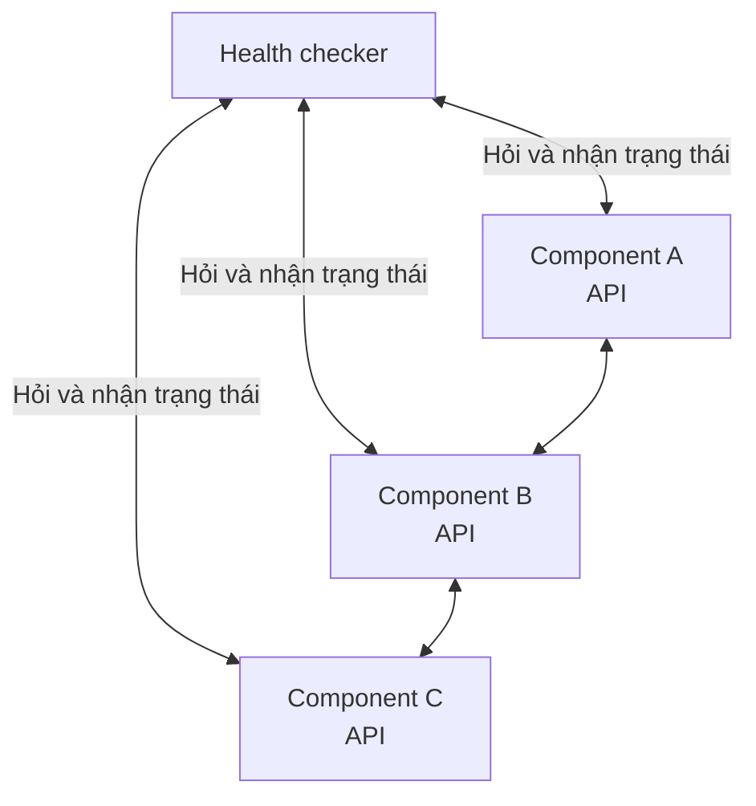
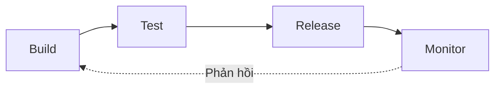
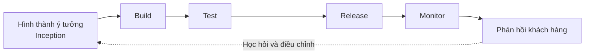

# Chương 7: Đo lường thành công và duy trì thành công

*Nguyên tác: Chapter 7: Measuring Success and Remaining Successful — trang 105–131*

Trong các chương trước, chúng ta đã xem xét những công cụ và kỹ thuật cần thiết để áp dụng CD và DevOps thành công, đồng thời chỉ ra một số rào cản có thể phải vượt qua. Với những thông tin đó, bạn đã có nền tảng tốt để thành công. Trong chương cuối này, chúng ta sẽ bàn về hai việc cũng quan trọng như cách triển khai CD và DevOps: **đo lường thành công** và **làm gì khi đã đến gần mục tiêu**.

Trước tiên là một lĩnh vực quan trọng nhưng đôi khi bị xem nhẹ hoặc gạt bỏ: giám sát và đo lường tiến độ. Thoạt nhìn, đây có vẻ chỉ hữu ích cho giới quản lý và không tạo thêm giá trị cho công việc của nhóm. Tuy nhiên, khả năng chứng minh tiến độ chắc chắn có giá trị.

Chúng ta không chỉ nói về vài biểu đồ quản lý dự án đơn giản hay nội dung để đưa vào PowerPoint. Mục tiêu là đo được càng nhiều khía cạnh của toàn bộ quy trình càng tốt, nhờ đó thấy rõ đã đi được bao xa và còn bao xa nữa. Muốn so sánh hiệu quả giữa “trước kia” và “hiện tại”, cần bắt đầu thu thập dữ liệu từ sớm; nếu không có dữ liệu đại diện cho trước kia, việc so sánh về sau sẽ rất khó.

Có một cảnh báo: vì xây dựng giải pháp giám sát và báo cáo hiệu quả có thể tốn thời gian, bạn dễ bị cám dỗ dùng tạm một thứ “đủ chạy trước mắt”. Trước khi cắt góc, hãy nhớ rằng phần lớn năng lực giám sát sẽ tồn tại lâu dài và có thể trở thành một phần không thể thiếu của cách làm việc mới. Nếu ngay từ đầu cung cấp giải pháp chất lượng thấp, lòng tin vào nó sẽ nhanh chóng bị xói mòn. Như các chương trước đã nói, xây dựng lòng tin rất quan trọng.

Chúng ta sẽ bắt đầu từ các chỉ số kỹ thuật.

## Đo lường thực hành kỹ thuật tốt và hiệu quả

*Nguyên tác: Measuring effective engineering best practice*

Khái niệm này lúc đầu hơi khó hình dung: làm sao đo được kỹ thuật hiệu quả, hơn nữa lại đo được “thực hành tốt nhất”? Thực ra nó không kỳ lạ đến vậy. Có nhiều loại công cụ hỗ trợ, chẳng hạn phân tích chất lượng mã, độ phức tạp của mã và độ bao phủ unit test. Bạn cũng có thể đo tỷ lệ comment so với mã hoặc tần suất commit.

Tuy nhiên, những phép đo này có thể che giấu thực hành xấu cũng như làm nổi bật thực hành tốt. Bạn cần thống nhất điều gì cần thiết, thế nào là tốt hoặc xấu, rồi tìm hiểu công cụ nào có thể nhận diện và báo cáo chất lượng mã.

Việc đó nghe đơn giản và thực tế có thể đơn giản, nhưng cần đầu tư thời gian, công sức ban đầu. Có thể phải thử sai và tinh chỉnh trong quá trình thực hiện. Mức độ đầu tư phụ thuộc vào điều gì quan trọng với bạn, mức độ doanh nghiệp tin tưởng chất lượng phần mềm, cũng như niềm tin họ dành cho các nhóm xây dựng và chăm sóc nền tảng.

Trước khi đo chỉ số mã nguồn, hãy cân nhắc cảm nhận của kỹ sư phần mềm. Một số người có thể dè chừng hoặc phòng thủ vì cho rằng kỹ năng và tay nghề tạo ra mã chất lượng của họ đang bị nghi ngờ. Bạn không nên dựng thêm rào cản giữa mình và các nhóm kỹ thuật — các bộ phận khác trong doanh nghiệp đã có thể tạo ra đủ rào cản rồi.

Hãy giới thiệu công cụ như một lợi ích tích cực cho kỹ sư. Chẳng hạn, họ có phương tiện chứng minh chất lượng mã; nhận diện khu vực quá phức tạp hoặc có nguy cơ chứa lỗi; tìm mã dư thừa để loại bỏ; nhìn thấy các phụ thuộc cứng để hỗ trợ việc chia nền tảng thành component, v.v. Những công cụ này rất mạnh, giống như dao đa năng Thụy Sĩ dành cho phân tích phần mềm.

Một cách khác để thuyết phục những người phản đối mạnh mẽ là cho họ tham gia thiết lập và cấu hình công cụ: cùng xác định ngưỡng tỷ lệ comment/mã hoặc mức code coverage chấp nhận được. Dù làm theo cách nào, bạn phải có được sự đồng thuận của kỹ sư phần mềm.

### Mã nguồn so với chú thích

*Nguyên tác: Code versus comments*

Tập trung vào mã là điều tốt, nhưng đưa comment vào mã nguồn sẽ làm nó dễ đọc hơn, nhất là trong tương lai khi một người không phải tác giả ban đầu cần refactor hoặc sửa lỗi.

Một số kỹ sư không cho rằng comment có giá trị. Họ tin rằng nếu kỹ sư khác không đọc được mã thì người đó không đủ năng lực. Điều này có thể đúng hoặc không, nhưng thêm comment vào mã nguồn nên được khuyến khích như một thực hành kỹ thuật tốt và một phép lịch sự.

Nếu áp dụng phân tích tỷ lệ code/comment, hãy lưu ý những người “lách luật” bằng cách chèn các comment kiểu như:

```java
/**
 * Đây là comment vì tôi được yêu cầu phải viết comment trong mã.
 * Công cụ phân tích yêu cầu có đủ comment để mã không bị đánh dấu
 * là chất lượng kém, nên tôi viết thật nhiều cho đạt tỷ lệ.
 *
 * Thực ra người đọc nên xem mã thay vì đọc comment này...
 */
```

Ví dụ có phần cực đoan, nhưng nếu xem kỹ codebase, rất có thể bạn sẽ tìm thấy những thứ tương tự.

Theo kinh nghiệm của tác giả, comment đặc biệt hữu ích khi phải mở lại mã rất cũ — theo tiêu chuẩn hiện nay, “rất cũ” đôi khi chỉ là vài năm — để điều tra lỗi hoặc tìm hiểu nó làm gì. Nếu mã dựa trên design pattern lỗi thời hoặc phiên bản ngôn ngữ cũ như Java hay C#, việc hiểu nó sẽ rất tốn thời gian nếu hoàn toàn không có giải thích.

> **Chú thích:** Comment tốt giải thích **vì sao**, ràng buộc hoặc quyết định khó thấy; comment chỉ lặp lại **mã đang làm gì** nhanh chóng trở thành nhiễu và dễ lỗi thời. Tỷ lệ comment cao không tự động đồng nghĩa chất lượng cao.
>
> **Ví dụ:** `retry(3)` không cần comment “thử lại ba lần”. Nhưng comment “giới hạn ba lần vì nhà cung cấp khóa tài khoản sau năm lần thất bại trong một phút” lưu lại kiến thức nghiệp vụ mà bản thân mã không thể hiện.

### Độ phức tạp của mã

*Nguyên tác: Code complexity*

Trong một số tình huống, mã phức tạp là chấp nhận được và đôi khi cần thiết, nhất là mã được tối ưu cực cao khi tài nguyên hạn chế hoặc giao diện thời gian thực nơi từng mili-giây đều quan trọng. Nhưng với cửa hàng trực tuyến hoặc module tài chính, mã quá phức tạp có thể gây hại nhiều hơn lợi. Phức tạp chỉ để phô diễn là không cần thiết.

Mã quá phức tạp gây nhiều vấn đề, đặc biệt khi debug hoặc mở rộng để đáp ứng use case mới. Vì vậy, khả năng phân tích độ phức tạp của một đoạn mã sẽ hữu ích.

Có một số phương pháp được công nhận để đo độ phức tạp mã nguồn. Phương pháp thường được nhắc đến nhất là **độ phức tạp chu trình** (*cyclomatic complexity*), còn gọi là MCC hoặc McCabe Cyclomatic Complexity, do Thomas McCabe giới thiệu trong thập niên 1970. Với công cụ phù hợp, phép đo này tạo ra số liệu định lượng từ mã nguồn.

Sách trình bày công thức MCC như sau:

```text
M = E - N + X
```

Trong đó:

- `M` là chỉ số MCC.
- `E` là số cạnh — luồng mã được thực thi do một quyết định.
- `N` là số nút hoặc điểm quyết định — các câu lệnh điều kiện.
- `X` là số lối thoát — các câu lệnh `return` — trong đồ thị của phương thức.

Nên dành thời gian tìm hiểu nguyên lý trước khi vội triển khai công cụ. Nếu không hiểu nền tảng của phép đo, bạn sẽ khó cấu hình công cụ và thống nhất ngưỡng phù hợp.

> **Chú thích:** Các tài liệu thường biểu diễn cyclomatic complexity theo công thức đồ thị `M = E - N + 2P`, trong đó `P` là số thành phần liên thông; với một phương thức đơn lẻ, cũng có thể hiểu gần đúng là “số điểm rẽ nhánh + 1”. Công thức trong sách dùng biến `X` cho số lối thoát. Khi cấu hình công cụ, cần theo đúng định nghĩa của chính công cụ đó.
>
> **Ví dụ:** Một hàm có chuỗi `if/else`, nhiều vòng lặp và nhiều `catch` có MCC cao, nghĩa là cần nhiều đường kiểm thử hơn. Nhóm có thể tách việc kiểm tra quyền, tính giá và áp dụng khuyến mãi thành các hàm nhỏ thay vì giữ trong một hàm thanh toán khổng lồ.

### Độ bao phủ mã

*Nguyên tác: Code coverage*

Nếu quy trình phát triển không có unit test hoặc không dùng test-driven development, phân tích độ bao phủ unit test sẽ khó tạo ra thông tin có ý nghĩa. Điều đó không có nghĩa là không thể phát triển phần mềm chất lượng nếu thiếu unit test — rất nhiều phần mềm tốt đã được tạo ra trước thời TDD và test automation. Nhưng nếu có khả năng viết unit test thì không có lý do hợp lý để không làm.

Đưa unit test vào quy trình phát triển luôn là ý hay, vì nó cho phép thực thi các nhánh mã và logic ở mức chi tiết, thấp hơn, từ đó hy vọng phát hiện và loại bỏ lỗi rất sớm. Khi ngày càng dựa vào unit test để tìm vấn đề, bạn nên biết chúng được sử dụng rộng đến đâu — đó là lý do cần phân tích coverage.

Ví dụ, nếu vừa bắt đầu bổ sung unit test, bạn có thể xác định khu vực nào của nền tảng đã được bao phủ và khu vực nào chưa, rồi tập trung manual test hoặc integration test vào khoảng trống. Nếu unit test đã là một phần không thể thiếu của quy trình, coverage giúp phát hiện vùng rủi ro tiềm ẩn.

Chỉ số được đo về cơ bản là tỷ lệ phần trăm codebase được test bao phủ. Nếu doanh nghiệp quá ám ảnh con số này, họ có thể coi tỷ lệ thấp đồng nghĩa rủi ro lớn. Điều đó không nhất thiết đúng, nhất là khi mới đưa unit test vào một codebase có sẵn. Bạn phải cung cấp ngữ cảnh và bảo đảm mọi người hiểu con số thật sự có nghĩa gì.

> **Chú thích:** Coverage chỉ cho biết một dòng hoặc nhánh đã được thực thi trong test, không chứng minh assertion đúng hay test có giá trị. Coverage 80% với test kiểm tra hành vi quan trọng có thể đáng tin hơn 100% với assertion hời hợt.
>
> **Ví dụ:** Thay vì đặt mục tiêu “mọi repository phải đạt 90%”, nhóm yêu cầu mã mới không làm coverage giảm và các luồng thanh toán, phân quyền, khôi phục dữ liệu phải có test theo rủi ro. Phần giao diện sinh tự động có thể áp dụng ngưỡng khác.

### Tần suất commit

*Nguyên tác: Commit rates*

Commit thường xuyên vào source control là điều cần được khuyến khích rộng rãi và ăn sâu vào cách làm việc. Để mã nguồn nằm lâu trên máy trạm hoặc laptop cá nhân rất rủi ro, đôi khi dẫn đến làm trùng việc hoặc tệ hơn là chặn tiến độ của kỹ sư khác.

Có thể xuất hiện nỗi lo rằng commit càng thường xuyên thì càng dễ tạo lỗi, nhất là khi mã chưa hoàn thiện có nguy cơ lọt vào nhánh chính. Theo tác giả, rủi ro thật sự lại nằm ở việc trì hoãn commit: lượng mã tích tụ càng lớn thì càng có thể gây nhiều vấn đề.

Như đã nói, cách tốt nhất để giao thay đổi là từng phần nhỏ và thường xuyên. Nguyên tắc này không chỉ áp dụng cho binary phần mềm; đưa từng phần mã gia tăng nhỏ vào source control cũng là thực hành tốt. Nếu đo được, bạn có thể thấy ai đang làm theo và ai chưa.

Một số nhóm còn tạo bảng xếp hạng, chẳng hạn mười người commit nhiều nhất tuần. Nhưng điều này có thể bị nhìn nhận tiêu cực và khuyến khích hành vi sai, vì vậy phải sử dụng rất thận trọng.

Phần lớn giải pháp source control hiện đại có công cụ báo cáo mức sử dụng và tần suất commit. Nếu công cụ bạn chọn không có, thường sẽ tồn tại công cụ mã nguồn mở hỗ trợ.

Một số người muốn cấu hình continuous integration chạy theo mỗi commit. Cách này hoạt động tốt nhưng có thể gây phiền nếu đồng thời khuyến khích commit thường xuyên: khi nhiều kỹ sư cùng làm trên một codebase, hàng đợi CI có thể rất dài. Cần áp dụng lẽ thường và thiết kế năng lực CI phù hợp.

> **Chú thích:** Số commit không đo năng suất hay giá trị. Một commit có thể là sửa lỗi quan trọng, còn 30 commit có thể chỉ là đổi định dạng. Dùng chỉ số này để xếp hạng cá nhân gần như chắc chắn tạo động lực chia nhỏ commit giả tạo hoặc né công việc khó.
>
> **Ví dụ:** Thay vì thưởng “người commit nhiều nhất”, nhóm theo dõi kích thước batch, thời gian từ commit đến phản hồi CI và tỷ lệ nhánh sống quá lâu. Mục tiêu là phát hiện công việc đang tích tụ, không đánh giá cá nhân bằng số lần bấm commit.

### Mã không dùng hoặc dư thừa

*Nguyên tác: Unused/redundant code*

Khi nền tảng phần mềm trưởng thành, codebase sẽ trải qua nhiều lần refactor: thêm tính năng, sửa lỗi, cải tiến chức năng hiện có, ngừng dùng chức năng cũ, v.v. Theo thời gian, một phần mã nguồn trở nên dư thừa và không còn được sử dụng. Người ta có xu hướng giữ nguyên vì:

1. Có thể sau này lại cần.
2. Kỹ sư không chắc điều gì xảy ra nếu xóa.
3. Việc gỡ bỏ hoặc tháo rời mã cần công sức.

Giữ mã dư thừa có thể an toàn trước mắt nhưng gây rắc rối về sau. Khi điều tra nguyên nhân gốc của lỗi, kỹ sư có thể mất thời gian đọc những dòng mã thực chất đã “chết”. Tệ hơn, họ có thể tưởng đã tìm thấy nguyên nhân trong đoạn mã vốn chưa bao giờ được thực thi.

Vì vậy, loại bỏ mã dư thừa là thực hành an toàn và tốt. Xác định mã nào nên xóa có thể rất khó và tốn công, nhưng có nhiều công cụ tốt có thể quét mã, chỉ ra phần không còn được thực thi và đưa vào danh sách ứng viên cần loại bỏ.

Nếu phát hiện lượng mã dư thừa khổng lồ, một vấn đề khác sẽ xuất hiện: làm sao xin phép dành nhiều giờ xóa thứ dường như không tạo giá trị kinh doanh? Khi đó, hãy giải thích tác hại của việc giữ lại, thống nhất bắt đầu từ quy mô nhỏ rồi mở rộng dần.

> **Ví dụ:** Nhóm xóa một module tính phí cũ sau khi xác nhận không còn entry point, thêm characterization test cho module thay thế và theo dõi production. PR nhỏ, có khả năng rollback, dễ phê duyệt hơn một chiến dịch “xóa 50.000 dòng” không chia giai đoạn.

### Mã trùng lặp

*Nguyên tác: Duplicate code*

Tương tự mã dư thừa, codebase — nhất là codebase lớn — rất có khả năng chứa mã hoặc chức năng trùng lặp. Đôi khi đây là chủ ý thiết kế; đôi khi kỹ sư chưa quen toàn bộ nền tảng nên tạo lại một hàm hoặc chức năng vốn đã tồn tại.

Tái sử dụng mã là một thực hành kỹ thuật tốt. Nếu dùng công cụ để tìm đoạn trùng lặp, bạn sẽ có danh sách ứng viên để chuyển thành thư viện dùng chung hoặc giải pháp tương tự. Bản thân sự trùng lặp không nhất thiết là rủi ro, nhưng có thể làm tăng khối lượng công việc khi cùng một logic nằm rải rác ở nhiều khu vực và đều phải sửa.

> **Chú thích:** Không phải mọi đoạn giống nhau đều nên gom ngay. Trừu tượng hóa quá sớm có thể ghép những phần tình cờ giống nhau nhưng sẽ tiến hóa theo hướng khác. Hãy xem xét liệu chúng có cùng lý do thay đổi hay không.
>
> **Ví dụ:** Hai dịch vụ cùng sao chép thuật toán tính thuế chịu một quy định pháp lý chung, nên dùng một thư viện hoặc dịch vụ chuẩn là hợp lý. Hai đoạn định dạng địa chỉ trông giống nhau nhưng phục vụ hai quốc gia có luật khác nhau có thể nên tách riêng.

### Tuân thủ quy tắc và tiêu chuẩn viết mã

*Nguyên tác: Adherence to coding rules and standards*

Các nhóm phát triển có thể đã có tiêu chuẩn viết mã hoặc cố gắng tuân theo thực hành tốt được công nhận bên ngoài. Khả năng phân tích phần nào của codebase tuân thủ hoặc không tuân thủ tiêu chuẩn rất hữu ích vì nó tiếp tục chỉ ra những vùng rủi ro tiềm ẩn. Có nhiều công cụ hỗ trợ công việc này.

Loại phân tích này cần thời gian thiết lập vì thường dựa trên bộ quy tắc và ngưỡng định sẵn, chẳng hạn `info`, `minor`, `major`, `critical` và `blocker`. Bạn phải làm việc cùng các nhóm kỹ thuật để thống nhất và cấu hình chúng trong công cụ.

Nghe có vẻ rất nhiều việc. Nó có đáng không? Có.

### Bắt đầu từ đâu và tại sao phải bận tâm?

*Nguyên tác: Where to start and why bother?*

Nhìn chung, có nhiều thứ bạn có thể và nên đo, phân tích, tạo metric. Hãy xác định điều quan trọng nhất rồi bắt đầu từ đó. Một số công cụ rất mạnh và cung cấp sẵn phần lớn thứ cần thiết, nhưng bạn vẫn phải đầu tư để cấu hình đúng. Đây cũng là cơ hội tốt để thực hành những hành vi muốn đưa vào tổ chức: cộng tác, đối thoại cởi mở và trung thực, v.v.

Triển khai các công cụ này có thể trông giống đưa vào một “cây gậy” để đánh kỹ sư. Thực ra, chúng nên được nhìn nhận và giới thiệu như cách rất mạnh để phát hiện vấn đề sớm, nhờ đó kỹ sư tập trung xử lý vùng rủi ro trước khi chúng trở thành sự cố thực tế.

Nên triển khai các công cụ này sớm trong quá trình tiến hóa CD và DevOps để theo dõi tiến độ ngay từ đầu. Ban đầu kết quả chắc chắn không đẹp và có thể có câu hỏi về giá trị của hoạt động không trực tiếp thúc đẩy adoption. Tuy không tác động trực tiếp, nó mang lại các lợi ích đáng kể:

- Có thêm dữ liệu chứng minh chất lượng phần mềm, từ đó xây dựng lòng tin rằng mã có thể được phát hành nhanh và an toàn.
- Góc nhìn súc tích về toàn bộ codebase có thể hỗ trợ việc tái kỹ thuật để component hóa nền tảng.
- Khi tự tin hơn vào codebase, kỹ sư có thể tập trung phát triển tính năng mới mà không lo “mở hộp giun” — đụng một chỗ lại kéo theo vô số vấn đề ẩn.

Bạn cũng có thể tích hợp phép đo và công cụ vào quy trình CI như các quality gate nhỏ, riêng biệt. Giả sử job CI của một component chạy build và automated test; nếu thành công thì phần mềm đủ điều kiện phát hành. Nếu thêm kiểm tra chất lượng mã và kết quả không đạt, component sẽ không đi tiếp. Nhờ vậy, bạn có bằng chứng rằng phần mềm được viết tốt, vượt qua test và xứng đáng được phát hành.

Một hạn chế là phần lớn công cụ tập trung vào ngôn ngữ phổ biến như Java hay C#, nên lựa chọn có thể bị giới hạn. Tuy nhiên, vẫn nên tìm hiểu hoặc tự xây nếu cần.

> **Chú thích:** Quality gate nên ưu tiên **không làm chất lượng xấu thêm** và siết dần, thay vì yêu cầu một codebase cũ đạt chuẩn lý tưởng ngay lập tức. Nếu ngưỡng quá cứng từ ngày đầu, nhóm sẽ tìm cách vô hiệu hóa công cụ hoặc ngừng tin vào nó.
>
> **Ví dụ:** Codebase cũ có 4.000 cảnh báo. Pipeline không chặn vì toàn bộ nợ cũ, nhưng chặn PR tạo thêm lỗi `critical`, lỗ hổng mới hoặc làm coverage của mã thay đổi giảm. Mỗi sprint nhóm xử lý thêm một phần nợ kỹ thuật có ưu tiên.

## Đo lường trong thế giới thực

*Nguyên tác: Measuring the real world*

Phân tích và đo mã nguồn là một chuyện. Nhưng để CD và DevOps hoạt động, bạn còn phải theo dõi nền tảng, phần mềm đang chạy và hiệu quả tổng thể của việc áp dụng CD và DevOps.

### Đo lường độ ổn định của các môi trường

*Nguyên tác: Measuring stability of the environments*

Bạn rất có thể có nhiều môi trường khác nhau phục vụ các mục đích khác nhau trong quy trình chuyển giao sản phẩm. Khi chu kỳ phát hành tăng tốc, mức độ phụ thuộc vào các môi trường này cũng tăng. Với chu kỳ hai hoặc ba tháng, một môi trường hỏng nửa ngày có thể không tác động nhiều; nhưng nếu phát hành mười lần mỗi ngày, nửa ngày ngừng hoạt động là tổn thất lớn.

Trong ngành CNTT dường như tồn tại một cụm từ chung xuất hiện hết lần này đến lần khác: **“lỗi môi trường”**.

- Vì sao test qua đêm thất bại? Có vẻ mạng hoặc cơ sở dữ liệu chập chờn — chắc là lỗi môi trường.
- Build server vừa mất kết nối mạng — chắc là lỗi môi trường.
- Tôi không commit được thay đổi — chắc là lỗi môi trường.
- Vì sao người dùng không đăng nhập được? Mã của tôi ổn, nên chắc là lỗi môi trường.
- Vì sao hệ thống production không hoạt động? Chắc là lỗi môi trường.

Tất cả chúng ta đều từng nghe, và một số người cũng từng nói như vậy. Cách nói này không hữu ích, thậm chí phản tác dụng về lâu dài, nhất là khi đang xây dựng quan hệ giữa Dev và Ops. Nó ngầm quy lỗi cho hạ tầng do Operations phụ trách dù chưa có bằng chứng cụ thể.

Để vượt qua thái độ ấy và tạo hành vi tốt, cần làm một việc nghe có vẻ đơn giản:

- Chứng minh không còn nghi ngờ rằng nền tảng phần mềm hoạt động đúng như mong đợi, do đó vấn đề phải nằm ở hạ tầng;

hoặc:

- Chứng minh không còn nghi ngờ rằng hạ tầng hoạt động đúng như mong đợi, do đó vấn đề phải nằm ở phần mềm.

Tác giả nói “đơn giản”, nhưng thực ra việc này không đơn giản chút nào. Hãy xem các lựa chọn.

#### Kết hợp kiểm thử tự động

*Nguyên tác: Incorporating automated tests*

Chúng ta đã xem lợi ích của automated test trong việc chứng minh chất lượng từng component khi phát hành. Nếu gom tất cả các test rồi chạy liên tục trên một môi trường, phần lớn phần mềm của nền tảng sẽ được kiểm tra lặp đi lặp lại — mức độ bao phủ tùy thuộc số lượng test.

Nếu đưa kết quả lên dashboard đơn giản, chẳng hạn ô xanh là đạt và ô đỏ là thất bại, ta có thể nhanh chóng nhìn thấy mức độ khỏe mạnh của môi trường; chính xác hơn là phần mềm có hành xử như mong đợi hay không. Khi test bắt đầu thất bại, hãy xem điều gì đã thay đổi kể từ lần chạy thành công cuối để khoanh vùng nguyên nhân gốc.

Cách này có nhiều điều kiện hạn chế:

- Cần độ bao phủ test đủ tốt để tạo mức tin cậy cao.
- Test có thể được viết theo nhiều cách và bằng nhiều công nghệ không phối hợp tốt với nhau.
- Một số test có thể xung đột, nhất là khi phụ thuộc vào bộ dữ liệu test định trước.
- Bản thân test có thể không vững chắc và bỏ lọt vấn đề, đặc biệt khi dùng mock hoặc stub.
- Một số test có thể **flaky** — thiếu ổn định và thỉnh thoảng thất bại không có nguyên nhân rõ ràng.
- Chạy toàn bộ test từ đầu đến cuối có thể mất nhiều giờ nếu thực thi tuần tự.

Nếu chấp nhận các hạn chế hoặc có nguồn lực củng cố test để chúng chạy liên tục, nhất quán như một nhóm, bạn sẽ có giải pháp đem lại mức tin cậy cao hơn vào nền tảng phần mềm và tương đối dễ phát hiện sự bất ổn của một môi trường — ít nhất về lý thuyết.

> **Chú thích:** Một test thất bại chỉ là tín hiệu, chưa phải bằng chứng nguyên nhân nằm ở ứng dụng hay hạ tầng. Muốn phân biệt, cần kết hợp lịch sử thay đổi, log, trace và metric hạ tầng.
>
> **Ví dụ:** Bộ smoke test đăng nhập thất bại ở staging. Dashboard cho thấy không có deployment ứng dụng mới nhưng độ trễ DNS tăng đột biến cùng thời điểm. Nhóm có bằng chứng để điều tra lớp mạng thay vì Dev và Ops tranh luận dựa trên phỏng đoán.

#### Kết hợp kiểm thử tự động và giám sát hệ thống

*Nguyên tác: Combining automated tests and system monitoring*

Chỉ chạy test mới cho bạn một nửa câu chuyện. Để có bức tranh toàn diện, cần liên tục giám sát hạ tầng nơi phần mềm vận hành để chắc chắn nó hành xử như mong đợi. Các chỉ số có thể lấy từ nhiều giải pháp giám sát hạ tầng tiêu chuẩn: mức sử dụng CPU, dung lượng lưu trữ, bộ nhớ, lưu lượng và độ trễ mạng, v.v.

Khi đặt kết quả kiểm thử và giám sát cạnh nhau, chúng ta bắt đầu thấy môi trường tổng thể ổn định đến đâu và, quan trọng hơn, có dấu hiệu vấn đề bắt nguồn từ đâu. Mục tiêu tổng thể khá đơn giản nhưng triển khai có thể khó hơn nhiều.

Nếu muốn kết hợp hoàn toàn hai nguồn thành một dashboard thống nhất, cần bảo đảm đầu ra của automated test và hạ tầng có thể biểu diễn cùng định dạng. Có cả giải pháp mã nguồn mở lẫn thương mại; nếu có thời gian và nguồn lực, bạn cũng có thể xây một giải pháp riêng.

Mục tiêu cuối cùng là xác định **toàn bộ môi trường** — gồm cả hạ tầng và phần mềm — có khỏe mạnh hay không. Theo nghĩa này, khi ai đó nói “chắc là lỗi môi trường”, họ mới thực sự nói đúng: môi trường là cả hệ thống, không chỉ phần do Ops quản lý.

Vì thế, danh sách trước có thể được mở rộng:

- Chứng minh phần mềm hoạt động đúng và vấn đề nằm ở hạ tầng;
- hoặc chứng minh hạ tầng hoạt động đúng và vấn đề nằm ở phần mềm;
- hoặc cùng thừa nhận vấn đề có thể xảy ra vì bất kỳ lý do gì, rồi cộng tác theo tinh thần DevOps để tìm và xử lý nguyên nhân gốc.

Automated test và system monitoring giúp cho biết nền tảng có ổn định, vận hành như kỳ vọng hay không, nhưng có thể chưa đủ chi tiết để xác định một môi trường thật sự khỏe mạnh. Cách này còn bị hạn chế ở non-production: rất khó chạy test tự động trong production nếu test liên tục tạo rồi xóa dữ liệu trong cơ sở dữ liệu thật. Vì vậy, cần xem xét monitoring và metric thời gian thực sâu hơn.

### Giám sát thời gian thực chính phần mềm

*Nguyên tác: Real-time monitoring of the software itself*

Giám sát hệ thống và chạy automated test cung cấp dữ liệu hữu ích nhưng chỉ chứng minh một điều: nền tảng đang hoạt động và test đang đạt. Chúng không cho hiểu biết sâu về cách nền tảng hành xử, đặc biệt trong production dưới tải của nhiều người dùng thật. Muốn đạt điều đó, cần tiến thêm một cấp.

Hãy hình dung cách phát triển xe đua Formula One. Tay đua thử nghiệm ngồi trong buồng lái, đạp ga và đánh lái; kỹ thuật viên quan sát tốc độ và thấy xe phản ứng thế nào. Nhưng thứ có giá trị hơn với họ là metric chuyên sâu từ vô số cảm biến và thiết bị điện tử nằm sâu bên trong xe.

Nền tảng phần mềm cũng vậy. Cần dữ liệu từ sâu bên trong để hiểu điều gì đang xảy ra; chỉ kiểm thử và quan sát đầu ra không đủ. Ý tưởng này không mới. Hệ điều hành từ lâu đã cung cấp nhiều cách đào sâu để lấy metric hữu ích, vậy tại sao không áp dụng cho component phần mềm?

Một phần dữ liệu có sẵn trong log mà nền tảng tạo ra, chẳng hạn HTTP log và error log. Có nhiều giải pháp thu thập chúng rồi tạo báo cáo, biểu đồ để kết hợp với kết quả monitoring và test. Nhưng rất khó làm hoàn toàn theo thời gian thực khi lượng log khổng lồ; log dài cũng nhanh chóng tiêu thụ nhiều dung lượng lưu trữ.

Cách sạch hơn là xây khả năng cung cấp dữ liệu ngắn gọn, nhất quán ngay trong phần mềm. Giả sử các component giao tiếp qua API. Nếu API có chức năng health check, một công cụ có thể lần lượt hỏi từng component về trạng thái, rồi nhận lại dữ liệu sức khỏe.



*Giải pháp health checker thu thập trạng thái sức khỏe từ các component phần mềm.*

Health checker gọi từng component qua API. Dữ liệu trả về có thể được lưu, báo cáo hoặc hiển thị trên dashboard, đơn giản hay phức tạp tùy nhu cầu. Mục tiêu là xác định từng component có khỏe hay không.

Ví dụ, một trường cho biết component có kết nối được cơ sở dữ liệu hay không. Nếu giá trị là `false`, đồng thời system monitor cho thấy dung lượng trống trên database server gần bằng không, bạn có thể nhanh chóng xác định và khắc phục vấn đề.

Phương pháp này phụ thuộc vào công cụ gọi từng component, thu thập dữ liệu và trình bày dưới dạng có thể đọc. Nó cũng bị giới hạn bởi dữ liệu API được thiết kế để trả về. Nếu muốn bổ sung số kết nối database đang mở, bạn phải đổi API, triển khai lại mọi component rồi cập nhật công cụ nhận trường mới. Không phải vấn đề quá lớn, nhưng vẫn là vấn đề.

Rủi ro lớn hơn là công cụ health checker trở thành **single point of failure**. Nếu nó ngừng hoạt động, bạn lại bị mù vì không thể xem hay thu thập dữ liệu.

Có một hướng khác: mỗi component tự sinh metric rồi **đẩy** dữ liệu đến hệ thống giám sát. Sách dùng Graphite làm ví dụ. Thay vì mở rộng API, ta thêm một lượng mã nhỏ để gom metric trong component và đẩy chúng lên nền tảng. Từ đó có thể truy vấn dữ liệu và tạo biểu đồ thời gian thực.

Một lợi thế nữa là công cụ CD cũng có thể gửi sự kiện đánh dấu thời điểm phát hành. Cách này rất mạnh để phát hiện sự cố liên quan đến release gần như ngay lập tức. Chẳng hạn, nếu TPS — số giao dịch mỗi giây — của component giảm mạnh ngay sau release, khả năng cao phiên bản mới có lỗi. Bạn có thể rollback bằng cách phát hành lại phiên bản trước rồi xem TPS có trở lại bình thường không.

Dù chọn công cụ kéo dữ liệu từ component, để component đẩy metric, hay kết hợp cả hai, bạn sẽ có thông tin rất phong phú và sâu. Khi chồng thêm kết quả automated test và system monitoring, lượng dữ liệu có thể nhiều như dữ liệu của kỹ thuật viên Formula One. Thử thách là kết hợp tất cả thành hình thức mạch lạc, dễ hiểu. Đây lại là cơ hội thực hành DevOps, bởi dữ liệu cần thu thập và trình bày nên được kỹ sư ở cả hai phía cùng làm rõ và thống nhất.

> **Chú thích:** Health check hiện đại thường tách **liveness** — tiến trình còn sống hay không — khỏi **readiness** — có sẵn sàng nhận lưu lượng hay không. Một endpoint “OK” duy nhất có thể gây hiểu lầm nếu ứng dụng còn chạy nhưng không truy cập được dependency thiết yếu.
>
> **Ví dụ:** Sau release, deployment marker xuất hiện trên biểu đồ. Ngay sau đó p95 latency tăng từ 180 ms lên 900 ms, error rate tăng và connection pool gần cạn. Nhờ tương quan theo thời gian, nhóm nhanh chóng rollback rồi điều tra thay đổi truy vấn thay vì chờ khách hàng báo lỗi.

### Đo lường hiệu quả của CD

*Nguyên tác: Measuring effectiveness of CD*

Triển khai CD và DevOps không rẻ. Nó cần nhiều công sức và công sức chuyển thành chi phí. Mọi doanh nghiệp đều muốn thấy lợi tức đầu tư, nên không có lý do gì bạn không cung cấp loại thông tin này.

Các chỉ số kỹ thuật chuyên sâu rất có giá trị với người làm kỹ thuật, nhưng một quản lý cấp trung bình thường không hiểu hết ý nghĩa của TPS hay số commit — và không thể trách họ. Điều họ cần là dữ liệu tổng hợp cấp cao đại diện cho tiến độ và thành công.

Với CD và DevOps, yếu tố quan trọng là cải thiện hiệu suất và thông lượng vì chúng chuyển trực tiếp thành tốc độ đưa sản phẩm ra thị trường và thời điểm doanh nghiệp bắt đầu thu được giá trị. Đó mới là mục tiêu. CD và DevOps là chất xúc tác để điều này thành hiện thực, vậy hãy thể hiện nó.

Nếu có công cụ điều phối quy trình CD, hãy tích hợp metric vào đó. Sách gợi ý thu thập:

- Số lần deployment hoàn tất.
- Thời gian đưa một release candidate vào production.
- Thời gian từ commit đến khi phần mềm hoạt động trong production.
- Số release candidate đã được build.
- Bảng xếp hạng các component được phát hành.
- Danh sách component duy nhất đi qua CD pipeline.

Dữ liệu phải được tóm tắt đơn giản, dễ hiểu và cho mọi người cùng xem. Dashboard mẫu trong sách:

| Chỉ số | Tuần này | Tháng này | Từ đầu năm (YTD) |
|---|---:|---:|---:|
| Số release candidate | 10 | 32 | 102 |
| Số release | 8 | 30 | 99 |
| Thời gian trung bình từ build release candidate đến production | 20 phút | 32 phút | 30 phút |
| Dịch vụ được phát hành nhiều nhất | CUSTORDERS | PAYMENTS | CUSTORDERS |
| Thời gian nhanh nhất từ release candidate đến production | 10 phút | 14 phút | 10 phút |
| Thời gian nhanh nhất từ commit đến production | 120 phút | 160 phút | 120 phút |

Loại thông tin này rất hiệu quả. Nếu dễ nhìn và dễ truy cập, nó khơi mở thảo luận về tiến độ, khu vực còn cần cải thiện và tối ưu. Có thể thêm bảng xếp hạng như kỹ sư phát hành nhiều nhất tuần để tạo cạnh tranh thân thiện — miễn là thật sự thân thiện.

Dữ liệu tài chính cũng có giá trị với quản lý, chẳng hạn chi phí nguồn lực cho mỗi release. Nếu có, thông tin này không chỉ hữu ích cho quản lý mà còn giúp kỹ sư hiểu chi phí của hoạt động. Ban đầu có thể ước tính đơn giản từ chi phí trung bình theo giờ của kỹ sư rồi bổ sung chi tiết khi có dữ liệu tốt hơn.

Không nên hạn chế quyền truy cập. Dữ liệu phải hiện diện rõ để mọi người thấy tiến độ và khoảng cách tới mục tiêu ban đầu. Nếu muốn khuyến khích cởi mở và trung thực, việc chia sẻ toàn bộ metric thu thập trong quá trình triển khai sẽ tạo mức minh bạch cao.

Có thể gặp phản đối rằng làm vậy là “phơi đồ bẩn trước công chúng”. Nhưng nếu người ta sợ chia sẻ tin xấu — chẳng hạn chất lượng phần mềm thấp hơn điều quản lý từng tuyên bố hoặc một phần hạ tầng thực sự rất tệ — thì họ phải vượt qua nỗi sợ đó. Mọi phần của doanh nghiệp cuối cùng đều trở thành bảng tính và biểu đồ: tài chính, số nhân viên, dư luận về sản phẩm. Quy trình chuyển giao sản phẩm không có lý do để khác. Khi thu thập và chia sẻ dữ liệu chất lượng, bạn có sẵn sự thật và số liệu lúc câu hỏi xuất hiện.

> **Chú thích:** Một dashboard hiện đại nên cân bằng **tốc độ** và **độ ổn định**. Chỉ đếm deployment có thể khuyến khích chia nhỏ vô nghĩa; chỉ đo thời gian nhanh nhất che giấu trải nghiệm điển hình. Các chỉ số thường hữu ích hơn gồm deployment frequency, lead time for changes, change failure rate và time to restore service.
>
> **Ví dụ:** Dashboard cấp lãnh đạo hiển thị lead time trung vị và p95, deployment frequency, tỷ lệ thay đổi gây sự cố, thời gian khôi phục và xu hướng chi phí. Nhờ vậy, tăng tốc từ 10 lên 30 release/tuần chỉ được xem là thành công nếu lỗi và chi phí không tăng mất kiểm soát.

## Kiểm tra, thích ứng và tiếp tục tiến lên

*Nguyên tác: Inspect, adapt, and drive forward*

Qua các chương vừa rồi, chúng ta đã đề cập rất nhiều. Hy vọng bạn đã thu được đủ mẹo, kinh nghiệm và kiến thức nền để hiểu:

- Những thứ cần thiết để hiện thực hóa lợi ích của CD và DevOps.
- Công cụ và quy trình dùng để tìm, làm nổi bật những vấn đề đang ẩn ngay trước mắt.
- Những rào cản kỹ thuật và phi kỹ thuật có thể gặp và phải vượt qua.
- Mỗi người sẽ phản ứng độc đáo, khác nhau trước thay đổi.
- Tầm quan trọng của văn hóa, hành vi và môi trường cùng tác động tích cực hoặc tiêu cực của chúng.
- Lợi thế của một nhóm chuyên trách, tập trung vào triển khai CD và DevOps.
- Tầm quan trọng của việc truyền đạt và chia sẻ thông tin, dữ liệu với càng nhiều người càng tốt.
- Giá trị của PR tốt.

Ở giai đoạn cuối cuốn sách, hãy giả định bạn đã tích cực triển khai CD và DevOps trong tổ chức được một thời gian. Mục tiêu và tầm nhìn đã được xác lập, một nhóm chuyên trách ở bên bạn và mọi người đã làm việc chăm chỉ. Doanh nghiệp bắt đầu thấy lợi ích: tính năng chất lượng đến thị trường sớm hơn. Quy trình chuyển giao phần mềm đã được thu gọn thành:



*Một quy trình gọn gàng để chuyển giao phần mềm.*

Không bao giờ được quên mục tiêu và tầm nhìn ban đầu. Trên hành trình, nhiều việc sẽ kéo bạn lệch hướng và nhóm có thể phải điều chỉnh đường đi nhiều lần. Nhưng nếu vẫn kiên định tiến theo hướng đã đặt ra, kết quả sẽ đến. Việc đó không nhanh, dễ hay không đau đớn; nó cần thời gian và công sức, nhưng thành quả sẽ xứng đáng.

Giờ hãy giả định hành trình gần kết thúc, mục tiêu đã hiện ra và bạn chuẩn bị chạy nước rút. Tuy nhiên, mọi chuyện vẫn chưa hoàn toàn rõ ràng; còn vài vấn đề ẩn sẽ giữ bạn bận rộn thêm một thời gian.

### Chúng ta đã đến nơi chưa?

*Nguyên tác: Are we there yet?*

Hãy nhìn lại tình hình khi đến gần mục tiêu. Bạn đã đi rất xa; mọi thứ trơn tru hơn; tổ chức cộng tác chặt chẽ hơn; khoảng cách giữa Dev và Ops từ một vực sâu đã thu thành vết nứt nhỏ; và phần lớn điều đặt ra đã hoàn thành. Nhưng — đây là một chữ “nhưng” rất quan trọng — công việc chưa kết thúc.

Bạn sẽ nghe những câu như: “Chúng ta triển khai nhanh rồi, chắc là xong” hoặc “Tôi thấy developer và operations làm việc cùng nhau, vậy DevOps đã được triển khai”, cùng câu hỏi “Dự án đặc biệt nhỏ bé này còn phải chạy bao lâu nữa?”. Đây là điều bình thường ở mọi dự án, nhất là từ người chưa hiểu đầy đủ việc bạn làm hoặc thành tựu đã đạt được.

Những vấn đề lớn được hình dung ở đầu dự án sẽ sớm trở thành chuyện quá khứ và được thay bằng những vấn đề mới, thú vị không kém. Để giải thích, tác giả chuyển sang một phép so sánh khác.

### Dòng chảy

*Nguyên tác: Streaming*

Hãy so sánh quy trình phát hành với một dòng sông:

- Ban đầu, nhiều suối nhỏ chảy xuống và hợp thành sông. Dòng sông bị cản bởi hàng loạt âu thuyền và một con đập khổng lồ.
- Nước bị dồn lại thành hồ chứa.
- Vài tháng một lần, cửa xả được mở; nước chảy tự do nhưng chỉ là một đợt ngắn, dữ dội.
- Khi các chướng ngại nhân tạo dần được loại bỏ, dòng chảy đều hơn nhưng lại gặp những tảng đá lớn ở hạ lưu.
- Từng tảng đá được gỡ bỏ có hệ thống, làm dòng chảy tăng và trở nên nhất quán, dự đoán được, quản lý được.
- Mực nước giảm làm lộ ra các viên sỏi tạo dòng xoáy nhỏ. Chúng hạn chế dòng chảy nhưng chưa đủ để chặn nó.
- Dòng chảy tiếp tục tăng, mực nước tiếp tục hạ, và người ta nhận ra các “viên sỏi” thực ra chỉ là phần chóp của những tảng đá khác từng bị che dưới nước.

Phép ẩn dụ này liên quan rất nhiều đến CD và DevOps:

- Trước khi bắt đầu, nhiều luồng công việc hợp vào một release lớn, phức tạp — giống các dòng suối đổ vào sông và hồ chứa.
- Những vấn đề lớn, dễ thấy và gây đau đớn nhất lúc đầu là âu thuyền và con đập.
- Khi chúng được loại bỏ, dòng chảy ổn định hơn nhưng vẫn bị chặn bởi các tảng đá: thiếu thực hành kỹ thuật tốt, văn hóa và hành vi xấu, thiếu môi trường cởi mở và trung thực, v.v.
- Khi từng tảng đá được xử lý, dòng chảy trở nên đều đặn; rồi những vấn đề chưa thấy trước xuất hiện — các viên sỏi hóa ra là tảng đá nằm dưới mực nước.

Mục tiêu và tầm nhìn ban đầu tập trung vào âu thuyền và con đập — những điều đã biết lúc khởi hành. Loại bỏ chúng tạo đà và đem lại kết quả tích cực. Khi tiếp tục xử lý các tảng đá, hiệu quả trở nên rõ ràng với mọi người. Nhưng rồi những người tham gia bắt đầu quên nỗi đau cũ và chú ý đến vấn đề mới, vốn trước đây chưa lộ rõ hoặc quá nhỏ khi đặt cạnh vấn đề lớn:

- Vì sao build và automated test mất 10 phút? Chẳng lẽ không thể tính bằng giây?
- Vì sao phải mất 5 phút điền tài liệu release? Chẳng lẽ không tự động hóa được?
- Vì sao phải phát hành component tuần tự? Chẳng lẽ không chạy song song được?
- Vì sao cập nhật MySQL lâu như vậy? Có thể tinh giản hoặc chọn nền tảng lưu trữ khác không?
- Vì sao phải dựng sẵn máy chủ VM? Có thể cấp phát theo nhu cầu không?
- Vì sao thay đổi mạng phải chờ nhiều ngày? Có thể triển khai một dạng IaaS không?

Chỉ sau vài tháng, phần lớn người từng bị bó buộc bởi chu kỳ release kéo dài nhiều tuần hoặc nhiều tháng đã gần như quên thời kỳ tăm tối. Họ tìm ra thứ mới để lo lắng. Điều này diễn ra trong mọi dự án, từ thay đổi doanh nghiệp lớn đến phát triển phần mềm đơn giản. Quan trọng hơn, đây là dấu hiệu tích cực.

Trước kia, độ phức tạp của release lớn khiến các nhóm không thể thật sự đổi mới. Giờ phát hành phần mềm đã trở thành tiếng ồn nền thường ngày: nó cứ diễn ra lặp lại mà không cần nhiều công sức. Người mới gia nhập không biết thời kỳ cũ và mặc nhiên coi phát hành dễ dàng là chuyện bình thường.

Những vấn đề nhỏ đang được nêu ra từng bị xem là phiền toái ưu tiên thấp, nhưng giờ chúng là vấn đề thật cần xử lý; nếu không, mọi thứ có thể chậm lại và thời kỳ tăm tối quay về.

Điều đó có nghĩa mục tiêu ban đầu chưa đạt và bạn thất bại? Không. Nó chỉ có nghĩa mục tiêu cần được tinh chỉnh, kiểm tra và thích ứng. Bối cảnh đã đổi nên kế hoạch cũng phải đổi. Nhóm có phải bắt đầu lại từ đầu không? Không, nhưng đây là lúc thích hợp để xây dựng chiến lược rút lui.

> **Chú thích:** Khi nút thắt lớn được gỡ, nút thắt kế tiếp mới trở nên nổi bật. Đây không phải “scope creep” nếu mục tiêu ban đầu đã đạt; nó là hệ quả của tối ưu dòng giá trị liên tục. Cần ghi nhận thành công cũ trước khi đặt baseline và mục tiêu mới.
>
> **Ví dụ:** Lead time giảm từ 30 ngày xuống 2 giờ. Lúc này, bước ký artifact mất 12 phút trở thành phần đáng kể và được ưu tiên tối ưu, dù trước đây 12 phút gần như vô nghĩa. Nhóm công bố mục tiêu 30 ngày đã hoàn thành rồi tạo một chu kỳ cải tiến mới, thay vì tuyên bố dự án cũ thất bại.

### Rời sân khấu về bên trái

*Nguyên tác: Exit stage left*

Doanh nghiệp đã quen với những thay đổi mà nhóm bỏ rất nhiều giờ triển khai và giờ nhìn thấy các vấn đề mới. Ai nên xử lý những thử thách ấy? Câu trả lời đơn giản là: không phải bạn và nhóm chuyên trách.

Bạn đã đưa vào cách làm việc cộng tác, giúp thu hẹp khoảng cách Dev/Ops, triển khai công cụ mới, tối ưu quy trình, uống rất nhiều cà phê và ngủ rất ít. Giờ là lúc những người đã được hỗ trợ bước lên.

Toàn doanh nghiệp đã có công cụ, kiến thức, sự tự tin và kinh nghiệm. Khi gần tới mục tiêu, “khúc hát thiên nga” của nhóm là giúp người khác tự giúp chính họ. Bạn đã đạt hoặc sắp đạt mục tiêu — chẳng hạn đưa phần mềm chất lượng lên production mười lần mỗi ngày, hoặc loại bỏ rào cản Dev/Ops. Theo đúng tinh thần Agile, đã đến lúc kiểm tra và thích ứng.

Trọng tâm phải chuyển từ **trực tiếp giao hàng** sang **hỗ trợ người khác giao hàng**. Hãy khuyến khích người trong mạng lưới bước ra ánh sáng và chịu trách nhiệm với “tảng đá” của chính họ. Đây là thay đổi vai trò, nhưng không quá khó so với những gì cả nhóm đã trải qua.

Ở Chương 2, vấn đề lớn của doanh nghiệp được gọi là “con voi trong phòng”. Chúng ta dùng retrospective và các công cụ khác để nhìn lại, lập kế hoạch tiến lên; dùng đối thoại cởi mở, trung thực và can đảm để tìm đường đúng. Bây giờ hãy coi các tảng đá dưới nước là những con voi mới. Tình huống tương tự trước đây, nhưng có một khác biệt quan trọng: doanh nghiệp giờ có công cụ và năng lực nhận diện chúng nhanh, cùng kinh nghiệm và sự tự tin để loại bỏ nhanh, ít đau đớn hơn.

> **Ví dụ:** Thay vì nhóm DevOps trung tâm tự sửa pipeline cho mọi đội, họ cung cấp template, tài liệu, office hours và chỉ hỗ trợ ca khó. Mỗi nhóm sản phẩm sở hữu pipeline và SLO của mình; nhóm trung tâm đo mức tự phục vụ và dần rút khỏi công việc thường ngày.

### Đừng ngủ quên trên chiến thắng

*Nguyên tác: Rest on your laurels (not)*

Bạn đã đạt nhiều tiến bộ và doanh nghiệp tốt hơn nhờ công việc đó. Nhóm có quyền tự hào, nhưng đây không phải lý do để ngồi lại ngắm thành quả. Doanh nghiệp có thể thoái hóa dễ như tiếp tục tiến hóa nếu sự tự mãn xuất hiện.

Với mọi dự án hoặc thay đổi doanh nghiệp sâu rộng, nếu nhịp thay đổi dừng hẳn, mọi thứ bắt đầu trì trệ và thói quen cũ quay lại. Những người chậm thích nghi có thể lại lớn tiếng, còn người đi theo có thể bắt đầu nghe họ.

Vai trò của nhóm đã chuyển từ người trực tiếp làm sang người hỗ trợ và tạo ảnh hưởng. Hãy duy trì điều đó: tiếp tục hiện diện, sẵn sàng trợ giúp khi cần. Giống cha mẹ tốt tạo ra môi trường an toàn để trưởng thành và tự khám phá, nhóm chỉ cần tác động nhẹ: hướng dẫn một chút, cho lời khuyên đúng lúc và thỉnh thoảng đẩy nhẹ theo hướng phù hợp.

Điều này nghe đơn giản hơn thành tựu trước đó nhưng đôi khi khó hơn. Bạn đã quen tự làm, giờ phải hỗ trợ và quan sát người khác làm. Nó khó theo cách khác nhưng cũng đáng giá. Nhóm đã tiến thêm một bước trong quá trình tiến hóa và có thể nhìn xa hơn mục tiêu ban đầu để tìm cơ hội hỗ trợ trên phạm vi rộng hơn.

> **Chú thích:** “Rút lui” không đồng nghĩa bỏ mặc. Trạng thái bền vững cần ownership rõ ràng, tài liệu, đào tạo, chỉ báo suy giảm và cơ chế hỗ trợ. Nếu mọi kiến thức vẫn nằm trong nhóm dự án, việc giải tán nhóm chỉ tạo một silo mới.

### Tầm nhìn rộng hơn

*Nguyên tác: Wider vision*

CD và DevOps không nên chỉ giới hạn ở chuyển giao phần mềm hoặc sản phẩm. Công cụ, quy trình và thực hành tốt của cách làm này có thể mở rộng sang khu vực khác trong doanh nghiệp.

Giả sử quy trình chuyển giao sản phẩm đã tối ưu và hiệu quả, nhưng một số chức năng nằm trước hoặc sau nó bắt đầu ọp ẹp, thậm chí cản trở giai đoạn giao hàng vốn đã rất hiệu quả. Không có lý do gì bạn không thể dùng các kỹ thuật đã học để xử lý vấn đề rộng hơn.

Bạn đã có kinh nghiệm, sự tự tin và uy tín để biến thứ cồng kềnh thành quy trình tinh gọn hơn. Chẳng hạn, có thể mở rộng quy trình tạo sản phẩm để bao gồm **giai đoạn hình thành ý tưởng** (*inception*, đôi khi gọi là *blue-sky phase*) nằm trước khâu chuyển giao và **phản hồi khách hàng** nằm sau khi sản phẩm được bàn giao:



*Mở rộng quy trình tạo sản phẩm để bao gồm cả giai đoạn trước và sau chuyển giao.*

Cách này có thể đem lại giá trị kinh doanh lớn hơn và cho phép nhiều bộ phận hưởng lợi từ CD và DevOps. Đây chỉ là một gợi ý; lựa chọn phụ thuộc vào doanh nghiệp, nhu cầu và điểm đau lớn nhất.

Dù có mở rộng phạm vi hay không, bạn và nhóm đã vượt qua giai đoạn trực tiếp triển khai giải pháp CD/DevOps và giờ có một chút thời gian rảnh xứng đáng.

> **Ví dụ:** Nhóm áp dụng vòng phản hồi nhanh vào giai đoạn khám phá sản phẩm: thử prototype nhỏ, đo hành vi khách hàng rồi mới đầu tư build đầy đủ. Sau release, telemetry và phản hồi hỗ trợ quay về backlog. Dòng giá trị lúc này không kết thúc ở deployment mà khép kín từ ý tưởng đến học hỏi.

### Tiếp theo là gì?

*Nguyên tác: What's next?*

Bạn và nhóm đã hoàn thành điều đặt ra; mọi thứ hoạt động tốt, thậm chí tốt hơn dự kiến. Doanh nghiệp đã trưởng thành, tự buộc dây giày và không cần bạn nữa — nhưng chưa hoàn toàn.

Nếu so sánh điểm bắt đầu và điểm hiện tại của phần lớn cá nhân, có thể họ đang ở đúng điểm tiến hóa mà bạn và nhóm từng đứng khi bắt đầu cuộc phiêu lưu. Còn nhóm đã tiến xa hơn, trở thành người nắm giữ kiến thức và kinh nghiệm, là chuyên gia lĩnh vực.

Tùy quy mô và mức độ đa dạng của doanh nghiệp, luôn có người cần trợ giúp, hỗ trợ và hướng dẫn. Bối cảnh CD và DevOps liên tục thay đổi: cách làm mới, công cụ mới, ý tưởng mới, góc nhìn mới. Chỉ theo kịp chúng cũng có thể chiếm phần lớn thời gian. Có thể nhóm đã kết nối với cộng đồng CD/DevOps rộng lớn để chia sẻ kinh nghiệm ra ngoài và mang kiến thức của người khác trở lại doanh nghiệp.

Có thể nên giữ một nhóm chuyên trách để tiếp tục phát triển bộ công cụ CD, đào tạo người mới, truyền bá cách làm và giám sát để tổ chức không trượt về thời kỳ cũ. Hoặc hợp lý hơn là giải tán nhóm, đưa thành viên trở lại cộng đồng kỹ thuật ban đầu để duy trì chuyển động từ cấp cơ sở.

Cũng có thể việc áp dụng CD và DevOps làm doanh nghiệp khả thi hơn, tăng trưởng nhanh qua mua lại và cần mở rộng adoption. Cuối cùng, quyết định phụ thuộc cách doanh nghiệp vận hành vì mỗi nơi khác nhau. Nhưng phải tránh tạo ra một tầng lớp tinh hoa tách rời công việc hàng ngày. Lựa chọn là của bạn.

> **Chú thích:** Hai mô hình phổ biến là một **platform/enabling team** lâu dài hoặc mô hình liên kết, nơi chuyên gia quay về các nhóm sản phẩm nhưng duy trì community of practice. Tiêu chí chọn không phải “giữ nhóm hay giải tán” một cách máy móc, mà là cách duy trì năng lực mà không biến nhóm trung tâm thành nút thắt.

## Tổng kết

*Nguyên tác: Summary*

Cuốn sách, giống mọi điều tốt đẹp, đã đi đến hồi kết. Rất nhiều nội dung được trình bày trong số trang tương đối ít. Đây không phải bộ toàn tập cuối cùng về CD và DevOps; nó là tập hợp gợi ý dựa trên kinh nghiệm và quan sát.

Ngay cả khi bạn chỉ đang xem xét sơ bộ việc triển khai, giờ bạn đã hiểu mình và tổ chức sắp bước vào điều gì. Biết trước giúp chuẩn bị trước. Hành trình không hoàn toàn thuận buồm xuôi gió; sẽ có những thử thách thú vị phải vượt qua — hay đúng hơn, bạn **sẽ** vượt qua chúng.

Những điều chính cần nhớ:

- CD và DevOps không chỉ là lựa chọn kỹ thuật và công cụ; phần lớn thành công được xây trên hành vi, văn hóa và môi trường.
- Các nhóm triển khai thành công hiếm khi hối tiếc hoặc muốn quay lại thời release đồng nghĩa làm đêm, làm cuối tuần. Nếu có làm ngoài giờ, hy vọng đó là vì đổi mới và mong muốn tạo ra ứng dụng đột phá, không phải vì quy trình phát hành tồi.
- Không nhất thiết triển khai CD và DevOps cùng lúc, nhưng chúng bổ trợ nhau. Dev và Ops khó cộng tác chặt nếu không thể release nhanh; release nhanh lại cần Dev và Ops cộng tác chặt.
- Khi phải lựa chọn kỹ thuật như công cụ, hãy khảo sát hoặc xin tư vấn. Đừng chọn thứ chỉ “gần đúng” rồi bẻ cách làm việc để vừa với công cụ.
- Nếu giải pháp và công cụ nội bộ tùy chỉnh phù hợp hơn, hãy thử xây dựng; thậm chí có thể mở mã nguồn sau khi hoàn thành để giúp người khác mới bắt đầu.
- Thay đổi có thể lớn và đáng sợ, nhưng nếu bước vào với đôi mắt mở, bạn có thể vượt qua. Cộng đồng toàn cầu sẵn sàng hỗ trợ và tư vấn, đừng ngại tìm đến.
- Đừng triển khai CD hay DevOps chỉ vì đó là trào lưu mới mà mọi người đang làm. Bạn cần lý do tốt; nếu không, sẽ không nhận được lợi ích và cũng không thật sự tin vào việc mình làm.
- Không cần triển khai mọi điều đã đọc. Hãy lấy phần phù hợp nhất với hoàn cảnh rồi phát triển từ đó, như với bất kỳ phương pháp Agile tốt nào.
- Hãy đưa “kiểm tra và thích ứng” vào tư duy của mọi người. Khi gặp rào cản, dùng nó để vượt qua hoặc tìm đường vòng.
- Chia sẻ cả thất bại lẫn thành công để bạn học và người khác có cơ hội học từ bạn.
- Trên hết, hãy vui với hành trình và — điều này rất quan trọng — đừng bỏ cuộc trong bất kỳ hoàn cảnh nào.

**Chúc may mắn!**

---

> **Ghi chú của người dịch:** Bản dịch ưu tiên truyền đạt đúng ý trong ngữ cảnh CD/DevOps. Những đoạn mang nhãn **Chú thích** và **Ví dụ** là phần giải thích bổ sung, không thuộc nguyên văn của sách. Các sơ đồ và dashboard được dựng lại từ hình trong sách để phù hợp với Markdown.
