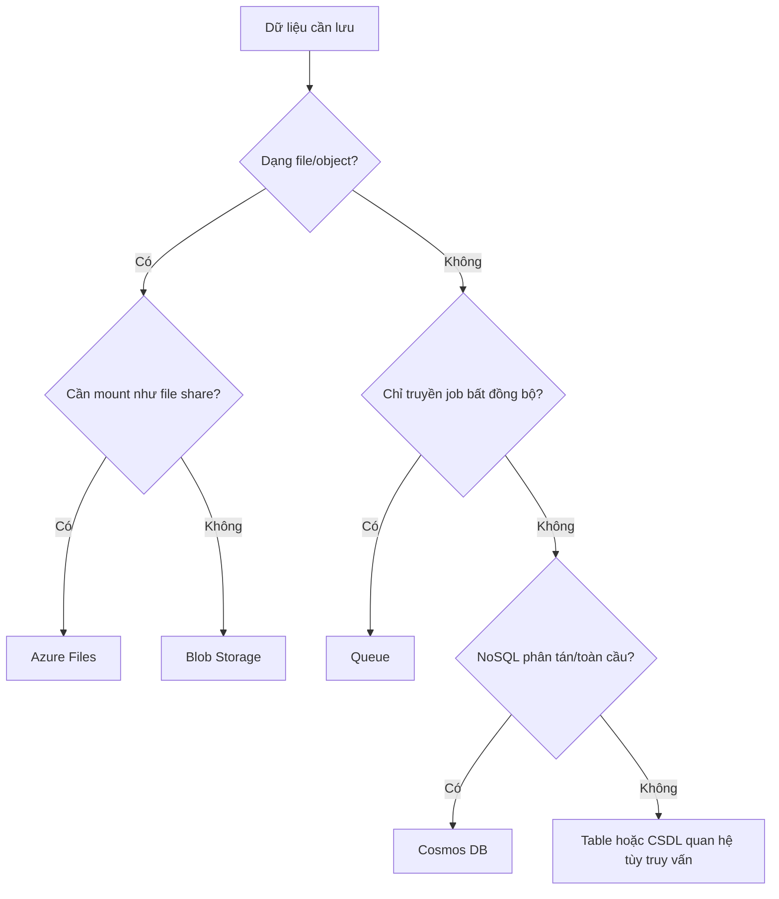

# Week 02 - Cloud service, mô hình triển khai và lưu trữ Azure

> 🟦 **Mục tiêu tuần:** Phân biệt IaaS/PaaS/SaaS và public/private/community/hybrid cloud; chọn đúng Blob, File, Queue, Table hoặc Cosmos DB; cấp quyền dữ liệu an toàn.

## 1. Lịch học

| Mốc | Thời lượng | Nội dung | Kết quả cần có |
|---|---:|---|---|
| Thứ Hai, 21/09/2026 | 19:30-21:00 | Đặc tính cloud, SOA, SLA, co giãn | Phân tích được một dịch vụ có thật sự là cloud hay không |
| Thứ Tư, 23/09/2026 | 19:30-21:00 | Service model và deployment model | Chọn đúng IaaS/PaaS/SaaS cho một yêu cầu |
| Thứ Bảy, 26/09/2026 | 08:30-10:30 | Azure Storage, SAS, Cosmos DB | Tạo kho Blob, cấp quyền ngắn hạn và dọn tài nguyên |

## 2. Cloud có những đặc tính gì?

| Khái niệm | Hiểu đơn giản | Ví dụ thực tế |
|---|---|---|
| **Scalability** | Khả năng hệ thống tăng quy mô để phục vụ tải lớn hơn. | Ứng dụng từ 2 tăng lên 10 server khi số người dùng tăng lâu dài. |
| **Elasticity** | Tăng/giảm tài nguyên nhanh theo tải, thường tự động. | Hệ thống bán vé tăng worker trong 30 phút cao điểm rồi giảm về mức cũ. |
| **Availability** | Xác suất dịch vụ sẵn sàng tại thời điểm người dùng cần. | API đạt 99,9% thời gian hoạt động trong tháng. |
| **Reliability** | Khả năng cho kết quả đúng và ổn định trong một khoảng thời gian. | Dịch vụ thanh toán không làm mất hoặc nhân đôi giao dịch dù retry. |
| **Fault tolerance** | Tiếp tục phục vụ khi một thành phần hỏng. | Một node chết nhưng load balancer chuyển request sang node khác. |
| **Resilience** | Phát hiện, chịu đựng và phục hồi sau sự cố. | Database failover sang bản sao rồi đồng bộ lại khi primary trở về. |
| **Manageability** | Có thể quan sát và điều khiển hệ thống bằng portal, API, policy. | Ops xem CPU, đặt cảnh báo và scale từ một dashboard. |
| **Interoperability** | Các hệ thống khác nhau trao đổi qua giao diện/chuẩn chung. | Ứng dụng Java gọi REST API của dịch vụ viết bằng .NET. |
| **QoS** | Các tiêu chí chất lượng như latency, throughput, availability. | Video phải bắt đầu phát trong dưới 2 giây ở p95. |
| **SLA** | Cam kết đo được giữa nhà cung cấp và khách hàng, kèm phạm vi/điều kiện. | Nhà cung cấp cam kết uptime tháng; vi phạm có thể được service credit. |
| **SOA** | Xây hệ thống từ các dịch vụ có giao diện rõ ràng và có thể tái sử dụng. | Dịch vụ kiểm tra tồn kho được web, mobile và POS cùng sử dụng. |
| **Multi-tenancy** | Nhiều khách hàng dùng chung hạ tầng/phần mềm nhưng dữ liệu được cô lập. | Một ứng dụng CRM phục vụ nhiều công ty, mỗi bản ghi có `tenant_id`. |
| **Measured service** | Mức sử dụng được đo để giám sát và tính phí. | Số GB-tháng lưu trữ và số request được ghi nhận riêng. |

> 🟥 **Dễ nhầm:** **Scalability** là khả năng chịu quy mô lớn; **elasticity** nhấn mạnh việc co giãn theo thời gian và nhu cầu.

## 3. Chọn mô hình dịch vụ

| Mô hình | Bạn quản lý | Nhà cung cấp quản lý | Ví dụ thực tế |
|---|---|---|---|
| **IaaS** | OS, runtime, ứng dụng, dữ liệu | Server vật lý, storage, network, ảo hóa | Thuê Azure VM để chạy phần mềm cũ cần quyền root. |
| **PaaS** | Code, cấu hình ứng dụng, dữ liệu | Hạ tầng, OS, runtime nền | Deploy API lên Azure App Service mà không vá hệ điều hành. |
| **SaaS** | Người dùng, dữ liệu/cấu hình được cho phép | Toàn bộ ứng dụng và stack | Dùng Microsoft 365/Gmail qua trình duyệt. |
| **FaaS / serverless** | Hàm và logic kích hoạt | Cấp phát, runtime, co giãn theo sự kiện | Upload ảnh vào Blob sẽ kích hoạt Function tạo thumbnail. |

**Mẹo chọn:** Chọn mức trừu tượng **cao nhất** vẫn đáp ứng yêu cầu kiểm soát. Ví dụ, website chuẩn nên thử PaaS trước; chỉ chọn VM khi thật sự cần quyền hệ điều hành hoặc phần mềm đặc thù.

## 4. Chọn mô hình triển khai

| Mô hình | Khi phù hợp | Ví dụ thực tế |
|---|---|---|
| **Public cloud** | Cần triển khai nhanh, quy mô linh hoạt, không muốn sở hữu data center. | Startup chạy API trên Azure. |
| **Private cloud** | Cần quyền kiểm soát hạ tầng/chính sách nội bộ rất cao. | Ngân hàng vận hành cloud riêng trong data center của mình. |
| **Community cloud** | Nhiều tổ chức có chung yêu cầu pháp lý/nghiệp vụ. | Nhóm bệnh viện dùng hạ tầng chung tuân thủ cùng chuẩn dữ liệu y tế. |
| **Hybrid cloud** | Một phần dữ liệu/hệ thống phải ở on-premises nhưng cần cloud để mở rộng. | Hệ thống lõi ở nội bộ, web front-end và DR ở Azure. |

## 5. Azure Storage và Cosmos DB

| Khái niệm | Dùng khi nào | Ví dụ thực tế |
|---|---|---|
| **Storage account** | Biên quản trị cho các dịch vụ dữ liệu Azure Storage. | Một ứng dụng ảnh có Blob container và Queue trong cùng account. |
| **Blob Storage** | Lưu object/file không cấu trúc. | Ảnh sản phẩm, video, backup, log. |
| **Azure Files** | Cần file share qua SMB/NFS. | Nhiều server cùng mount thư mục cấu hình dùng chung. |
| **Queue Storage** | Giao tiếp bất đồng bộ đơn giản. | Web đẩy job “resize ảnh”; worker lấy job xử lý sau. |
| **Table Storage** | Key-value/NoSQL đơn giản, truy cập theo partition/row key. | Lưu trạng thái thiết bị IoT theo `deviceId`. |
| **SAS** | Cấp quyền giới hạn theo tài nguyên, hành động và thời hạn. | Cho người dùng upload trực tiếp một ảnh trong 10 phút mà không lộ account key. |
| **Access key** | Khóa cấp quyền rất rộng cho storage account. | Chỉ hệ thống quản trị khẩn cấp dùng; không nhúng vào mobile app. |
| **Firewall/private endpoint** | Hạn chế đường mạng được phép truy cập storage. | Chỉ subnet backend mới đọc được hồ sơ khách hàng. |
| **Cosmos DB** | NoSQL phân tán cần độ trễ thấp và phân phối toàn cầu. | Giỏ hàng cần được đọc nhanh ở nhiều khu vực địa lý. |
| **Partition key** | Khóa quyết định cách dữ liệu và lưu lượng được phân bố. | Chọn `customerId` cho giỏ hàng để thao tác của nhiều khách được dàn đều. |
| **Request Unit (RU)** | Đơn vị chuẩn hóa chi phí tài nguyên của thao tác Cosmos DB. | Query quét toàn bộ container tốn nhiều RU hơn point-read theo `id` + partition key. |
| **Consistency level** | Mức cân bằng giữa tính mới nhất, latency, throughput và availability. | Session consistency bảo đảm người vừa cập nhật hồ sơ đọc thấy thay đổi của chính mình. |
| **Geo-replication/failover** | Sao dữ liệu sang region khác để đọc gần người dùng hoặc phục hồi. | Ứng dụng toàn cầu chuyển đọc sang region dự phòng khi region chính gặp sự cố. |

### Chuỗi suy luận khi chọn storage

## 6. Trick tối ưu chi phí, hiệu năng và bảo mật

- **Blob:** đặt lifecycle rule chuyển dữ liệu ít truy cập sang tier rẻ hơn rồi xóa đúng hạn. Ví dụ log 30 ngày chuyển cool, 180 ngày xóa.
- **Định dạng:** dữ liệu phân tích nên ưu tiên Parquet nén thay vì CSV lớn; ví dụ query chỉ 3 cột không cần đọc toàn bộ bản ghi.
- **SAS:** ưu tiên user-delegation SAS/Entra ID, quyền tối thiểu, thời hạn ngắn; tuyệt đối không đưa account key vào Git.
- **Cosmos DB:** chọn partition key có cardinality cao và phân bố đều; tránh khóa như `country` nếu 90% dữ liệu là `VN`.
- Dùng **point read** khi biết `id` và partition key; tránh query cross-partition không cần thiết.
- Chọn throughput phù hợp mẫu tải; workload thưa/khó đoán có thể cân nhắc serverless, workload ổn định mới so sánh provisioned/autoscale.
- Chỉ bật multi-region khi RTO/RPO và người dùng thực sự cần; mỗi bản sao tăng chi phí.
- Đặt budget và xóa account thử nghiệm sau khi lấy đủ bằng chứng.

## 7. Thực hành sau buổi học

### Lab chính - Blob + SAS có thời hạn

1. Tạo `rg-is402-w02`, gắn tag tuần và ngày hết hạn.
2. Tạo một StorageV2 account với redundancy chi phí thấp phù hợp lab.
3. Tạo container private `images`, upload một ảnh mẫu.
4. Xác nhận URL blob không truy cập công khai được.
5. Tạo SAS chỉ có quyền **read**, hết hạn sau 10 phút; mở URL có SAS để kiểm chứng.
6. Chờ SAS hết hạn hoặc thu hồi cơ chế cấp quyền, kiểm chứng truy cập bị từ chối.
7. Bật lifecycle rule mẫu cho prefix `logs/` và giải thích rule, không cần chờ rule chạy.
8. Xóa `rg-is402-w02`.

**Bài mở rộng Cosmos DB:** Thiết kế 8 document giỏ hàng với `customerId` làm partition key. So sánh một point-read và một query lọc theo `productName`; giải thích thao tác nào dự kiến tốn RU hơn.

**Bằng chứng cần nộp:** sơ đồ quyền truy cập, ảnh container private, SAS đã hết hạn, mẫu JSON Cosmos DB và bảng so sánh 2 truy vấn.

## 8. Tự kiểm tra

- [ ] Đặt một workload bất kỳ vào đúng IaaS/PaaS/SaaS và giải thích lý do.
- [ ] Nêu ví dụ riêng cho availability, reliability và resilience.
- [ ] Phân biệt Blob, File, Queue, Table và Cosmos DB.
- [ ] Giải thích vì sao partition key kém có thể vừa chậm vừa đắt.
- [ ] Không còn tài nguyên tuần 2.

## 9. Nguồn học tuần này

- Slide: [Buổi 02 - Cloud Computing Platform](../Buoi02_CloudComputingPlatform_01.pdf), trang 2-21.
- Slide: [Lecture 2 - Introduction to Cloud Computing](../Lecture%202%20-%20Introduction%20to%20Cloud%20Computing.pdf), trang 3-55 và 81-121.
- Giáo trình Marinescu: Chương 1-2, đặc biệt 2.1 và 2.6-2.10.
- Giáo trình Buyya: Chương 1, mục 1.3-1.8.
- Tài liệu hiện hành: [Azure Storage SAS](https://learn.microsoft.com/azure/storage/common/storage-sas-overview), [Cosmos DB partitioning](https://learn.microsoft.com/azure/cosmos-db/partitioning), [Cosmos DB consistency](https://learn.microsoft.com/azure/cosmos-db/consistency-levels).

---

**Một câu cần nhớ:** <strong>Chọn đúng mô hình dịch vụ và đúng kiểu lưu trữ trước khi tối ưu cấu hình.</strong>
