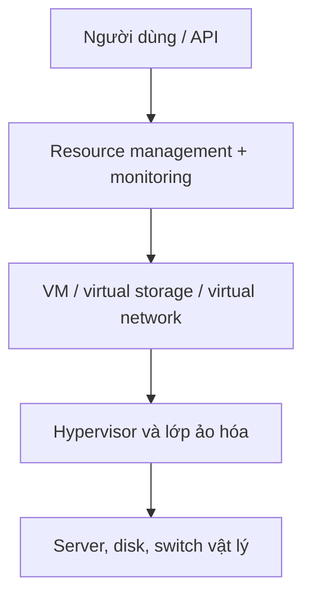

# Week 03 - IaaS, mạng ảo và truy vấn Data Lake

> 🟦 **Mục tiêu tuần:** Hiểu IaaS che giấu hạ tầng vật lý như thế nào; thiết kế VNet/subnet không chồng lấn; kết nối hai VNet bằng peering; biết vì sao định dạng và cách viết truy vấn ảnh hưởng trực tiếp đến chi phí Data Lake.

## 1. Lịch học

| Mốc | Thời lượng | Nội dung | Kết quả cần có |
|---|---:|---|---|
| Thứ Hai, 28/09/2026 | 19:30-21:00 | Kiến trúc IaaS và vòng đời VM | Mô tả được lớp abstraction và hai interface chính |
| Thứ Tư, 30/09/2026 | 19:30-21:00 | Network virtualization, VNet, subnet, peering | Vẽ được IP plan không chồng lấn |
| Thứ Bảy, 03/10/2026 | 08:30-10:30 | VNet lab và Synapse serverless concept | Tạo peering, kiểm chứng trạng thái và ước tính dữ liệu quét |

## 2. IaaS nhìn từ kiến trúc

| Khái niệm | Hiểu đơn giản | Ví dụ thực tế |
|---|---|---|
| **Infrastructure as a Service** | Thuê compute, storage và network đã được ảo hóa; khách hàng vẫn quản lý OS và ứng dụng. | Doanh nghiệp chuyển phần mềm kế toán cũ lên Azure VM mà chưa sửa code. |
| **Abstraction** | Che chi tiết phần cứng và cung cấp một giao diện logic ổn định. | Người dùng xin “VM 2 vCPU/8 GB” mà không cần biết CPU nằm ở server vật lý nào. |
| **Resource pool** | Gom tài nguyên vật lý thành một tập chung để cấp phát động. | Hàng trăm host trong data center cung cấp VM cho nhiều khách hàng. |
| **Resource management interface** | API/portal để tạo, dừng, resize, snapshot hoặc xóa tài nguyên. | Azure CLI tạo VM và gắn disk bằng lệnh. |
| **System monitoring interface** | Thu thập metric/log như CPU, RAM, I/O, dung lượng và băng thông. | Cảnh báo khi CPU VM vượt 80% trong 10 phút. |
| **VM lifecycle** | Các trạng thái tạo, chạy, tạm dừng/deallocate, resume và terminate. | VM dev chỉ chạy giờ hành chính rồi deallocate ban đêm. |
| **Thin provisioning** | Cấp dung lượng logic lớn hơn phần vật lý thực dùng và bổ sung dần. | Volume hiển thị 1 TB nhưng mới tiêu thụ 80 GB dữ liệu thật. |
| **Load balancing** | Phân phối tải qua nhiều instance. | 10 web server nhận request sau một load balancer. |
| **Live migration** | Di chuyển VM đang chạy giữa host với downtime rất nhỏ. | Nhà cung cấp bảo trì host vật lý mà ứng dụng vẫn phục vụ. |

## 3. Từ mạng vật lý đến mạng ảo

| Khái niệm | Hiểu đơn giản | Ví dụ thực tế |
|---|---|---|
| **Packet switching** | Dữ liệu được chia thành packet, có thể đi qua nhiều đường rồi ghép lại. | Cuộc gọi Internet vẫn tiếp tục khi router chọn đường khác. |
| **LAN / WAN** | LAN giới hạn trong khu vực nhỏ; WAN nối qua khoảng cách địa lý lớn. | Mạng phòng lab là LAN; kết nối trụ sở TP.HCM - Hà Nội là WAN. |
| **Network virtualization** | Gom/chia tài nguyên và chức năng mạng thành mạng logic quản trị bằng phần mềm. | Hai nhóm dùng chung switch vật lý nhưng ở hai mạng logic tách biệt. |
| **External virtualization** | Ảo hóa giữa nhiều thiết bị/mạng vật lý. | VLAN tách mạng sinh viên và giảng viên trên cùng hệ thống switch. |
| **Internal virtualization** | Tạo mạng logic giữa VM/container trong một host. | Ba VM nối qua virtual switch của hypervisor. |
| **VLAN / 802.1Q** | Gắn tag ở lớp 2 để chia broadcast domain. | Cổng switch cùng thiết bị vật lý nhưng VLAN 10 không thấy VLAN 20 nếu chưa route. |
| **VPN / tunnel** | Đóng gói lưu lượng để tạo đường logic qua mạng khác. | Nhân viên từ nhà kết nối an toàn vào mạng công ty. |
| **MPLS** | Chuyển tiếp theo label, thường dùng trong mạng nhà cung cấp. | Nhà mạng tạo đường riêng logic giữa các chi nhánh doanh nghiệp. |
| **GRE** | Tunnel đóng gói nhiều giao thức mạng, bản thân không cung cấp mã hóa. | Nối hai mạng private qua hạ tầng IP; nếu cần bảo mật thường kết hợp IPsec. |
| **TUN / TAP** | Thiết bị mạng ảo: TUN xử lý IP lớp 3, TAP xử lý Ethernet frame lớp 2. | QEMU nối NIC của VM vào Linux bridge qua TAP. |
| **Virtual switch** | Switch phần mềm nối VM với nhau và với NIC vật lý. | Hai VM backend trao đổi trong host mà packet không cần ra switch vật lý. |
| **VNet** | Ranh giới mạng logic riêng trong Azure. | `vnet-app` chứa subnet web và subnet database. |
| **CIDR/address space** | Ký hiệu dải IP và độ dài prefix. | `10.10.0.0/16` có thể chia thành các subnet `/24`. |
| **Subnet** | Phần nhỏ của VNet dùng phân đoạn tài nguyên và policy. | Web ở `10.10.1.0/24`, database ở `10.10.2.0/24`. |
| **NSG** | Tập luật allow/deny lưu lượng theo nguồn, đích, cổng và giao thức. | Chỉ subnet web được gọi database qua cổng 5432. |
| **VNet peering** | Kết nối riêng giữa hai VNet qua backbone của Azure. | VNet ứng dụng giao tiếp VNet dữ liệu mà không dùng public Internet. |
| **Hub-and-spoke** | VNet hub chứa dịch vụ dùng chung, các spoke chứa workload riêng. | Firewall/DNS ở hub; dev, test, prod là ba spoke. |

> 🟥 **Dễ nhầm:** Peering tạo kết nối nhưng **không tự biến mọi luồng thành hợp lệ**. NSG, route và firewall vẫn có thể chặn traffic. Hai VNet peering cũng phải có dải địa chỉ không chồng lấn.

## 4. Data Lake và Synapse serverless SQL

| Khái niệm | Hiểu đơn giản | Ví dụ thực tế |
|---|---|---|
| **Data Lake** | Kho lưu dữ liệu thô và đã xử lý ở quy mô lớn, thường trên object storage. | Lưu clickstream JSON, giao dịch Parquet và ảnh sản phẩm trong ADLS Gen2. |
| **ADLS Gen2** | Blob Storage có hierarchical namespace phục vụ analytics. | Pipeline tổ chức file theo `/sales/year=2026/month=09/`. |
| **Serverless SQL pool** | Chạy SQL trực tiếp trên file mà không duy trì cluster SQL riêng. | Analyst dùng `OPENROWSET` đọc Parquet của tháng 9. |
| **Schema-on-read** | Cấu trúc được áp khi đọc thay vì bắt buộc trước khi ghi. | Cùng log JSON được đọc theo các trường khác nhau cho hai báo cáo. |
| **Partition pruning** | Chỉ đọc thư mục/phân vùng liên quan đến điều kiện truy vấn. | Lọc `year=2026/month=09` thay vì quét 5 năm dữ liệu. |
| **Column pruning** | Chỉ đọc các cột cần thiết của định dạng cột. | Query `customer_id,total` trên Parquet không đọc trường mô tả dài. |

## 5. Trick tối ưu

- Lập IP plan trước khi tạo VNet; chồng CIDR khiến peering hoặc kết nối hybrid khó triển khai lại.
- Không tạo public IP cho VM chỉ để kiểm tra nội bộ; dùng private connectivity khi có thể.
- Peering có chi phí xử lý dữ liệu; đặt các thành phần giao tiếp nhiều ở topology/region hợp lý.
- NSG theo **least privilege**; không mở `0.0.0.0/0` tới SSH/RDP.
- Với serverless SQL, ưu tiên **Parquet nén**, file có kích thước tương đối đồng đều và partition theo cột lọc phổ biến.
- Tránh `SELECT *`; chọn đúng cột và đường dẫn partition để giảm byte được quét.
- Tách storage dùng cho analytics khỏi workload ghi dày nếu bị throttling.
- Dùng tags/budget và xóa resource group ngay sau lab.

## 6. Thực hành sau buổi học

### Lab chính - Hai VNet và peering không cần VM

1. Tạo `rg-is402-w03`.
2. Tạo `vnet-app` với address space `10.10.0.0/16`, subnet `app` là `10.10.1.0/24`.
3. Tạo `vnet-data` với address space `10.20.0.0/16`, subnet `data` là `10.20.1.0/24`.
4. Tạo peering hai chiều, kiểm tra trạng thái **Connected**.
5. Tạo NSG mẫu: chỉ cho subnet app truy cập TCP 443 vào subnet data; không cần gắn VM để tránh phí compute.
6. Vẽ route mong đợi từ `10.10.1.4` tới `10.20.1.4` và nêu lớp nào có thể chặn.
7. Xóa resource group.

### Bài mở rộng - Ước tính dữ liệu quét

Giả sử bộ CSV 100 GB có 20 cột. Sau khi đổi sang Parquet còn 25 GB; query chỉ dùng 4/20 cột và chỉ đọc một tháng trong 12 tháng. Hãy ước lượng thô lượng dữ liệu cần đọc và giải thích vì sao kết quả thực tế có thể khác.

**Đáp án định hướng:** xấp xỉ `25 × 4/20 × 1/12 ≈ 0,42 GB` nếu phân bố đều và pruning hoạt động; thực tế phụ thuộc compression, row group, partition, metadata và cách viết query.

**Bằng chứng cần nộp:** sơ đồ CIDR, ảnh trạng thái peering, bảng NSG, phép tính dung lượng quét và xác nhận cleanup.

## 7. Tự kiểm tra

- [ ] Nêu được phần nào do khách hàng và nhà cung cấp quản lý trong IaaS.
- [ ] Phân biệt internal và external network virtualization.
- [ ] Giải thích VLAN, tunnel, virtual switch bằng ví dụ.
- [ ] Thiết kế hai VNet không chồng CIDR.
- [ ] Giải thích tại sao Parquet + pruning giảm cả thời gian lẫn chi phí.

## 8. Nguồn học

- Slide: [Lecture 3 - Introduction to IaaS](../Lecture%203%20-%20Introduction%20to%20IaaS.pdf), trang 13-45.
- Slide: [Lecture 3.3 - Network Virtualization](../Lecture%203.3%20-%20Network%20virtualization.pdf), trang 5-54.
- Slide: [Buổi 01 - Giới thiệu](../Buoi01_GioiThieu_02.pdf), trang 10-12.
- Giáo trình Marinescu: Chương 5-6 và 7.3.
- Tài liệu hiện hành: [Azure VNet peering](https://learn.microsoft.com/azure/virtual-network/virtual-network-peering-overview), [Synapse serverless SQL best practices](https://learn.microsoft.com/azure/synapse-analytics/sql/best-practices-serverless-sql-pool).

---

**Một câu cần nhớ:** <strong>Mạng cloud tốt bắt đầu từ IP plan đúng; truy vấn Data Lake rẻ bắt đầu từ cách tổ chức file đúng.</strong>
