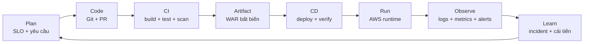
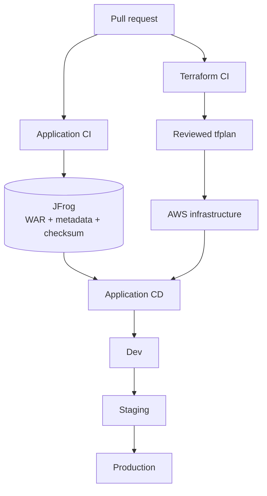
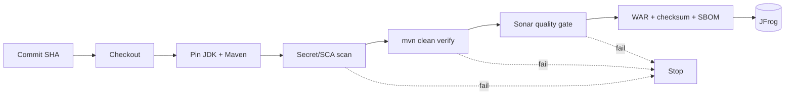
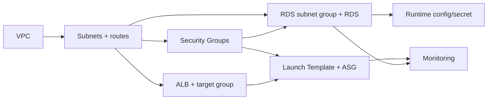
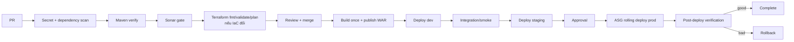

# DevOps Playbook cho Project 01

Tài liệu này lấy [DevOps Project 01](https://github.com/tuan-devops/DevOps-Projects/tree/master/DevOps-Project-01) làm case study. Mục tiêu không phải chỉ học cách tạo EC2/RDS, mà là hiểu vì sao một thay đổi phải đi qua từng bước từ Git đến production và quay lại thành feedback.

> Trạng thái repository tại commit `a38cc0fc72d8d127c8eeaf0a16b7724fb9aba7f1`: có ứng dụng Java demo và Terraform scaffold, nhưng chưa có pipeline CI/CD hoàn chỉnh và chưa deploy được nguyên trạng.

## 1. Tư duy DevOps cần lấy từ project này

DevOps không phải là danh sách Maven, SonarCloud, JFrog, Terraform và AWS. Mỗi công cụ chịu trách nhiệm cho một câu hỏi khác nhau:


| Câu hỏi                                            | Công cụ/khái niệm trả lời                |
| ------------------------------------------------------ | ------------------------------------------------ |
| Code thay đổi ở đâu, ai thay đổi và vì sao? | Git, pull request, review                      |
| Code có compile, test và đạt chuẩn không?      | Maven, test, SonarCloud, security scan         |
| Binary nào chính xác sẽ được phát hành?     | WAR versioned, checksum, JFrog                 |
| Hạ tầng mong muốn trông như thế nào?          | Terraform                                      |
| Hệ thống chạy ở đâu?                           | VPC, ALB, EC2/ASG, RDS                         |
| Config và secret lấy từ đâu?                    | Environment configuration, Secrets Manager/SSM |
| Làm sao thay phiên bản mà ít downtime?          | Rolling/immutable/blue-green deployment        |
| Làm sao biết release tốt hay xấu?                | Health check, smoke test, CloudWatch, alert    |
| Nếu xấu thì làm gì?                             | Stop promotion, rollback, incident feedback    |

Một quy trình DevOps hoàn chỉnh phải tạo thành vòng kín:



Repository hiện có một phần `Code`, một phần `Artifact`, `Infrastructure` và `Observe`; các mắt xích `PR gate`, `CI orchestration`, `artifact-to-server deployment`, `post-deploy verification` và `rollback` đang thiếu.

## 2. Ba pipeline khác nhau, không nên trộn lẫn

### Pipeline A — Application CI

Kiểm tra source và tạo đúng một WAR đáng tin cậy.

### Pipeline B — Infrastructure delivery

Kiểm tra Terraform, review execution plan và tạo/thay đổi AWS resources.

### Pipeline C — Application CD

Lấy WAR đã được CI tạo, đưa đúng phiên bản lên môi trường, kiểm tra sức khỏe và promote hoặc rollback.

Không nên chạy `terraform apply` cho mọi thay đổi giao diện nhỏ. Ngược lại, không nên rebuild WAR trong từng môi trường. Hai pipeline chỉ phối hợp khi một release cần cả thay đổi app và hạ tầng.



## 3. Trước CI: xác định “đủ tốt để release”

### Bước 0 — Định nghĩa yêu cầu vận hành

**Làm gì**

- Xác định endpoint chính: `/`, `/register`, `/login` và một endpoint riêng như `/actuator/health`.
- Đặt SLO ví dụ: availability, latency p95, tỷ lệ lỗi, thời gian phục hồi.
- Xác định RTO/RPO cho database, mức tải dự kiến, ngân sách và dữ liệu nhạy cảm.
- Xác định môi trường `dev`, `staging`, `prod` và ai được phép promote.

**Tại sao**

Không có tiêu chí thành công thì không thể thiết kế health check, alarm, Auto Scaling hay rollback. “CPU > 70%” chỉ là một con số; nó chỉ hữu ích khi được nối với mục tiêu phục vụ người dùng.

**Đầu ra**

- Definition of Done cho code và release.
- SLO/SLI, threat model cơ bản và acceptance test.
- Quyết định kiến trúc có căn cứ: có thực sự cần Nginx, Redis, CloudFront hay multi-VPC không.

**Repo hiện tại**

README tuyên bố high availability, auto-scaling, security và monitoring nhưng không đưa ra SLO/RTO/RPO hoặc tải mục tiêu. Vì thế nhiều dịch vụ được liệt kê mà chưa có lý do nghiệp vụ cụ thể.

## 4. Source control và pull request

### Bước 1 — Tạo thay đổi nhỏ, review được

**Làm gì**

1. Tạo branch ngắn hạn cho một thay đổi.
2. Commit cả code, test, schema migration hoặc Terraform liên quan.
3. Mở pull request với mục tiêu, rủi ro, cách kiểm thử và kế hoạch rollback.
4. Yêu cầu review và bắt buộc CI pass trước merge.

**Tại sao**

- Git cung cấp lịch sử và khả năng truy nguyên.
- PR là nơi con người review quyết định; pipeline review tính đúng đắn máy móc.
- Thay đổi nhỏ giảm blast radius và dễ rollback hơn thay đổi lớn.
- Branch protection ngăn merge khi build/test/scan thất bại.

**Gate**

PR không được merge khi thiếu review, CI đỏ, có secret, có lỗ hổng nghiêm trọng hoặc Terraform plan không được hiểu rõ.

**Repo hiện tại**

Repository có Git nhưng không có workflow CI trong `.github/workflows`; `.github` chỉ chứa file funding. Do đó push/PR không tự kích hoạt kiểm tra nào.

## 5. Application CI: từ source đến WAR



### Bước 2 — Checkout đúng commit

**Làm gì**

CI lấy chính xác commit SHA của pull request hoặc `main`.

**Tại sao**

Branch name có thể di chuyển; commit SHA là định danh bất biến. Mọi artifact, deployment và log sau này phải truy ngược được về SHA này.

**Đầu ra**

Workspace sạch chứa đúng source revision.

### Bước 3 — Pin toolchain

**Làm gì**

- Chọn JDK cụ thể.
- Dùng Maven Wrapper có đủ `.mvn/wrapper` hoặc pin phiên bản Maven trên runner.
- Cache Maven dependencies theo hash của `pom.xml`.

**Tại sao**

“Build được trên máy tôi” thường do khác Java/Maven/dependency cache. Pin toolchain làm build tái lập; cache chỉ tối ưu tốc độ, không được thay đổi kết quả.

**Repo hiện tại**

Project khai báo Java 11 nhưng wrapper thiếu thư mục `.mvn/wrapper` và file `mvnw` không có executable bit trên Unix.

### Bước 4 — Quét secret và dependency trước build sâu

**Làm gì**

- Secret scanning: không cho credential/token vào Git.
- Software composition analysis: kiểm tra thư viện có CVE và license không phù hợp.
- Có thể tạo SBOM để biết production đang chứa dependency nào.

**Tại sao**

Chạy sớm để fail nhanh, tránh mất thời gian build artifact vốn không bao giờ được phép phát hành. SBOM giúp trả lời nhanh khi một CVE mới xuất hiện.

**Gate**

- Phát hiện secret: dừng pipeline, revoke/rotate secret; chỉ xóa khỏi commit là chưa đủ.
- CVE vượt policy: dừng hoặc yêu cầu exception có thời hạn.

**Repo hiện tại**

Datasource và JFrog credential đã nằm trong Git. Đây là lỗi P0; không được đưa các giá trị đó sang secret store rồi tiếp tục dùng lại vì chúng đã phải được coi là compromised.

### Bước 5 — Compile và test bằng Maven

**Làm gì**

```bash
mvn -B -ntp clean verify
```

`verify` chạy đầy đủ lifecycle tới bước kiểm tra package, thay vì build trước bằng `-DskipTests` rồi mới chạy test như README.

**Tại sao**

- Compile bắt lỗi kiểu và dependency.
- Unit test kiểm tra logic nhanh.
- Integration test kiểm tra controller ↔ database/schema.
- Một lệnh duy nhất làm artifact chỉ được tạo khi các kiểm tra trước đó pass.

**Gate**

Bất kỳ compile/test nào fail thì không tạo release artifact.

**Repo hiện tại**

`mvn test` dừng ngay khi đọc [`pom.xml`](https://github.com/tuan-devops/DevOps-Projects/blob/master/DevOps-Project-01/Java-Login-App/pom.xml): dependency `mysql:mysql-connector-java` thiếu version với BOM Spring Boot 2.7.18. Project chỉ có một test `contextLoads()` nên ngay cả sau khi sửa build, login/register vẫn chưa được kiểm chứng.

### Bước 6 — Static analysis và Quality Gate

**Làm gì**

SonarCloud phân tích bug, vulnerability, code smell, duplication và coverage; pipeline chờ kết quả quality gate.

**Tại sao**

Compiler chỉ biết code có hợp lệ về cú pháp/kiểu. Nó không bắt được nhiều pattern nguy hiểm như SQL ghép chuỗi hoặc code khó bảo trì. Quality gate biến kết quả phân tích thành một quyết định tự động: pass mới đi tiếp.

**Gate gợi ý**

- Không có vulnerability/bug mới mức nghiêm trọng.
- Coverage trên code mới đạt ngưỡng của team.
- Không có secret hoặc security hotspot chưa review.

SonarQube Cloud định nghĩa quality gate là tập điều kiện cho kết quả phân tích và trả trạng thái Passed/Failed; pipeline có thể bị dừng nếu gate fail. Xem [SonarQube Cloud quality gates](https://docs.sonarsource.com/sonarqube-cloud/standards/quality-gates).

**Repo hiện tại**

SonarCloud chỉ xuất hiện trong README; không có scanner config, workflow hay bước chờ quality gate.

### Bước 7 — Đóng gói artifact bất biến

**Làm gì**

- Maven tạo WAR một lần.
- Gắn version với release/commit SHA, ví dụ `dptweb-1.0.0+<sha>.war`.
- Tạo checksum, build metadata và SBOM.
- Không nhúng credential hoặc environment-specific configuration vào WAR.

**Tại sao**

Nguyên tắc quan trọng là **build once, deploy many**. Dev, staging và production phải dùng cùng một byte-for-byte artifact; chỉ config/secret khác nhau. Nếu rebuild ở production, thứ được test không còn là thứ được phát hành.

**Đầu ra**

Một WAR có identity, checksum, provenance và kết quả test/scan đi kèm.

### Bước 8 — Publish tới JFrog

**Làm gì**

CI dùng token ngắn hạn/secret của runner để upload WAR vào release repository và xuất build-info.

**Tại sao**

Git lưu source; artifact repository lưu binary đã build. JFrog trở thành source of truth để CD lấy đúng phiên bản, hỗ trợ retention, quyền truy cập, provenance và rollback mà không phải rebuild commit cũ. JFrog mô tả Artifactory vừa là nguồn dependency vừa là đích publish Maven artifact; xem [Maven repositories](https://docs.jfrog.com/artifactory/docs/maven-repositories).

**Gate**

Upload, checksum và metadata phải thành công. Chỉ artifact đã qua các gate trước mới được đưa vào release repository.

**Repo hiện tại**

POM có `distributionManagement`, nhưng credential bị commit và không có CI gọi `mvn deploy`/JFrog CLI. File `settings.xml` đặt trong project cũng không tự động được Maven đọc nếu không truyền `-s` hoặc đặt đúng vị trí.

## 6. Infrastructure pipeline: từ Terraform đến AWS

### Bước 9 — Bootstrap identity và Terraform state

**Làm gì**

- CI đăng nhập AWS bằng OIDC và assume role theo least privilege; không giữ access key dài hạn.
- Tạo remote state backend riêng, mã hóa và có locking/versioning.
- Tách state và quyền cho `dev`, `staging`, `prod`.

**Tại sao**

Terraform state chứa mapping resource và có thể chứa dữ liệu nhạy cảm. State local dễ mất, khó phối hợp và dễ apply đồng thời. OIDC cấp credential ngắn hạn cho đúng repo/branch/environment, giảm rủi ro secret AWS lâu dài. GitHub hướng dẫn OIDC cho phép workflow truy cập AWS mà không lưu long-lived AWS credentials: [GitHub OIDC with AWS](https://docs.github.com/en/actions/how-tos/secure-your-work/security-harden-deployments/oidc-in-aws).

**Repo hiện tại**

Có block S3 backend nhưng mọi tham số bị comment; chưa có cấu hình locking hoặc CI identity.

### Bước 10 — Format, validate và policy/security scan

**Làm gì**

```bash
terraform fmt -check -recursive
terraform init -backend=false
terraform validate
```

Sau đó chạy linter/security/policy checks phù hợp.

**Tại sao**

- `fmt`: diff nhất quán, review dễ.
- `validate`: bắt reference, type và cấu hình trùng trước khi gọi AWS.
- Linter/policy: bắt cấu hình hợp lệ về cú pháp nhưng nguy hiểm về vận hành, ví dụ SSH mở toàn internet hoặc database không có deletion protection.

**Gate**

Bất kỳ lỗi syntax/reference/duplicate block hoặc policy P0 nào đều dừng trước `plan/apply`.

**Repo hiện tại**

`alb`, `asg` và `rds` khai báo output trùng trong `variables.tf` và `outputs.tf`, nên cấu hình chưa vượt qua bước validate. Hai module còn tạo ALB Security Group cùng tên trong một VPC.

### Bước 11 — Tạo và review execution plan

**Làm gì**

```bash
terraform plan -out=tfplan
```

Pipeline lưu `tfplan`, hiển thị resource nào sẽ add/change/destroy và gắn kết quả vào pull request.

**Tại sao**

Review HCL cho biết ý định; review plan cho biết tác động sau khi Terraform kết hợp code, state và provider. Đây là nơi phát hiện nhầm subnet, recreate RDS, thay security rule hoặc phá resource.

**Gate**

- Không có destroy ngoài dự kiến.
- Thay đổi production phải có người sở hữu hệ thống approve.
- Plan được approve phải là đúng plan sẽ apply, không chạy lại một plan khác sau approval.

### Bước 12 — Apply theo dependency graph

Terraform tự suy ra dependency từ reference, nhưng người học nên hiểu lý do thứ tự:



1. **VPC trước** vì mọi network resource cần boundary/VPC ID.
2. **Subnet/route trước** vì ALB, EC2 và RDS cần nơi đặt network interface.
3. **IGW/NAT** vì public ingress và private outbound phụ thuộc route.
4. **Security Group** vì ALB/app/DB cần rule theo quan hệ giữa tầng.
5. **RDS** vì app cần endpoint/schema/secret để kết nối.
6. **ALB/target group** vì ASG phải đăng ký instance vào target group.
7. **Launch Template/ASG** vì đây là nơi chạy artifact.
8. **Monitoring cuối** vì alarm cần ID của ASG/RDS/log group.

“Cuối” ở đây là quan hệ logic; Terraform vẫn chạy song song những resource không phụ thuộc nhau.

### Tại sao từng AWS component tồn tại?


| Component       | Lý do                                                       | Nếu bỏ đi                                                                            |
| ----------------- | -------------------------------------------------------------- | ----------------------------------------------------------------------------------------- |
| VPC             | Boundary mạng do team kiểm soát                           | Không có chỗ định nghĩa subnet/route/security riêng                              |
| Public subnet   | Đặt internet-facing ALB và NAT Gateway                    | Không có public ingress/egress point                                                  |
| Private subnet  | Không cấp đường inbound trực tiếp cho app/DB          | EC2/DB dễ bị lộ ra internet                                                          |
| IGW             | Kết nối public route với internet                         | ALB public không phục vụ được client                                              |
| NAT Gateway     | Cho private EC2 tải patch/artifact mà không nhận inbound | EC2 private không ra internet; có thể thay bằng VPC endpoint cho một số dịch vụ |
| ALB             | Một endpoint ổn định, health check và chia HTTP request | Client phải biết từng EC2 và instance lỗi vẫn có thể nhận traffic              |
| Target group    | Danh sách backend và health state                          | ALB không biết chuyển request tới đâu                                             |
| Launch Template | Khuôn immutable-ish cho instance mới                       | Instance tạo ra không đồng nhất                                                    |
| ASG             | Duy trì số lượng, thay instance lỗi và scale ngang     | Phải vận hành EC2 thủ công                                                         |
| RDS             | Managed MySQL, backup, patching và storage                  | Team phải tự vận hành database trên EC2                                            |
| Security Group  | Firewall stateful theo quan hệ ALB → app → DB             | Các tầng có thể nói chuyện quá rộng                                             |
| CloudWatch      | Tập trung metric/log/alarm                                  | Không biết release có làm hệ thống xấu đi                                       |

## 7. Application CD: từ JFrog đến ASG

### Bước 13 — Chọn artifact, không rebuild

**Làm gì**

CD nhận một artifact coordinate/version và checksum đã publish từ CI.

**Tại sao**

Promotion phải di chuyển cùng artifact qua các môi trường. Rollback chỉ là chọn artifact version trước, không checkout rồi build lại.

### Bước 14 — Inject configuration và secret lúc runtime

**Làm gì**

- DB endpoint, database name và feature flags đến từ config theo environment.
- DB credential lấy từ Secrets Manager/SSM bằng IAM role của instance.
- WAR không chứa password; pipeline log cũng không in secret.

**Tại sao**

Code giống nhau giữa các môi trường nhưng config khác nhau. Tách config cho phép rotate credential mà không rebuild app và ngăn secret xuất hiện trong Git/artifact.

### Bước 15 — Chạy database migration có version

**Làm gì**

Dùng Flyway/Liquibase để quản lý schema, chạy migration một lần trước hoặc trong release theo chiến lược an toàn.

**Tại sao**

README hiện có hai schema không thống nhất (`UserDB.Employee` và `javaapp.users`). SQL chạy tay không có lịch sử, không biết môi trường đang ở schema version nào và khó rollback.

**Gate**

Migration phải backward-compatible khi phiên bản app cũ và mới cùng chạy trong rolling deployment. Thường dùng chiến lược expand → deploy → contract thay vì rename/drop ngay.

### Bước 16 — Đưa WAR lên instance

Có hai hướng học:

1. **Deploy bằng CodeDeploy/SSM**: dễ tiếp cận, đưa WAR vào Tomcat và chạy lifecycle hooks.
2. **Bake AMI rồi ASG Instance Refresh**: WAR + runtime nằm trong image versioned; instance mới không phụ thuộc download lúc boot, phù hợp immutable infrastructure hơn.

Không nên để user data mỗi lần boot tự tải `latest.war`: “latest” không truy nguyên được, credential tải artifact khó quản lý và JFrog/network lỗi có thể làm cả đợt scale-out thất bại.

**Repo hiện tại**

Launch template chỉ `yum install` Java/Tomcat và start service; không có bước đưa WAR vào `/var/lib/tomcat/webapps` hoặc tương đương. Đây là mắt xích thiếu lớn nhất.

### Bước 17 — Rolling/immutable rollout qua ASG

**Làm gì**

- Tạo Launch Template/AMI version mới.
- Thay từng nhóm instance, không sửa tay toàn bộ máy đang chạy.
- Instance mới phải pass ALB health check trước khi instance cũ bị loại.
- Giới hạn số instance unavailable trong mỗi đợt.

**Tại sao**

Rolling giảm downtime; immutable replacement ngăn configuration drift. Nếu một instance lỗi, không SSH vào “vá”; sửa image/config và thay instance để lần scale-out sau vẫn nhất quán.

### Bước 18 — Health check và smoke test

**Làm gì**

1. **Process health**: Tomcat/Java process chạy.
2. **Readiness**: app đã load config và sẵn sàng nhận traffic.
3. **Dependency health**: cân nhắc kiểm tra DB nhưng tránh làm health endpoint quá mong manh.
4. **Smoke test sau deploy**: gọi một luồng read-only hoặc test account qua ALB.

**Tại sao**

Process chạy không có nghĩa ứng dụng phục vụ đúng. ALB chỉ chuyển traffic cho target healthy, còn smoke test xác nhận đường thật client → ALB → app → dependency.

**Repo hiện tại**

Target group check `/`, nhưng không có endpoint health chuyên dụng, WAR chưa được deploy và context path external Tomcat chưa được thống nhất. Health check vì thế không chứng minh app login đang hoạt động.

### Bước 19 — Promote môi trường

**Làm gì**

```text
same WAR SHA → dev → integration tests → staging → approval → production
```

**Tại sao**

- Dev phát hiện lỗi cấu hình sớm.
- Staging kiểm tra kiến trúc gần production.
- Approval production là risk control, không phải thao tác deploy thủ công.
- Cùng artifact bảo đảm thứ đã test chính là thứ được release.

AWS khuyến nghị pipeline bao gồm source, build, test, staging và production; nếu một stage fail thì pipeline dừng và không đi tiếp. Xem [AWS — Understanding CI/CD](https://docs.aws.amazon.com/prescriptive-guidance/latest/strategy-cicd-litmus/understanding-cicd.html).

### Bước 20 — Rollback tự động hoặc có kiểm soát

**Trigger**

- ALB unhealthy target tăng.
- HTTP 5xx/latency vượt ngưỡng.
- Smoke test fail.
- Error rate của app tăng sau release.

**Làm gì**

Ngừng thay instance, chuyển lại Launch Template/AMI/artifact version trước và kiểm tra phục hồi. Database migration phải được thiết kế để app cũ còn chạy được; rollback binary không tự động rollback dữ liệu an toàn.

**Tại sao**

Deployment không hoàn chỉnh nếu chỉ biết đi tới. Rollback là một phần của thiết kế release, không phải quyết định bộc phát khi incident xảy ra.

## 8. Runtime operations: hệ thống chạy và tự phản hồi

### Bước 21 — Load balancing và Auto Scaling

ALB và ASG giải quyết hai vấn đề khác nhau:

- ALB quyết định **request đi tới instance nào** và loại target unhealthy.
- ASG quyết định **cần bao nhiêu instance** và thay instance hỏng.

Chỉ đặt `min=2`, `max=6`, `desired=2` chưa phải dynamic scaling. Cần target-tracking policy, ví dụ dựa trên `ALBRequestCountPerTarget` hoặc CPU, cùng cooldown/warm-up. Request count thường gần nhu cầu phục vụ hơn CPU đối với web app, nhưng phải đo thực tế.

**Lý do giữ ít nhất hai instance**

Một instance có thể bị thay, patch hoặc lỗi; instance còn lại tiếp tục phục vụ. Hai instance nên trải trên hai AZ. Điều này chỉ bảo vệ application tier; RDS cũng phải Multi-AZ mới giảm single point of failure ở data tier.

### Bước 22 — Logs, metrics và alerts

**Metrics nên có**

- ALB: request count, target response time, HTTP 4xx/5xx, healthy host count.
- EC2/ASG: CPU, memory, disk, instance count, lifecycle failure.
- JVM/Tomcat: heap, GC pause, thread pool, request latency/error.
- RDS: CPU, connections, free memory/storage, latency, replica lag nếu có.
- Business: login success/failure, registration success/failure — không log password/PII.

**Logs nên có**

- Structured application logs có timestamp, level, request/correlation ID và release version.
- Tomcat access/error logs.
- ALB access logs.
- VPC Flow Logs cho network troubleshooting.
- CloudTrail cho thay đổi control plane.

**Alert nên có**

Alert phải yêu cầu hành động và đi tới SNS/on-call; không phải cứ có metric là có monitoring. Ba alarm trong repo đều có `alarm_actions = []`, nên hiện chỉ ghi trạng thái chứ chưa thông báo hoặc scale.

**Tại sao gắn release version vào telemetry**

Khi error rate tăng, operator cần trả lời “bắt đầu từ release nào?”. Nếu log/metric/deployment event cùng chứa version/commit SHA, việc tương quan và rollback nhanh hơn.

### Bước 23 — Feedback sau release

**Làm gì**

- Theo dõi deployment frequency, lead time for changes, change failure rate và time to restore.
- Sau incident, tạo action item vào backlog, thêm test/alert/runbook để lỗi không lặp lại.
- Review chi phí NAT Gateway, RDS và instance so với tải thật.

**Tại sao**

DevOps không kết thúc khi pipeline xanh. Giá trị nằm ở việc dùng dữ liệu production để cải thiện code, test, architecture và quy trình. AWS cũng khuyến nghị theo dõi build/deployment frequency, lead time và thời gian qua pipeline trong [CI/CD guidance](https://docs.aws.amazon.com/prescriptive-guidance/latest/aws-caf-platform-perspective/ci-cd.html).

## 9. Bảng “điều gì xảy ra nếu…”


| Tình huống                 | Cơ chế nên phản ứng         | Lý do                                            |
| ------------------------------ | ---------------------------------- | --------------------------------------------------- |
| Compile/test fail            | CI dừng                         | Không tạo artifact không đáng tin            |
| Sonar gate fail              | CI dừng trước publish         | Không đưa lỗi chất lượng vào release repo |
| Terraform validate fail      | Không tạo plan                 | Lỗi cấu hình chưa được phép chạm AWS     |
| Plan có destroy RDS         | Yêu cầu review/deny policy     | Ngăn mất dữ liệu ngoài ý muốn              |
| JFrog upload/checksum fail   | Không chạy CD                  | CD không có artifact xác định                |
| Instance mới không healthy | Dừng rollout, giữ instance cũ | Bảo toàn availability                           |
| Smoke test fail              | Rollback artifact/image          | Hạ tầng healthy chưa chắc nghiệp vụ đúng  |
| CPU cao ngắn hạn           | Warm-up/cooldown trước scale   | Tránh scale dao động                           |
| 5xx tăng sau deploy         | Alarm + rollback                 | Metric gắn với release cho thấy regression     |
| DB migration lỗi            | Dừng deployment                 | App mới có thể không tương thích schema    |
| Secret bị phát hiện       | Revoke/rotate, dừng pipeline    | Xóa khỏi file không làm secret hết bị lộ   |

## 10. Trạng thái của Project 01 theo chuỗi DevOps


| Stage                       |   Có trong repo? | Nhận xét                                                              |
| ----------------------------- | ------------------: | ------------------------------------------------------------------------- |
| Git/source                  |               Có | Repository và code có sẵn                                            |
| PR policy/branch protection | Không thể hiện | Không có policy-as-code                                               |
| Maven build                 |        Một phần | POM hiện không resolve được MySQL dependency                       |
| Automated tests             |          Rất ít | Chỉ`contextLoads()`                                                    |
| Secret/SCA scan             |            Không | Đang có credential trong Git                                          |
| SonarCloud gate             |            Không | Chỉ được nhắc trong README                                         |
| WAR artifact                |    Thiết kế có | Build hiện hỏng                                                       |
| JFrog publish               |        Một phần | Có`distributionManagement`, thiếu pipeline và secret handling đúng |
| Terraform modules           |               Có | Cấu trúc tốt cho học, nhưng validate/apply chưa sạch             |
| Remote state/OIDC           |            Không | S3 backend chỉ là placeholder                                         |
| Application deploy          |            Không | ASG không nhận WAR                                                    |
| Environment promotion       |            Không | Không có dev/stage/prod pipeline                                      |
| Health/smoke test           |        Một phần | Chỉ có ALB`/` health check                                            |
| Dynamic scaling             |            Không | Có ASG bounds, không có scaling policy                               |
| Logs/metrics                |        Một phần | Flow Logs + alarm; app log shipping/action thiếu                       |
| Rollback                    |            Không | Không có artifact/image rollback automation                           |
| Feedback metrics            |            Không | Không có DORA/SLO/runbook                                             |

## 11. Pipeline đích phù hợp nhất cho project

Vì code nằm trên GitHub, một lựa chọn dễ học là GitHub Actions làm orchestrator; Maven/Sonar/JFrog/Terraform vẫn giữ đúng vai trò:



Các workflow nên tách:

- `pr-app.yml`: secret/SCA scan, Maven verify, Sonar quality gate.
- `pr-infra.yml`: Terraform fmt/validate/security scan/plan, comment plan vào PR.
- `release.yml`: version + publish WAR/JFrog + provenance.
- `deploy.yml`: promote một artifact version qua environment, health/smoke/rollback.

Tách file giúp quyền rõ hơn: PR CI không cần quyền deploy production; infra apply role khác app deploy role; production environment có approval riêng.

## 12. Lộ trình lab để học DevOps từ repository này

### Lab 1 — Làm build xanh

- Sửa MySQL dependency, Maven Wrapper và test.
- Mục tiêu học: reproducible build và Maven lifecycle.

### Lab 2 — Làm app an toàn và test được

- Prepared SQL/JPA, Spring Security + BCrypt, controller stateless, Testcontainers.
- Mục tiêu học: pipeline chỉ mạnh khi application có test contract tốt.

### Lab 3 — Làm Terraform validate/plan sạch

- Xóa output trùng, hợp nhất ALB SG, thêm variable validation và root outputs.
- Mục tiêu học: module input/output, dependency graph và execution plan.

### Lab 4 — Tạo PR CI

- Maven verify, secret/SCA scan, Sonar gate, Terraform checks.
- Mục tiêu học: fail fast và quality gate.

### Lab 5 — Artifact management

- Tạo version theo tag/SHA, publish WAR + checksum/build-info lên JFrog.
- Mục tiêu học: build once, deploy many và provenance.

### Lab 6 — CD vào ASG

- Chọn CodeDeploy/SSM trước; sau đó thử AMI + Instance Refresh.
- Mục tiêu học: rollout, readiness, smoke test và rollback.

### Lab 7 — Production feedback

- CloudWatch Agent, structured logs, dashboard, SNS alarm, scaling policy, release marker.
- Mục tiêu học: observability, SLO và feedback loop.

Thứ tự này có chủ ý: không nên dựng pipeline deploy trước khi build/test đáng tin; không nên bật auto scaling trước khi instance mới tự cấu hình và healthy; không nên gọi hệ thống là production trước khi có quan sát và rollback.

## 13. Câu hỏi tự kiểm tra

Sau khi học xong, bạn nên trả lời được:

1. Vì sao Terraform tạo được EC2 nhưng chưa có nghĩa app đã được deploy?
2. Vì sao ASG có `min/max/desired` vẫn chưa phải auto scaling theo tải?
3. Vì sao ALB health check pass chưa đủ chứng minh login hoạt động?
4. Vì sao không rebuild WAR riêng cho staging và production?
5. Vì sao JFrog khác GitHub?
6. Vì sao SonarCloud phải là gate chứ không chỉ là report?
7. Vì sao private EC2 cần NAT hoặc VPC endpoint?
8. Vì sao DB subnet group có hai subnet chưa đồng nghĩa RDS Multi-AZ?
9. Vì sao rollback binary dễ hơn rollback database?
10. Metric/log nào cho biết release mới làm production xấu đi?

Nếu trả lời được mười câu này bằng chính code của Project 01, bạn đã hiểu phần DevOps cốt lõi của project sâu hơn nhiều so với việc chỉ chạy các lệnh trong README.
