# DevOps Playbook cho Project 30

Tài liệu này phân tích [DevOps Project 30](https://github.com/tuan-devops/DevOps-Projects/tree/a38cc0fc72d8d127c8eeaf0a16b7724fb9aba7f1/DevOps-Project-30) với trọng tâm: một thay đổi đi từ Git đến production như thế nào, tại sao mỗi công cụ xuất hiện, đâu là gate thật sự, và hệ thống phản hồi ra sao khi release hỏng.

Project gốc chỉ chứa một README hướng dẫn. README lại checkout repository ứng dụng [full-stack-blogging-app](https://github.com/ougabriel/full-stack-blogging-app/tree/74d291fe6d5b5c6b92050be41ab4d805b3c8b4e9), nơi có `Jenkinsfile`, `Dockerfile`, Kubernetes manifest và Terraform. Vì vậy tài liệu này đối chiếu cả hai repository, không chỉ diễn giải sơ đồ trong README.

> Kết luận ngắn: đây là một lab tốt để học cách Jenkins nối Maven, SonarQube, Nexus, Trivy, Docker và EKS. Tuy nhiên nó chưa phải “production deployment” hay “full monitoring” theo nghĩa vận hành thực tế. Nhiều phần còn làm tay, các quality/security check chưa chặn pipeline, lần deploy tiếp theo có thể không rollout, dữ liệu không bền và monitoring mới chỉ kiểm tra endpoint từ bên ngoài.

## 1. Bản đồ tư duy DevOps của project

Đừng học project này như một danh sách lệnh cài đặt. Hãy nhìn mỗi công cụ như người chịu trách nhiệm trả lời một câu hỏi:

| Câu hỏi DevOps | Công cụ trong project | Trách nhiệm đúng |
|---|---|---|
| Ai đổi code nào? | GitHub/Git | Version control, review, commit SHA và audit trail |
| Ai điều phối các bước? | Jenkins | Pipeline orchestration, credential binding, gate và log |
| Code Java có build/test được không? | Maven | Lifecycle, dependency, test, package JAR |
| Code có nợ kỹ thuật hoặc lỗi tĩnh không? | SonarQube | Static analysis, coverage và Quality Gate |
| JAR nào đã được phát hành? | Nexus | Lưu binary có version, metadata, checksum, provenance |
| Source/image có lỗ hổng không? | Trivy | Secret, dependency, misconfiguration và image scan |
| Đóng gói runtime thế nào? | Docker | Tạo container image nhất quán giữa các môi trường |
| Image chạy và tự phục hồi ở đâu? | Kubernetes trên EKS | Scheduling, replica, rollout, service discovery |
| AWS infrastructure được mô tả ở đâu? | Terraform | Desired state, plan, apply và lịch sử thay đổi IaC |
| Hệ thống có truy cập được không? | Blackbox Exporter | Probe HTTP/TCP/DNS từ góc nhìn bên ngoài |
| Metrics được lưu và truy vấn ở đâu? | Prometheus | Scrape time series, query và evaluate alert rules |
| Con người quan sát bằng gì? | Grafana | Dashboard và trực quan hóa |
| Ai nhận thông báo khi lỗi? | Chưa có đúng nghĩa | Cần Alertmanager/on-call; email Jenkins chỉ báo kết quả build |

Vòng lặp đầy đủ phải là:

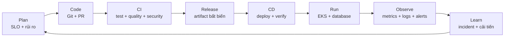

Project hiện minh họa được nhiều hộp trong sơ đồ, nhưng chưa nối chúng thành một vòng kín đáng tin cậy.

## 2. Project thực sự chứa gì?

### 2.1 Repository DevOps-Projects

Thư mục `DevOps-Project-30` chỉ có một file `README.md`. Không có source app, `Jenkinsfile`, Terraform module hay Kubernetes manifest tại đây. Vai trò của nó là runbook cài đặt thủ công.

README hướng dẫn:

1. Tạo riêng các EC2 cho Jenkins, SonarQube, Nexus và monitoring.
2. Cài plugin, Java, Maven, Docker, Trivy, Terraform và `kubectl` bằng lệnh tay.
3. Dùng Terraform từ một máy quản trị để tạo EKS.
4. Tạo ServiceAccount/RBAC/token Kubernetes thủ công rồi đưa token vào Jenkins.
5. Chạy Jenkins pipeline lấy code từ repository thứ hai.
6. Cấu hình DNS và bộ Prometheus–Grafana–Blackbox thủ công.

### 2.2 Repository ứng dụng

Repository được Jenkins checkout mới chứa phần implementation:

| File | Vai trò |
|---|---|
| [`pom.xml`](https://github.com/ougabriel/full-stack-blogging-app/blob/74d291fe6d5b5c6b92050be41ab4d805b3c8b4e9/pom.xml) | Spring Boot, Java 17, Maven, JaCoCo, Nexus endpoints |
| [`Jenkinsfile`](https://github.com/ougabriel/full-stack-blogging-app/blob/74d291fe6d5b5c6b92050be41ab4d805b3c8b4e9/Jenkinsfile) | CI/CD pipeline chính |
| [`Dockerfile`](https://github.com/ougabriel/full-stack-blogging-app/blob/74d291fe6d5b5c6b92050be41ab4d805b3c8b4e9/Dockerfile) | Đóng gói JAR vào Temurin JDK 17 Alpine |
| [`deployment-service.yml`](https://github.com/ougabriel/full-stack-blogging-app/blob/74d291fe6d5b5c6b92050be41ab4d805b3c8b4e9/deployment-service.yml) | Deployment 2 replica và Service LoadBalancer |
| [`EKS_Terraform/main.tf`](https://github.com/ougabriel/full-stack-blogging-app/blob/74d291fe6d5b5c6b92050be41ab4d805b3c8b4e9/EKS_Terraform/main.tf) | VPC, subnets, IAM, EKS, node group |
| [`RBAC.md`](https://github.com/ougabriel/full-stack-blogging-app/blob/74d291fe6d5b5c6b92050be41ab4d805b3c8b4e9/RBAC.md) | ServiceAccount và Role cho Jenkins |

Đây là bài học đầu tiên: **README tuyên bố kiến trúc không phải là bằng chứng hệ thống có kiến trúc đó**. Khi review DevOps, luôn lần theo chain:

```text
Documentation -> source -> pipeline -> artifact -> manifest -> cloud state -> telemetry
```

## 3. Ứng dụng làm gì?

Ứng dụng là blog nhỏ viết bằng Spring Boot 3.3.2 và Java 17:

- người dùng đăng ký, đăng nhập và đăng xuất;
- password được băm bằng BCrypt;
- người dùng tạo và xem post;
- Thymeleaf render giao diện phía server;
- Spring Data JPA truy cập database;
- Spring Security kiểm soát xác thực;
- H2 là database runtime.

Luồng logic rút gọn:

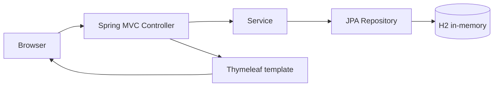

Điều quan trọng với DevOps không phải thuộc controller nào gọi service nào, mà là hiểu đặc tính vận hành của app:

- JAR cần JVM 17.
- App lắng nghe cổng 8080.
- Database nằm trong memory của từng process.
- HTTP session cũng ở trong từng process nếu không cấu hình ngoài.
- Không có Spring Boot Actuator/Micrometer, nên Prometheus không có metrics nội bộ để scrape.
- Chỉ có một test `contextLoads()`, chưa test hành vi đăng ký, đăng nhập hay tạo bài.

Những đặc tính đó quyết định cách scale, health check, data persistence và monitoring.

## 4. Kiến trúc hiện tại — đúng theo code và README

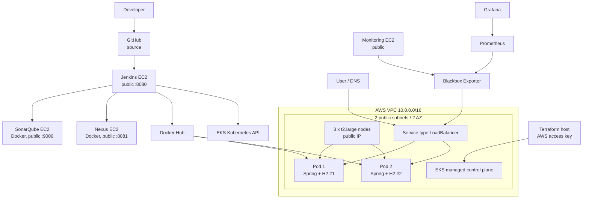

### Những gì sơ đồ này nói lên

1. **Control plane**: EKS quản lý Kubernetes API/control plane; EC2 node group chạy workload.
2. **Data plane**: hai Pod nhận traffic qua một AWS Load Balancer do Service tạo.
3. **Delivery plane**: Jenkins build, scan, publish rồi dùng credential Kubernetes để apply manifest.
4. **Artifact plane**: Nexus giữ JAR, Docker Hub giữ image. Image mới là release unit được EKS chạy.
5. **Observability plane**: Blackbox probe URL, Prometheus thu metrics probe, Grafana hiển thị.

### Điểm cần sửa trong cách gọi tên

Manifest dùng `Service.type: LoadBalancer`; nó không khai báo Ingress, AWS Load Balancer Controller hay annotation ALB. Vì vậy không thể kết luận đây là ALB chỉ từ source. Muốn ALB Layer 7 cần Ingress/Gateway và controller tương ứng; một Service LoadBalancer thường tạo load balancer Layer 4 tùy controller và cấu hình của cluster.

## 5. Ba pipeline nên tách biệt

Project hiện trộn provisioning thủ công, application CI và CD trong cùng một hành trình. Tư duy tốt hơn là tách ba pipeline:

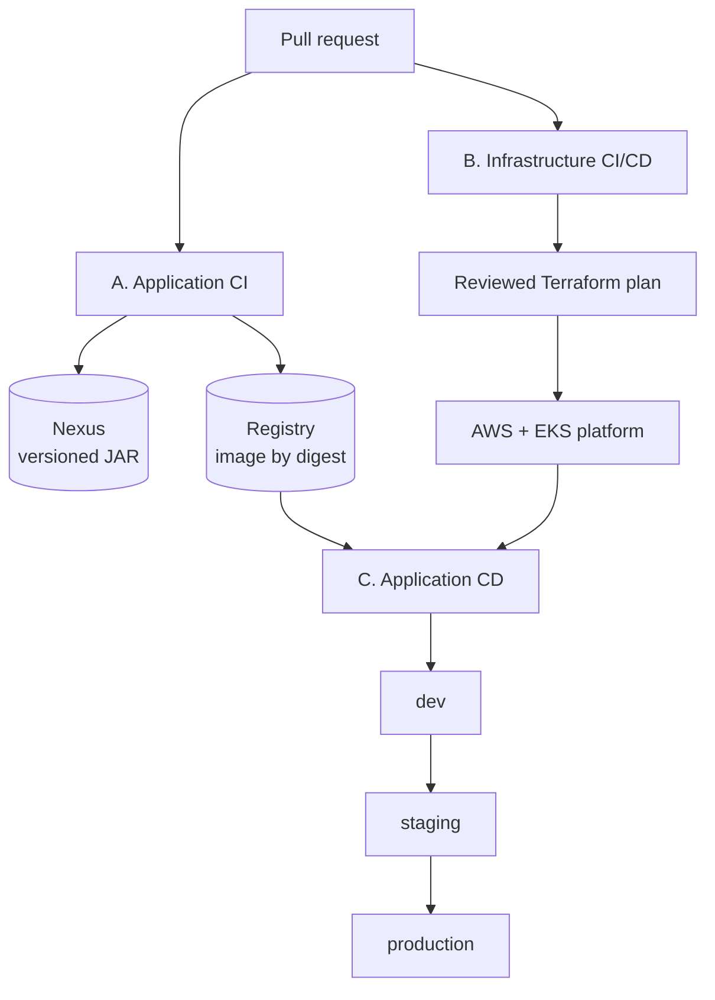

- **Application CI** thay đổi thường xuyên, kết quả là artifact bất biến.
- **Infrastructure pipeline** chạy khi IaC thay đổi, có plan và approval riêng.
- **Application CD** lấy artifact đã có; không rebuild cho từng môi trường.

Không nên `terraform apply` EKS chỉ vì sửa một dòng HTML. Cũng không nên build lại image khi promote từ staging sang production, vì hai môi trường sẽ không còn chạy cùng binary.

## 6. Pipeline Jenkins hiện tại chạy như thế nào?

```mermaid
flowchart LR
    CO["Checkout main"] --> COM["mvn compile"]
    COM --> TFS["Trivy fs<br/>report only"]
    TFS --> SON["Sonar scan<br/>no gate"]
    SON --> PKG["mvn package"]
    PKG --> NEX["mvn deploy<br/>Nexus"]
    NEX --> DB["docker build<br/>:latest"]
    DB --> TI["Trivy image<br/>report only"]
    TI --> PUSH["push Docker Hub<br/>:latest"]
    PUSH --> KAPPLY["kubectl apply"]
    KAPPLY --> SLEEP["sleep 20"]
    SLEEP --> GET["kubectl get pods/service"]
```

### Nhận xét tổng quát

Pipeline thể hiện đúng ý tưởng “commit đi qua build → quality → security → artifact → container → deploy”, nhưng implementation thiếu các gate khiến nhiều bước chỉ tạo cảm giác an toàn:

- Trivy có thể tìm thấy CRITICAL nhưng pipeline vẫn xanh.
- SonarQube có thể Quality Gate đỏ nhưng pipeline vẫn tiếp tục.
- `kubectl get pods` có thể in Pod lỗi nhưng command vẫn trả exit code 0.
- `latest` được push nhưng Deployment template không đổi, nên không chắc có rollout.
- `post` block nằm ngoài `pipeline {}` và không phải cấu trúc Declarative Pipeline hợp lệ.

Một pipeline không được đánh giá bằng số lượng stage; nó được đánh giá bằng **điều kiện nào khiến release dừng lại**.

## 7. Giải thích từng bước CI/CD và lý do

### Bước 1 — Trigger và checkout source

**Project làm gì**

Jenkins checkout branch `main` từ GitHub bằng URL cố định.

**Tại sao cần bước này**

Mọi pipeline cần input xác định: repository, revision và context của thay đổi. Git cung cấp lịch sử, PR cung cấp review, commit SHA cung cấp định danh bất biến.

**Vấn đề hiện tại**

- Pipeline không thể hiện webhook/PR trigger.
- Luôn checkout `main`, không chắc build đúng SHA đã kích hoạt job.
- Không đưa commit SHA vào version của JAR, image label hay deployment annotation.

**Cách làm production**

- Multibranch Pipeline hoặc webhook PR.
- Checkout chính xác `$GIT_COMMIT`.
- Gắn SHA vào build metadata, ví dụ `blog:git-74d291f` và OCI labels.
- Branch protection chỉ cho merge sau khi CI pass và review đủ.

**Gate**: không checkout được đúng revision hoặc source không sạch thì dừng.

### Bước 2 — Pin toolchain

**Project làm gì**

Jenkins khai báo tool có tên `jdk` và `maven`; project yêu cầu Java 17.

**Tại sao**

Build phụ thuộc vào compiler, Maven và plugin version. Nếu agent hôm nay dùng Java 17, ngày mai Java 21, kết quả có thể đổi dù source không đổi.

**Quan sát thực tế**

Chạy `mvn clean verify` trên Java 21 vẫn BUILD SUCCESS, nhưng JaCoCo 0.8.8 báo không instrument được class Java 21 (`Unsupported class file major version 65`). Điều này cho thấy build xanh chưa chắc báo cáo coverage đúng. Jenkins dự định dùng JDK 17 nên có thể tránh lỗi, hoặc nên nâng JaCoCo.

**Cách làm production**

- Pin JDK 17 và Maven version bằng image agent hoặc toolchain versioned.
- Dùng ephemeral agent, không build trên Jenkins controller.
- Cache Maven theo `pom.xml`, nhưng không đưa `target/` cũ sang build mới.

**Gate**: sai toolchain hoặc dependency resolution thất bại thì dừng.

### Bước 3 — Compile

**Project làm gì**

Chạy `mvn compile`.

**Tại sao**

Compile phát hiện syntax/type/dependency error sớm và tạo bytecode cho SonarScanner (`sonar.java.binaries=target`).

**Vấn đề**

Lifecycle Maven bị chạy lặp lại: `compile`, sau đó `package`, sau đó `deploy`. `package` và `deploy` sẽ đi lại qua các phase trước, gây tốn thời gian và có thể chạy test nhiều lần.

**Cách tốt hơn**

Chạy một lifecycle nhất quán:

```bash
mvn -B -ntp clean verify
```

Sau khi tất cả gate pass mới publish bằng một chiến lược tránh rebuild, hoặc dùng `deploy` trong một lần lifecycle được kiểm soát.

### Bước 4 — Test và coverage

**Project làm gì**

Không có stage `Test` riêng, nhưng `mvn package` và `mvn deploy` mặc định chạy test. JaCoCo được cấu hình trong Maven.

**Tại sao**

- Unit test phản hồi nhanh về logic.
- Integration test kiểm tra controller, persistence và security flow.
- Coverage chỉ ra vùng chưa được test; nó không chứng minh code đúng.

**Kết quả kiểm chứng ở commit được phân tích**

| Chỉ số | Kết quả |
|---|---:|
| Maven build | Success |
| Test | 1/1 pass |
| Test thực chất | Chỉ `contextLoads()` |
| Line coverage | 46/119 = 38,7% |
| Instruction coverage | 156/401 = 38,9% |
| Branch coverage | 0/4 = 0% |

Coverage hiện bị “đẹp giả” vì khởi động Spring đã chạy qua configuration và bean wiring. Các journey quan trọng chưa được chứng minh:

- đăng ký trùng username;
- login đúng/sai password;
- quyền tạo/xóa post;
- persistence và validation;
- session khi có nhiều replica.

**Gate nên có**

- test fail → dừng;
- publish JUnit report trong Jenkins;
- Quality Gate tập trung vào **new code**, không chỉ ép tổng coverage tùy tiện;
- test integration với database cùng loại production.

### Bước 5 — Trivy filesystem scan

**Project làm gì**

Chạy `trivy fs . --format table -o fs.html`.

**Tại sao**

Filesystem scan có thể phát hiện vulnerable dependencies, secret và một số cấu hình sai trước khi tốn chi phí build/deploy.

**Vấn đề cốt lõi**

Trivy mặc định có thể trả exit code 0 dù phát hiện issue. Pipeline chỉ xuất report HTML, không có `--exit-code`, nên đây là **report**, không phải **security gate**.

**Cách làm production**

Ví dụ policy cơ bản:

```bash
trivy fs --scanners vuln,secret,misconfig \
  --severity HIGH,CRITICAL \
  --exit-code 1 \
  --ignore-unfixed \
  .
```

- Chạy secret scan càng sớm càng tốt.
- Có file ignore với owner, lý do và ngày hết hạn; không ignore vô thời hạn.
- Lưu SARIF/JSON làm evidence, nhưng console gate phải trả non-zero.

**Gate**: secret hoặc vulnerability vượt policy → dừng trước khi publish.

### Bước 6 — SonarQube analysis và Quality Gate

**Project làm gì**

Chạy SonarScanner với project key/name và binary trong `target`.

**Tại sao**

SonarQube tập trung vào bug pattern, vulnerability, maintainability, duplication và coverage. Nó bổ sung cho test chứ không thay test.

**Vấn đề cốt lõi**

Gửi kết quả phân tích không có nghĩa là gate đã pass. Pipeline thiếu `waitForQualityGate`, vì vậy có thể deploy trước khi Sonar xử lý xong hoặc dù gate đỏ.

**Cách làm production**

```groovy
stage('Sonar analysis') {
  steps {
    withSonarQubeEnv('sonarqube') {
      sh 'mvn sonar:sonar'
    }
  }
}
stage('Quality Gate') {
  steps {
    timeout(time: 10, unit: 'MINUTES') {
      waitForQualityGate abortPipeline: true
    }
  }
}
```

SonarQube cần webhook về Jenkins. Gate nên ưu tiên new code để đội không bị chặn bởi toàn bộ legacy debt ngay ngày đầu.

**Gate**: Quality Gate không xanh hoặc timeout → không package release.

### Bước 7 — Package JAR

**Project làm gì**

`mvn package` tạo Spring Boot JAR trong `target/`.

**Tại sao**

Source không phải thứ production chạy; binary đã test mới là đơn vị cần quản lý. Package tách thời điểm build khỏi thời điểm deploy.

**Đầu ra nên có**

- JAR versioned;
- checksum;
- commit SHA, build number và timestamp;
- test/quality/security evidence;
- SBOM.

### Bước 8 — Publish JAR lên Nexus

**Project làm gì**

Jenkins dùng Maven settings chứa credential rồi `mvn deploy` tới Nexus release/snapshot repository. URL Nexus và repository distribution được hard-code trong `pom.xml` bằng HTTP/public IP.

**Tại sao cần Nexus**

- tách artifact khỏi workspace tạm của Jenkins;
- version, checksum và retention;
- consumer khác có thể dùng lại JAR;
- hỗ trợ audit: build nào sinh binary nào.

**Nexus khác Docker registry ra sao?**

Nexus ở project này lưu **Maven JAR**; Docker Hub lưu **container image**. Nếu image là đơn vị production chạy, registry image/digest mới là release unit trực tiếp. Nexus vẫn hữu ích cho thư viện Java, binary provenance hoặc quy trình enterprise, nhưng không nên giữ nó chỉ để có thêm một logo trong kiến trúc.

**Vấn đề hiện tại**

- README hướng dẫn `admin/admin`, anonymous access và HTTP.
- Release repository được hướng dẫn “Allow redeploy”. Cùng một version có thể bị ghi đè, phá reproducibility và rollback.
- `mvn deploy` lặp lifecycle build.
- Endpoint gắn với public IP; IP đổi là build hỏng.

**Cách làm production**

- TLS + internal DNS + authentication/least privilege.
- Release version bất biến; `Disable redeploy`.
- Snapshot có thể mutable theo policy, release thì không.
- Credential từ Jenkins Credentials/secret manager, không ghi trong Git.
- Retention, backup và restore test cho blob store/metadata.

**Gate**: publish phải atomic và không được ghi đè release đã có.

### Bước 9 — Docker build

**Project làm gì**

Dockerfile dùng `eclipse-temurin:17-jdk-alpine`, copy `target/*.jar`, expose 8080 và chạy `java -jar`. Jenkins tag image là `ugogabriel/gab-blogging-app`—ngầm hiểu `latest`.

**Tại sao container**

Container gom app và runtime thành một đơn vị nhất quán, có thể scheduling trên Kubernetes. Nó giảm khác biệt giữa Jenkins, staging và production.

**Vấn đề hiện tại**

- Runtime chứa full JDK thay vì JRE nhỏ hơn.
- Container chạy root; không có `USER`.
- Base tag không pin digest.
- Không có OCI labels, healthcheck hoặc build provenance.
- `COPY target/*.jar` có thể mơ hồ nếu thư mục có nhiều JAR.
- `latest` không truy ra commit và không rollback chắc chắn.

**Cách làm production**

- Multi-stage build hoặc đưa JAR đã verify vào minimal runtime image.
- Chạy non-root, read-only filesystem khi phù hợp.
- Pin base version/digest và có quy trình cập nhật định kỳ.
- Tag bằng semantic version + commit SHA; deploy bằng digest.
- Không cấp Docker socket của host cho job không tin cậy; Docker group gần như quyền root.

Ví dụ identity:

```text
human-readable tag: blog:1.4.2-git-74d291f
immutable identity: blog@sha256:...
```

### Bước 10 — Trivy image scan

**Project làm gì**

Scan image vừa build và xuất `image.html`.

**Tại sao scan hai lần**

`trivy fs` thấy source/dependency/config; `trivy image` thấy cả OS packages và nội dung thực tế trong image. Hai scan trả lời hai câu hỏi khác nhau.

**Vấn đề**

Lại không có `--exit-code`, nên CRITICAL vẫn có thể được push/deploy.

**Gate production**

```bash
trivy image --severity HIGH,CRITICAL --exit-code 1 \
  "registry.example/blog:${GIT_COMMIT}"
```

Sau đó có thể:

- sinh CycloneDX/SPDX SBOM;
- ký image bằng keyless/OIDC;
- lưu attestation về build và scan;
- enforce signature/policy tại admission controller.

### Bước 11 — Push image

**Project làm gì**

Login Docker Hub bằng Jenkins credential và push image `latest`.

**Tại sao registry**

EKS node cần một nơi phân phối content-addressed image. Registry cũng lưu layer, digest, vulnerability metadata và retention.

**Vấn đề**

- Chỉ dùng mutable tag `latest`.
- Không thấy promotion giữa môi trường.
- Không thấy signature, SBOM, retention hay registry-side scan.

**Cách đúng**

Build **một lần**, push digest, rồi dev/staging/prod cùng promote digest đó. Tag môi trường có thể đổi, nhưng manifest release nên chốt digest.

### Bước 12 — Deploy lên EKS

**Project làm gì**

Jenkins dùng server URL, CA/token credential rồi:

```bash
kubectl apply -f deployment-service.yml
```

Manifest tạo Deployment 2 replicas và Service LoadBalancer.

**Tại sao Kubernetes**

- desired state;
- tự tạo lại Pod bị chết;
- rolling update;
- service discovery/load balancing;
- scheduling và scaling.

**Failure mode nghiêm trọng nhất của project**

Manifest luôn chứa `image: ...:latest`. Lần đầu apply tạo Pod. Những lần sau Jenkins push nội dung mới vào cùng tag nhưng manifest không đổi. Kubernetes chỉ trigger rollout khi `.spec.template` thay đổi. Vì Pod template vẫn là chuỗi `...:latest`, `kubectl apply` có thể báo unchanged và **Pod cũ tiếp tục chạy image cũ**.

`imagePullPolicy: Always` chỉ có tác dụng khi container/Pod được tạo hoặc restart; nó không tự restart Pod mỗi khi registry đổi tag.

**Cách sửa**

```bash
kubectl set image deployment/blogging-app \
  blogging-app="registry.example/blog@sha256:${IMAGE_DIGEST}" \
  -n webapps

kubectl rollout status deployment/blogging-app \
  -n webapps --timeout=5m
```

Tốt hơn nữa là pipeline/GitOps cập nhật manifest/Helm values bằng tag SHA hoặc digest, tạo một diff có audit trail.

### Bước 13 — Verify sau deploy

**Project làm gì**

Chờ cố định 20 giây rồi chạy `kubectl get pods` và `kubectl get service`.

**Tại sao cần verify**

`kubectl apply` chỉ nói API server chấp nhận desired state, không chứng minh app đã Ready hay người dùng sử dụng được.

**Vấn đề**

- `sleep 20` quá dài khi app nhanh và quá ngắn khi app chậm.
- `kubectl get` thường trả 0 ngay cả khi Pod là `CrashLoopBackOff`.
- Manifest không có readiness/liveness/startup probe.
- Không smoke test HTTP hoặc journey login/create post.
- Không rollback tự động.

**Cách làm production**

1. `kubectl rollout status` với timeout.
2. Readiness probe xác định Pod được nhận traffic.
3. Smoke test endpoint qua Service/Ingress.
4. Kiểm tra error rate/latency trong canary window.
5. Nếu fail, rollback về digest trước và lưu evidence.

**Gate**: rollout, readiness hoặc smoke test fail → release fail; không promote.

### Bước 14 — Notification

**Project định làm gì**

Gửi email có trạng thái Jenkins và attach reports.

**Tại sao**

Pipeline cần phản hồi cho người chịu trách nhiệm, đặc biệt khi gate hoặc deploy fail.

**Lỗi cấu trúc**

`post { ... }` nằm sau dấu đóng của `pipeline {}`. Trong Declarative Pipeline, `post` phải ở trong top-level `pipeline` hoặc một `stage`; Jenkinsfile hiện tại không hợp lệ theo cú pháp đó.

Email build cũng không thay Alertmanager: email Jenkins nói “pipeline fail”, Alertmanager nói “dịch vụ production đang vi phạm điều kiện vận hành”.

## 8. Kubernetes manifest: điều gì có và điều gì còn thiếu?

### Hiện có

- Deployment với 2 replicas.
- RollingUpdate mặc định.
- Image pull secret.
- Service `LoadBalancer` port 80 → container port 8080.

### Chưa có

| Thiếu | Hậu quả | Vì sao cần |
|---|---|---|
| Namespace trong manifest | Deploy phụ thuộc context của Jenkins | Tách quyền, quota và tài nguyên theo môi trường |
| Immutable image | Không trace/rollback chắc chắn | Cùng tag có thể trỏ content khác |
| Readiness probe | Pod có thể nhận traffic khi chưa sẵn sàng | Bảo vệ request người dùng |
| Liveness probe | App treo nhưng process còn sống không được restart | Self-healing đúng nghĩa |
| Startup probe | Liveness có thể giết app lúc đang khởi động | Cho app chậm thời gian warm-up |
| Resource request/limit | Scheduling mù, một Pod có thể chiếm node | Capacity planning và isolation |
| HPA | Replica cố định dù tải đổi | Scale theo tín hiệu phù hợp |
| PDB | Maintenance có thể làm mất cả hai Pod | Giới hạn voluntary disruption |
| Topology spread/anti-affinity | Hai Pod có thể cùng một node/AZ | Replica không đồng nghĩa HA |
| SecurityContext | Container root/quyền rộng | Giảm blast radius |
| NetworkPolicy | Pod giao tiếp rộng | Least privilege ở network layer |
| ConfigMap/Secret strategy | Config gắn cứng hoặc thủ công | Tách config khỏi image |
| Ingress/TLS/DNS as code | Expose dịch vụ thủ công | TLS, routing, ownership, audit |
| Rollout deadline | Pipeline không biết rollout mắc kẹt | Fail có giới hạn thời gian |

Một Deployment “2 replicas” chỉ tạo **capacity redundancy**. Nó chưa tạo high availability nếu cả hai replica nằm cùng node, dùng state local, không có readiness và không có disruption policy.

## 9. Lỗi kiến trúc dữ liệu: hai replica nhưng hai thế giới khác nhau

Ứng dụng dùng H2 URL `jdbc:h2:mem:twitterapp`. Mỗi Pod có JVM và memory riêng:

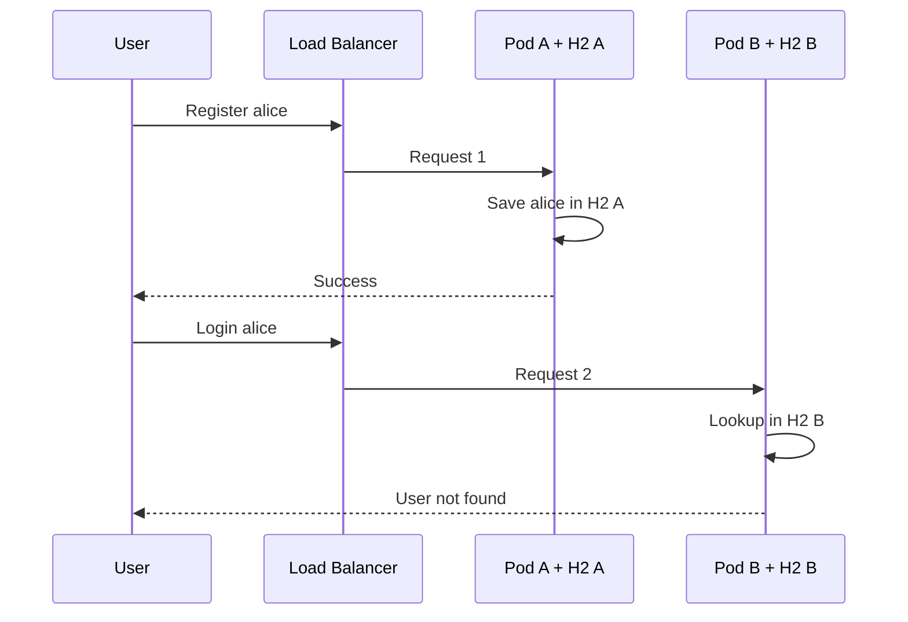

Ngoài ra, restart/reschedule Pod sẽ xóa toàn bộ dữ liệu trong H2 memory. Đây không phải lỗi Kubernetes; Kubernetes đang scale đúng một ứng dụng chưa được thiết kế stateless.

### Thiết kế đúng

- Chuyển dữ liệu sang RDS PostgreSQL/MySQL Multi-AZ hoặc data service phù hợp.
- Dùng Flyway/Liquibase cho schema migration có version.
- Session stateless bằng token an toàn, hoặc externalize session sang Redis nếu cần server-side session.
- Credential database lấy từ Secrets Manager/External Secrets, không baked vào image.
- Backup, restore test, RPO/RTO và connection pool phải được định nghĩa.

Lúc đó Pod có thể bị tạo/xóa mà không làm mất business state.

## 10. RBAC và credential flow

### Project hiện tại

- Tạo namespace `webapps`.
- Tạo ServiceAccount `jenkins`.
- Tạo Role với `apiGroups: ["*"]`, `resources: ["*"]` và nhiều verbs.
- Tạo thủ công Secret loại `kubernetes.io/service-account-token`.
- Copy token dài hạn và endpoint cluster vào Jenkins credential.

Role là namespace-scoped nên tốt hơn `cluster-admin`, nhưng wildcard mọi resource vẫn quá rộng. Token tĩnh, không hết hạn là credential có blast radius lớn.

### Thiết kế nên dùng

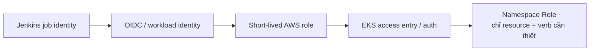

- Không dùng AWS access key dài hạn nếu có thể federation/OIDC.
- Không lưu permanent Kubernetes bearer token.
- Role chỉ cần `get/list/watch/patch/update` cho đúng Deployment/Service cần deploy; tách quyền đọc và ghi nếu cần.
- Credential có TTL, rotation và audit.
- Dev/staging/prod dùng role/namespace/account riêng.

Kubernetes chính thức khuyến nghị TokenRequest/short-lived token thay cho ServiceAccount token Secret dài hạn.

## 11. Terraform provisioning: luồng và lý do

### Resource graph hiện tại

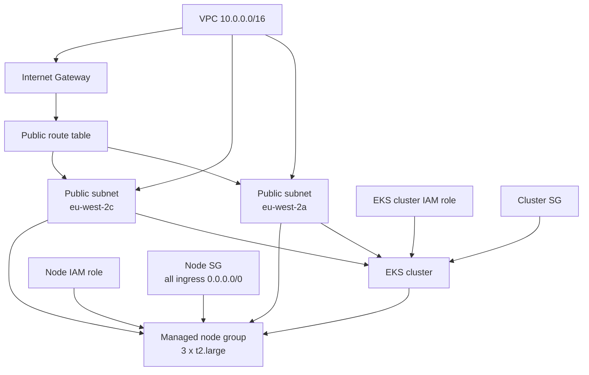

### Tại sao Terraform có giá trị

- Desired state được review cùng code.
- Dependency graph quyết định thứ tự resource.
- `plan` cho thấy tác động trước khi thay đổi.
- State nối resource trong code với resource thật.
- Có thể lặp lại môi trường với module/variable thay vì click tay.

### Luồng IaC đúng

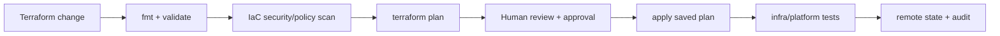

**Lý do thứ tự**

1. `fmt/validate` rẻ, fail nhanh.
2. Security/policy scan chặn cấu hình nguy hiểm trước khi gọi AWS.
3. `plan` biến thay đổi trừu tượng thành create/update/destroy cụ thể.
4. Approval bảo vệ production khỏi destroy hoặc exposure ngoài ý muốn.
5. Apply đúng saved plan tránh khác biệt giữa thứ đã review và thứ thực thi.
6. Test sau apply chứng minh endpoint/add-on/node thực sự hoạt động.

### Vấn đề trong Terraform hiện tại

| Hiện trạng | Rủi ro |
|---|---|
| Region/AZ/name hard-code | Khó tái sử dụng và tạo nhiều environment |
| Chỉ public subnets, node có public IP | Mở rộng attack surface |
| Node SG mở mọi protocol/port từ `0.0.0.0/0` | Internet có thể tiếp cận node trên mọi cổng được route |
| EKS API endpoint không cấu hình rõ | Mặc định có thể public rộng |
| Node group min=desired=max=3 | Không có cluster/node autoscaling |
| `t2.large` hard-code | Capacity/cost không dựa workload |
| SSH key name hard-code | Remote access không được quản lý tốt |
| Không provider/Terraform version pin | Upgrade có thể làm plan thay đổi |
| Không remote backend/locking | State local dễ mất và concurrent apply |
| Không KMS/control-plane logging | Thiếu hardening và audit |
| Không EKS add-ons versioned | CNI/CoreDNS/kube-proxy lifecycle mơ hồ |
| Không OIDC/Pod Identity | Workload khó có AWS permission ngắn hạn |
| Không tags/module/environment separation | Cost ownership và reuse kém |

README còn dùng `aws configure` với access key dài hạn và `terraform apply --auto-approve`. Đây phù hợp lab cá nhân, không phù hợp production change management.

### Target network hợp lý hơn

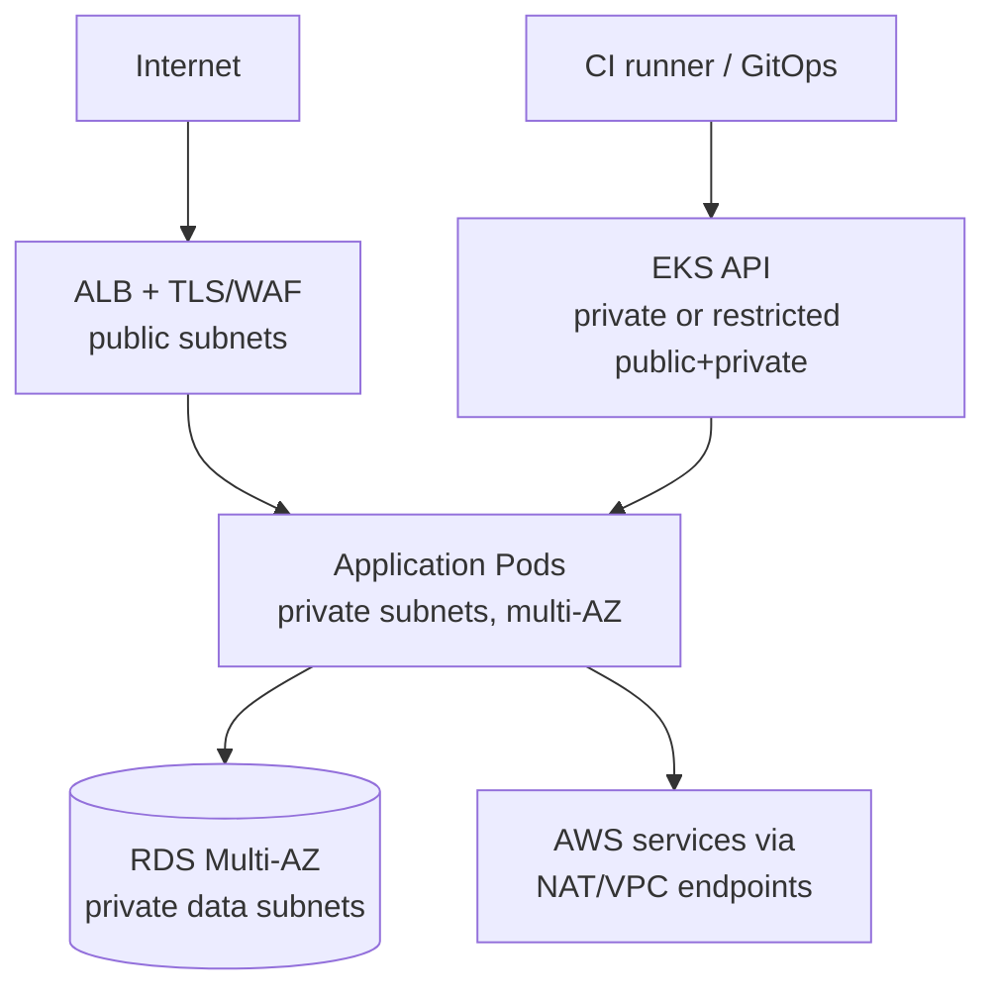

AWS EKS best practices khuyến nghị node ở private subnets; public subnets dành cho internet-facing load balancer, và public API endpoint nên bị giới hạn CIDR hoặc dùng private endpoint.

## 12. Monitoring hiện tại thực sự quan sát được gì?

Project dựng Blackbox Exporter, Prometheus và Grafana trên một EC2 riêng.

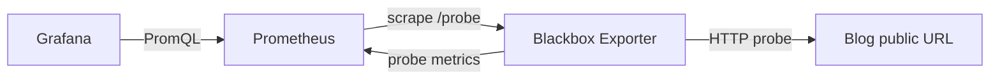

### Giá trị của cách làm này

Blackbox monitoring trả lời câu hỏi gần người dùng: DNS/TCP/TLS/HTTP endpoint có hoạt động không, status code và latency probe thế nào. Nó vẫn hữu ích ngay cả khi app không expose metrics.

### Vì sao chưa phải “full monitoring”

Nó không trả lời:

- request rate, error rate, latency p95/p99 bên trong app;
- JVM heap, GC pause, thread pool;
- database connections/query latency;
- CPU/memory/restart của Pod;
- node pressure/capacity;
- deployment version nào đang lỗi;
- log/trace nào giải thích lỗi;
- ai được page khi SLO vi phạm.

Ứng dụng không có Actuator/Micrometer, manifest không có ServiceMonitor/PodMonitor và stack không có Alertmanager.

### Các lỗi cấu hình/runbook đáng chú ý

- Prometheus YAML trong README ghi `crape_configs` thay vì `scrape_configs`.
- Target blog thiếu scheme `http://` hoặc `https://`.
- Blackbox dùng `valid_http_versions: ["1"]`; giá trị chuẩn thường là `HTTP/1.1`, `HTTP/2.0`.
- Field `valid_http_mimes` không xuất hiện trong schema Blackbox Exporter hiện hành.
- Prometheus trỏ Blackbox bằng public IP dù cùng monitoring host có thể dùng private/localhost.
- Các process chạy tay, không systemd/container orchestration/restart policy.
- Không volume/backup/HA/TLS/auth rõ ràng; Grafana hướng dẫn credential mặc định.
- Mở public port cho tool quản trị làm tăng attack surface.

### Observability target

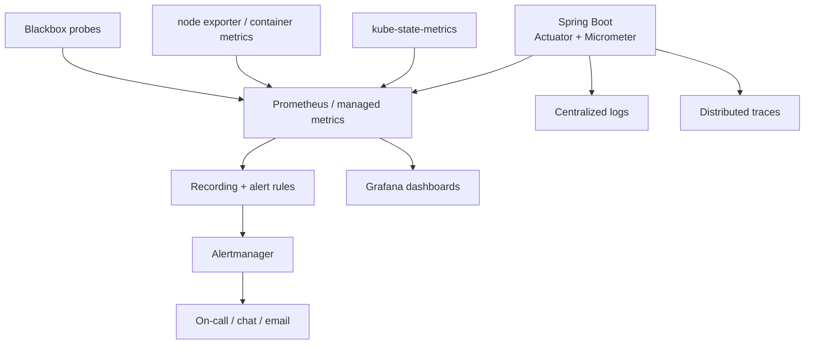

### Bộ tín hiệu tối thiểu

| Lớp | Metrics/telemetry | Câu hỏi |
|---|---|---|
| User journey | probe success, DNS/TLS/HTTP latency | Người dùng có vào được không? |
| Application | RED: rate, errors, duration | App có phục vụ đúng và nhanh không? |
| JVM | heap, GC, threads | Runtime có cạn tài nguyên không? |
| Kubernetes | readiness, restart, pending, desired/available replicas | Scheduler/workload có khỏe không? |
| Node | CPU, memory, disk, network | Cluster có đủ capacity không? |
| Database | connections, latency, storage, replication | Data layer có nghẽn không? |
| Delivery | version/digest, deploy duration/failure | Release nào tạo regression? |

Alert nên dựa trên triệu chứng ảnh hưởng người dùng/SLO, có owner và runbook. Dashboard không tự đánh thức người trực; Alertmanager đảm nhiệm grouping, silencing, inhibition và notification routing.

## 13. Kiến trúc production đề xuất

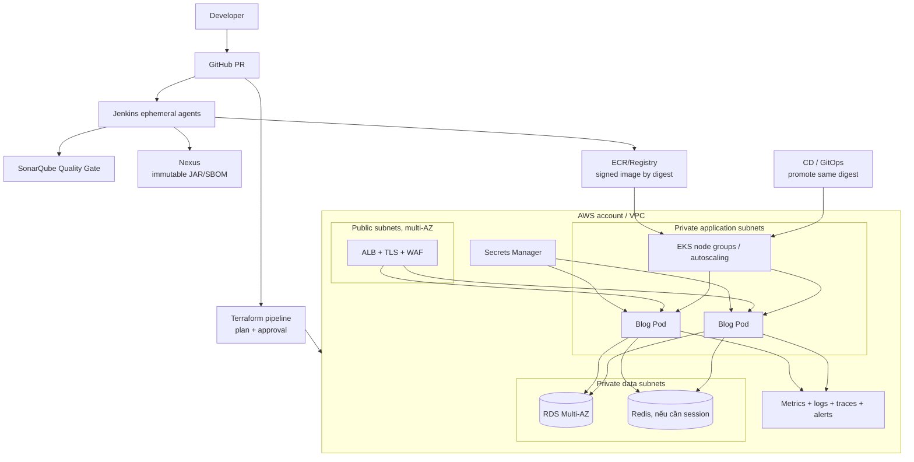

### Vì sao chọn các thay đổi này?

- **Private nodes**: workload không cần public IP; giảm đường tấn công trực tiếp.
- **ALB ở public subnet**: chỉ entry point cần nhận traffic Internet.
- **RDS**: tách business state khỏi lifecycle ngắn của Pod.
- **Image digest**: một identity bất biến cho trace, promotion và rollback.
- **Ephemeral CI agents**: build sạch và giảm persistence của credential.
- **Short-lived identity**: hạn chế thiệt hại khi token lộ.
- **Quality/security gates**: report trở thành policy có khả năng dừng release.
- **Full observability loop**: phát hiện, chẩn đoán, thông báo và học từ incident.

## 14. Pipeline mục tiêu và lý do thứ tự

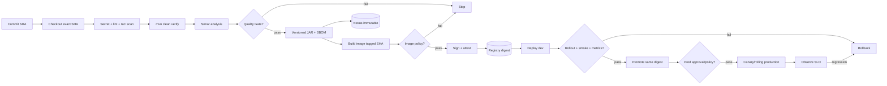

### Lý do cho từng nhóm thứ tự

1. **Cheap and fast first**: secret/lint/config scan chạy trước để không tốn phút build cho thay đổi chắc chắn bị từ chối.
2. **Test before publish**: artifact không được rời workspace nếu logic chưa pass.
3. **Quality Gate before release**: analysis chỉ có giá trị khi policy có thể chặn.
4. **Build once**: cùng một JAR/image được scan, ký và promote.
5. **Scan before push/deploy**: tránh đưa release không đạt policy vào luồng production.
6. **Immutable publish before deploy**: runtime luôn pull được identity đã audit.
7. **Deploy before promote**: dev/staging cung cấp evidence thực tế.
8. **Verify by condition, not sleep**: chờ readiness/rollout/SLO thay vì đoán số giây.
9. **Rollback is part of design**: biết digest trước, migration compatibility và lệnh rollback trước khi release.

## 15. Deployment strategy và rollback

### Rolling update

Phù hợp mặc định khi app backward-compatible, readiness chính xác và đủ capacity. Nên đặt rõ `maxUnavailable`, `maxSurge`, `progressDeadlineSeconds`.

### Canary

Đưa digest mới vào một phần traffic, so sánh error rate/latency với baseline rồi tăng dần. Hữu ích khi rủi ro cao hơn và metrics đáng tin.

### Blue/green

Duy trì hai environment, chuyển traffic khi green pass. Rollback nhanh nhưng tốn tài nguyên và database migration phải tương thích.

### Rollback thật sự cần gì?

- image digest cũ vẫn còn trong registry;
- manifest/release revision có audit;
- database migration theo expand/contract, không phá version cũ ngay;
- lệnh/quyền rollback đã test;
- monitoring xác nhận rollback phục hồi SLO.

Chỉ có `kubectl rollout undo` mà image dùng `latest` và data migration phá ngược thì chưa phải rollback plan.

## 16. Security threat model rút gọn

| Bề mặt | Hiện trạng | Cải tiến ưu tiên |
|---|---|---|
| Jenkins/Sonar/Nexus/Grafana | EC2/public ports, credential mặc định trong runbook | Private access/VPN/SSO, TLS, patching, backup |
| Jenkins build | Docker socket/group trên host | Ephemeral isolated agent, BuildKit/Kaniko hoặc managed build |
| AWS auth | `aws configure` với access key | OIDC/federation, short-lived role, account separation |
| EKS auth | Long-lived ServiceAccount token | Short-lived identity/EKS access + least RBAC |
| Node network | All ingress from Internet | Private nodes, minimal SG, no public SSH |
| Container | Root, full JDK, mutable tag | Non-root, minimal runtime, digest, signature |
| Supply chain | Scan report không gate | Policy exit code, SBOM, attestation, signing |
| Secrets | Manual Jenkins/Kubernetes secrets | Secret manager, rotation, audit, no Git |
| App security | CSRF bị disable toàn cục, H2 console được mở | Review threat model; production profile đóng H2 console, CSRF phù hợp |
| Artifact | HTTP, anonymous/redeploy release | TLS, auth, immutable release, backup |

Không phải mọi mục đều phải mua thêm tool. Nhiều cải tiến lớn nhất đến từ default an toàn, identity ngắn hạn, scope nhỏ và gate có exit code.

## 17. Failure scenarios để luyện tư duy vận hành

### Scenario A — Trivy báo CRITICAL nhưng job xanh

**Nguyên nhân**: command chỉ xuất report, exit code vẫn 0.  
**Phát hiện**: mở report mới thấy lỗi.  
**Sửa**: policy severity + `--exit-code 1`; exception có TTL.  
**Bài học**: scan không có enforcement chỉ là thông tin.

### Scenario B — Push image mới nhưng app vẫn là phiên bản cũ

**Nguyên nhân**: reuse `latest`; Pod template không thay đổi nên không rollout.  
**Phát hiện**: so sánh image ID/digest đang chạy với digest vừa push.  
**Sửa**: update manifest bằng SHA/digest; `rollout status`.  
**Bài học**: deployment phải thay đổi desired state, không chỉ registry state.

### Scenario C — Register thành công rồi login thất bại ngẫu nhiên

**Nguyên nhân**: request đi vào hai Pod có H2/session khác nhau.  
**Phát hiện**: lỗi phụ thuộc Pod, data khác giữa replica.  
**Sửa**: external database và session strategy.  
**Bài học**: horizontal scaling yêu cầu stateless compute.

### Scenario D — Pod Running nhưng website lỗi

**Nguyên nhân**: `Running` chỉ nói container process tồn tại; không có readiness/smoke.  
**Phát hiện**: blackbox fail hoặc người dùng báo lỗi.  
**Sửa**: startup/readiness/liveness, rollout status và synthetic journey.  
**Bài học**: process health khác service health.

### Scenario E — Sonar gate đỏ nhưng production vẫn nhận release

**Nguyên nhân**: pipeline submit analysis nhưng không chờ gate.  
**Sửa**: webhook + `waitForQualityGate abortPipeline: true`.  
**Bài học**: asynchronous check phải được join lại vào control flow.

### Scenario F — Monitoring server reboot và mất quan sát

**Nguyên nhân**: process chạy tay, không service manager/persistence/HA.  
**Sửa**: managed monitoring hoặc deploy stack bằng Helm/IaC, persistent storage, backup và HA theo yêu cầu.  
**Bài học**: monitoring cũng là production system cần được vận hành.

## 18. Ưu tiên cải tiến

### P0 — Chặn release sai và mất dữ liệu

1. Bỏ `latest`; tag/digest bất biến và update Deployment template mỗi release.
2. Dùng RDS/database bền vững; xử lý session cho nhiều replica.
3. Thêm readiness/startup/liveness, resources và `rollout status`.
4. Biến Trivy và Sonar thành gate thật.
5. Sửa `post` block vào bên trong `pipeline`.
6. Thu hồi credential mặc định/dài hạn; đóng public access không cần thiết.

### P1 — Làm delivery tái lập và an toàn

1. Terraform remote state + lock + version pin + reviewed plan.
2. Private subnets cho nodes; giới hạn EKS endpoint/SG.
3. Short-lived AWS/Kubernetes identity và least privilege RBAC.
4. Build một lần, promote cùng digest; ký image và lưu SBOM.
5. Tách environment/account/namespace; config/secrets externalized.
6. Thêm integration/e2e tests cho business journeys.

### P2 — Hoàn thiện vận hành

1. Micrometer/Actuator, kube metrics, logs, traces.
2. Alertmanager, SLO/error budget và runbook.
3. HPA + node autoscaling, PDB, topology spread.
4. Canary/blue-green nếu rủi ro và quy mô cần.
5. Backup/restore/DR exercises và cost visibility.

## 19. Lộ trình học thực hành theo project

### Lab 1 — Làm CI nói thật

- Thêm test register/login/post.
- Chạy `mvn clean verify` và publish JUnit/JaCoCo.
- Cố tình tạo test fail để quan sát pipeline dừng.
- Thêm Sonar webhook + Quality Gate.
- Thêm Trivy `--exit-code 1`, rồi thử dependency có CVE trong môi trường lab.

**Mục tiêu học**: phân biệt “tool chạy” với “gate kiểm soát release”.

### Lab 2 — Artifact bất biến

- Version JAR bằng build version/SHA.
- Nexus release `Disable redeploy`.
- Image tag SHA, lấy digest sau push.
- Gắn commit, build URL, source URL vào OCI labels.

**Mục tiêu học**: từ production truy ngược đúng source và evidence.

### Lab 3 — Kubernetes delivery

- Thêm probes/resources/securityContext.
- Deploy bằng digest.
- Dùng `kubectl rollout status` và smoke test.
- Cố tình dùng image lỗi, quan sát rollout fail rồi rollback.

**Mục tiêu học**: desired state, readiness, rollout và rollback.

### Lab 4 — Stateless application

- Chuyển H2 sang PostgreSQL.
- Thêm Flyway migration.
- Scale 2–3 replica và test session/data consistency.
- Kill Pod ngẫu nhiên, xác nhận dữ liệu vẫn còn.

**Mục tiêu học**: vì sao container/Pod phải disposable.

### Lab 5 — Infrastructure pipeline

- Refactor VPC thành public/private subnets đa AZ.
- Remote state/lock, provider pin và variables.
- PR chạy fmt/validate/security/plan; production apply cần approval.
- Tạo rồi destroy một environment lab có kiểm soát.

**Mục tiêu học**: IaC không chỉ là “tự động tạo”, mà là reviewable change management.

### Lab 6 — Observability loop

- Thêm Actuator/Micrometer.
- Thu RED/JVM/Kubernetes metrics.
- Tạo Grafana dashboard và Alertmanager route.
- Cố tình tạo lỗi/latency, xác nhận alert → runbook → recovery.

**Mục tiêu học**: telemetry phải dẫn đến hành động, không chỉ dashboard đẹp.

## 20. Checklist trước khi gọi là production

### Source và CI

- [ ] Build đúng commit SHA của PR.
- [ ] Toolchain được pin.
- [ ] Unit/integration/e2e test đủ cho critical journeys.
- [ ] Test reports và coverage được lưu.
- [ ] Sonar Quality Gate chặn pipeline.
- [ ] Trivy/secret/IaC/image scan trả non-zero theo policy.

### Supply chain

- [ ] JAR/image có version bất biến và checksum/digest.
- [ ] Release artifact không được redeploy.
- [ ] SBOM, signature và provenance đi cùng release.
- [ ] Promote cùng image digest qua mọi môi trường.

### Infrastructure và security

- [ ] Terraform remote state, lock, version pin, plan review.
- [ ] Worker nodes ở private subnets; SG least privilege.
- [ ] EKS endpoint private hoặc public CIDR bị giới hạn.
- [ ] Short-lived identities; không permanent access key/token.
- [ ] Secrets được rotate và audit.
- [ ] Jenkins/Sonar/Nexus/Grafana không để public/default credentials.

### Runtime và data

- [ ] Probes, resources, PDB và topology policy.
- [ ] HPA/node autoscaling dựa trên workload thực.
- [ ] Business data/session nằm ngoài Pod.
- [ ] Migration backward-compatible.
- [ ] Rollout status, smoke test và rollback đã test.

### Observability và operations

- [ ] Metrics, logs và traces có version/environment labels.
- [ ] Blackbox + app + Kubernetes + database telemetry.
- [ ] Alertmanager/on-call route và runbook.
- [ ] SLO/error budget được định nghĩa.
- [ ] Backup restore và incident drill đã chạy.

## 21. Những điểm tốt nên giữ lại

Phân tích production-readiness không có nghĩa project không có giá trị. Những ý tưởng tốt gồm:

- dùng Pipeline as Code;
- đưa quality, security và packaging vào delivery flow;
- tách JAR repository và image registry theo loại artifact;
- dùng Terraform cho EKS thay vì hoàn toàn click console;
- dùng Deployment nhiều replica và Service LoadBalancer;
- bắt đầu monitoring từ user-facing endpoint;
- gửi feedback sau pipeline.

Bước trưởng thành tiếp theo là biến từng ý tưởng thành **code tái lập, policy chặn được, identity ngắn hạn, artifact bất biến và telemetry có hành động**.

## 22. Nguồn và bằng chứng

### Source của project

- [Project 30 README tại commit đã phân tích](https://github.com/tuan-devops/DevOps-Projects/blob/a38cc0fc72d8d127c8eeaf0a16b7724fb9aba7f1/DevOps-Project-30/README.md)
- [Application repository tại commit đã phân tích](https://github.com/ougabriel/full-stack-blogging-app/tree/74d291fe6d5b5c6b92050be41ab4d805b3c8b4e9)
- [Jenkinsfile](https://github.com/ougabriel/full-stack-blogging-app/blob/74d291fe6d5b5c6b92050be41ab4d805b3c8b4e9/Jenkinsfile)
- [Dockerfile](https://github.com/ougabriel/full-stack-blogging-app/blob/74d291fe6d5b5c6b92050be41ab4d805b3c8b4e9/Dockerfile)
- [Kubernetes manifest](https://github.com/ougabriel/full-stack-blogging-app/blob/74d291fe6d5b5c6b92050be41ab4d805b3c8b4e9/deployment-service.yml)
- [Terraform](https://github.com/ougabriel/full-stack-blogging-app/tree/74d291fe6d5b5c6b92050be41ab4d805b3c8b4e9/EKS_Terraform)

### Tài liệu chính thức dùng để kiểm chứng hành vi

- [Jenkins Declarative Pipeline syntax](https://www.jenkins.io/doc/book/pipeline/syntax/): `post` nằm trong `pipeline` hoặc stage.
- [SonarQube — Jenkins pipeline pause](https://docs.sonarsource.com/sonarqube-server/10.7/analyzing-source-code/ci-integration/jenkins-integration/pipeline-pause): cần webhook và `waitForQualityGate` để gate có thể fail pipeline.
- [Trivy exit code](https://www.trivy.dev/docs/dev/guide/configuration/others/): mặc định issue không làm command fail; dùng `--exit-code` để enforce trong CI.
- [Kubernetes Deployments](https://kubernetes.io/docs/concepts/workloads/controllers/deployment/): rollout chỉ trigger khi Pod template thay đổi; `kubectl rollout status` phản ánh hoàn tất/thất bại.
- [Kubernetes Service Accounts](https://kubernetes.io/docs/concepts/security/service-accounts/): TokenRequest/short-lived token được khuyến nghị; static long-lived token Secret không được khuyến nghị.
- [Amazon EKS VPC/subnet best practices](https://docs.aws.amazon.com/eks/latest/best-practices/subnets.html): node private, load balancer public và endpoint access được giới hạn.
- [Sonatype repository fields](https://help.sonatype.com/en/configurable-repository-fields.html): `Disable redeploy` làm component đã publish trở thành bất biến.
- [Prometheus alerting overview](https://prometheus.io/docs/alerting/latest/overview/): Prometheus alert rules gửi sang Alertmanager để group/silence/route notification.
- [Blackbox Exporter configuration](https://github.com/prometheus/blackbox_exporter/blob/master/CONFIGURATION.md): schema chính thức cho HTTP probe.

---

## Kết luận

Project 30 minh họa một chuỗi công cụ DevOps rộng, nhưng bài học lớn nhất nằm ở những đường nối giữa chúng:

- Sonar/Trivy chỉ có ý nghĩa khi là gate.
- Artifact chỉ đáng tin khi bất biến và truy nguyên được.
- Push image không đồng nghĩa Kubernetes đã rollout.
- Hai replica không tạo HA nếu state nằm trong từng Pod.
- Terraform chỉ an toàn khi có state, plan, review và policy.
- Dashboard không tạo observability nếu không có telemetry nội bộ, alert và runbook.
- Deploy chưa kết thúc ở `kubectl apply`; nó kết thúc khi hệ thống được verify, quan sát và có đường rollback.

Nếu nắm được các quan hệ nhân–quả này, bạn đang học DevOps chứ không chỉ học cách cài Jenkins, Docker và Kubernetes.
